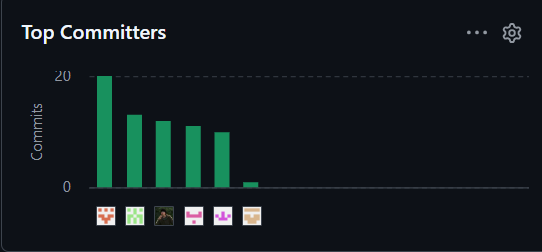
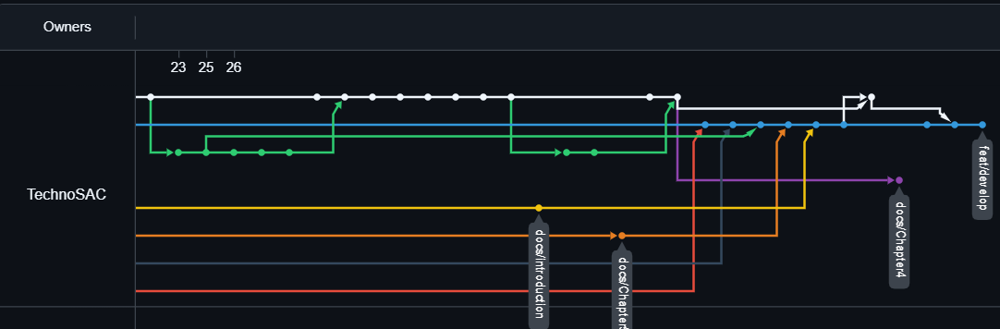

    
  <h2>Informe de Trabajo Final</h2>
  
<strong>Universidad:</strong> Universidad Peruana de Ciencias Aplicadas

  
<strong>Ciclo:</strong> 2026-10

  
<strong>Curso:</strong> 1ASI0729-2610 Desarrollo de Aplicaciones Open Source

  
<strong>Sección:</strong> 11959

  
<strong>Profesor:</strong> Hugo Allan Mori Paiva

<h2 align="center">Relación de Integrantes:</h2>

  <table>
    <tr>
      <th><strong>Código</strong></th>
      <th><strong>Apellidos y Nombres</strong></th>
    </tr>
    <tr>
      <td>u20241c630</td>
      <td>Asto Jacome Jose Gustavo</td>
    </tr>
    <tr>
      <td>u202312566</td>
      <td>Cayanchi Avila Milenko Rubén</td>
    </tr>
    <tr>
      <td>u20231a257</td>
      <td>Brayan Alexis Corvacho Damian</td>
    </tr>
    <tr>
      <td>u202320684</td>
      <td>Ponce Perales Alberto Alejandro</td>
    </tr><tr>
      <td>u202319027</td>
      <td>Herrera Enriquez Diego Fernando</td>
    </tr>
  </table>

<strong>Mes y Año:</strong> Abril 2026

## Registro de Versiones del Informe

<table border>
  <thead>
    <tr>
      <th><b>Versión</b></th>
      <th><b>Fecha</b></th>
      <th><b>Autores</b></th>
      <th><b>Descripción de modificación</b></th>
    </tr>
  </thead>
  <tbody>
    <tr>
      <td>AV1</td>
      <td>27/04/2026</td>
      <td>
        - Asto Jacome Jose Gustavo  
        - Cayanchi Avila Milenko Rubén 
        - Brayan Alexis Corvacho Damian  
        - Herrera Enriquez Diego fernando 
        - Alberto Alejandro Ponce Perales
      </td>
      <td>
        Se incluyeron los siguientes capítulos:  
        • Estructura del informe  
        • Capítulo I: Introducción  
        • Capítulo II: Requirements Elicitation & Analysis  
        • Capítulo III: Requirements Specification  
        • Capítulo IV: Product Design  
        • Capítulo V: Product Implementation, Validation & Deployment  
        • Configuración inicial del repositorio y de la Landing Page  
        • Aplicación de GitFlow y conventional commits
      </td>
    </tr>
    <tr>
      <td>TB1</td>
      <td>21/05/2026</td>
      <td>
        - Asto Jacome Jose Gustavo  
        - Cayanchi Avila Milenko Rubén 
        - Brayan Alexis Corvacho Damian  
        - Herrera Enriquez Diego Fernando 
        - Alberto Alejandro Ponce Perales
      </td>
      <td>
        Se desarrolló e implementó la Web Application (Frontend) de FullTank en Angular 17, correspondiente al Sprint 2 del proyecto. Se incluyeron los siguientes avances:  
        • Implementación del Dashboard principal del proveedor con KPIs y navegación directa a módulos operativos  
        • Módulo de Inventario (CRUD de productos de combustible)  
        • Módulo de Pedidos (Ordering): solicitudes, órdenes, aprobación, rechazo, despacho, cierre, búsqueda y filtrado  
        • Módulo de Logística (Fulfillment): gestión de vehículos, conductores y dispatch dashboard con validación de disponibilidad  
        • Módulo de Reportes (Reporting): gráficos de ventas, distribución por sector y portafolio de clientes  
        • Integración del historial de pedidos en el módulo de Ordering  
        • Conexión a una API simulada (json-server) desplegada en Render  
        • Despliegue del Frontend en Firebase Hosting  
        • Actualización del Capítulo V con la evidencia de Sprint Planning, Sprint Backlog, ejecución y despliegue del Sprint 2
      </td>
    </tr>
    <tr>
      <td>AV2</td>
      <td>21/06/2026</td>
      <td>
        - Asto Jacome Jose Gustavo  
        - Cayanchi Avila Milenko Rubén 
        - Brayan Alexis Corvacho Damian  
        - Herrera Enriquez Diego Fernando 
        - Alberto Alejandro Ponce Perales
      </td>
      <td>
        Se diseñó e implementó la arquitectura Backend de FullTank utilizando Spring Boot y Domain-Driven Design, correspondiente al Sprint 3 del proyecto. Se incluyeron los siguientes avances:  
        • Desarrollo de los servicios REST organizados por bounded contexts: Identity & Access, Equipment, Catalog/Inventory, Ordering, Payment, Fulfillment, Notification y Reporting & Analytics  
        • Implementación de autenticación y autorización mediante JSON Web Tokens (JWT)  
        • Persistencia de datos mediante Spring Data JPA sobre base de datos relacional  
        • Documentación de los servicios desarrollados mediante OpenAPI/Swagger  
        • Validación funcional de endpoints mediante Swagger UI y Postman  
        • Actualización del Capítulo IV con los diagramas de clases (Class Diagrams) de Frontend y Backend por bounded context  
        • Actualización del Capítulo V con la evidencia de Sprint Planning, Sprint Backlog, ejecución, documentación de servicios y despliegue del Sprint 3
      </td>
    </tr>
  </tbody>
</table>

## Project Report Collaboration Insights

**Link del repositorio del informe:**  
https://github.com/PrimeFuel/Prime_Fuel_Document

**Link del repositorio de la Landing Page:**  
https://github.com/PrimeFuel/FullTank_LandingPage

**Link del repositorio del fronted:**  
https://github.com/PrimeFuel/frontend

**Link del repositorio del backend:**  
https://github.com/PrimeFuel/backend

**Link de los repositorios de la organización:**  

https://github.com/PrimeFuel

**Link del figma:** https://www.figma.com/design/ZMHB35H60u2eUhctevkVKc/Fullank-Completo?node-id=0-1&t=I3nr2x0tcAinM7gE-1

Este informe ha sido desarrollado de forma colaborativa mediante GitHub, empleando GitFlow y Conventional Commits. Cada miembro del equipo ha contribuido con commits y ramas durante el desarrollo del proyecto.

**Participación por miembro**

A continuación, se muestra un gráfico de barras con la cantidad de commits realizados por cada integrante del equipo:

**Evolución temporal de commits**

El siguiente gráfico muestra una línea de tiempo con la evolución semanal de los commits realizados por todos los miembros:

## Contenido

- [Capítulo I: Introducción](#capítulo-i-introducción)
  - [1.1 Startup Profile](#11-startup-profile)
    - [1.1.1 Descripción de la Startup](#111-descripción-de-la-startup)
    - [1.1.2 Perfiles de integrantes del equipo](#112-perfiles-de-integrantes-del-equipo)
  - [1.2 Solution Profile](#12-solution-profile)
    - [1.2.1 Antecedentes y problemática](#121-antecedentes-y-problemática)
    - [1.2.2 Lean UX Process](#122-lean-ux-process)
      - [1.2.2.1 Lean UX Problem Statements](#1221-lean-ux-problem-statements)
      - [1.2.2.2 Lean UX Assumptions](#1222-lean-ux-assumptions)
      - [1.2.2.3 Lean UX Hypothesis Statements](#1223-lean-ux-hypothesis-statements)
      - [1.2.2.4 Lean UX Canvas](#1224-lean-ux-canvas)
  - [1.3 Segmentos objetivos](#13-segmentos-objetivos)
- [Capítulo II: Requirements Elicitation \& Analysis](#capítulo-ii-requirements-elicitation--analysis)
  - [2.1. Competidores.](#21-competidores)
    - [2.1.1. Análisis competitivo.](#211-análisis-competitivo)
    - [2.1.2. Estrategias y tácticas frente a competidores.](#212-estrategias-y-tácticas-frente-a-competidores)
      - [a. Diferenciación a través de especialización](#a-diferenciación-a-través-de-especialización)
      - [b. Innovación en la interfaz de usuario y experiencia](#b-innovación-en-la-interfaz-de-usuario-y-experiencia)
      - [c. Flexibilidad en precios y modelo SaaS escalable](#c-flexibilidad-en-precios-y-modelo-saas-escalable)
      - [d. Aprovechamiento de la digitalización en la logística](#d-aprovechamiento-de-la-digitalización-en-la-logística)
      - [e. Expansión hacia mercados internacionales](#e-expansión-hacia-mercados-internacionales)
  - [2.2. Entrevistas.](#22-entrevistas)
    - [2.2.1. Diseño de entrevistas.](#221-diseño-de-entrevistas)
    - [2.2.2 Registro de entrevistas](#222-registro-de-entrevistas)
    - [2.2.3 Análisis de entrevistas](#223-análisis-de-entrevistas)
  - [2.3 Needfinding](#23-needfinding)
    - [2.3.1 User Personas](#231-user-personas)
    - [2.3.2 User Task Matrix](#232-user-task-matrix)
    - [2.3.3 User Journey Mapping](#233-user-journey-mapping)
    - [2.3.4 Empathy Mapping](#234-empathy-mapping)
  - [2.4 Big Picture Event Storming](#24-big-picture-event-storming)
  - [2.5 Ubiquitous Language](#25-ubiquitous-language)
- [Capítulo III: Requirements Specification](#capítulo-iii-requirements-specification)
  - [3.1 User Stories](#31-user-stories)
  - [3.2 Impact Mapping](#32-impact-mapping)
- [Capítulo IV: Product Design](#capítulo-iv-product-design)
  - [4.1 Style Guidelines](#41-style-guidelines)
    - [4.1.1 General Style Guidelines](#411-general-style-guidelines)
    - [4.1.2 Web Style Guidelines](#412-web-style-guidelines)
  - [4.2 Information Architecture](#42-information-architecture)
    - [4.2.1 Organization Systems](#421-organization-systems)
    - [4.2.2 Labeling Systems](#422-labeling-systems)
    - [4.2.3 SEO Tags and Meta Tags](#423-seo-tags-and-meta-tags)
    - [4.2.4 Searching Systems](#424-searching-systems)
    - [4.2.5 Navigation Systems](#425-navigation-systems)
  - [4.3 Landing Page UI Design](#43-landing-page-ui-design)
    - [4.3.1 Landing Page Wireframe](#431-landing-page-wireframe)
    - [4.3.2 Landing Page Mock-up](#432-landing-page-mock-up)
  - [4.4 Web Applications UX/UI Design](#44-web-applications-uxui-design)
    - [4.4.1 Web Applications Wireframes](#441-web-applications-wireframes)
    - [4.4.2 Web Applications Wireflow Diagrams](#442-web-applications-wireflow-diagrams)
    - [4.4.3 Web Applications Mock-ups](#443-web-applications-mock-ups)
    - [4.4.4 Web Applications User Flow Diagrams](#444-web-applications-user-flow-diagrams)
  - [4.5 Web Applications Prototyping](#45-web-applications-prototyping)
  - [4.6 Domain-Driven Software Architecture](#46-domain-driven-software-architecture)
    - [4.6.1 Design-Level Event Storming](#461-design-level-event-storming)
    - [4.6.2 Software Architecture Context Diagram](#462-software-architecture-context-diagram)
    - [4.6.3 Software Architecture Container Diagrams](#463-software-architecture-container-diagrams)
    - [4.6.4 Software Architecture Components Diagrams](#464-software-architecture-components-diagrams)
  - [4.7 Software Object-Oriented Design](#47-software-object-oriented-design)
    - [4.7.1 Class Diagrams](#471-class-diagrams)
  - [4.8 Database Design](#48-database-design)
    - [4.8.1 Database Diagrams](#481-database-diagrams)

## Student Outcome

<table border>
  <thead>
    <tr>
      <th width="25%"><b>Criterio Específico</b></th>
      <th><b>Acciones Realizadas</b></th>
      <th><b>Conclusiones</b></th>
    </tr>
  </thead>
  <tbody>
    <tr>
      <td width="25%"><b>Comunica oralmente con efectividad a rangos de audiencia</b></td>
      <td>
        <b>Jose Asto Jacome</b> 
        AV1: Expuso oralmente los hallazgos del análisis competitivo y las estrategias frente a competidores durante las sesiones de equipo. 
        TB1: Presentó oralmente la implementación del Dashboard principal del proveedor (KPIs y navegación) y los módulos de Reporting (gráfico de ventas mensuales, distribución por sector y portafolio de clientes) desarrollados en Angular. 
        AV2: Presentó oralmente el avance del Dashboard principal del proveedor, los módulos de Reporting y los servicios backend de Reporting & Analytics, explicando al equipo la lógica de las métricas e indicadores expuestos. 
        <b>Milenko Cayanchi Avila</b> 
        AV1: Presentó oralmente los resultados del Needfinding, incluyendo User Personas y User Journey Mapping, ante el grupo. 
        TB1: Comunicó oralmente la estructuración de las bases del proyecto Angular (layout, router y store con Angular Signals) y el desarrollo del módulo de Inventario (CRUD de productos y lista de stock). 
        AV2: Comunicó oralmente la estructura base del proyecto Angular, la configuración del store con Angular Signals, el módulo de Inventario y los endpoints de consulta de usuarios y gestión de stock implementados en el backend. 
        <b>Brayan Corvacho Damian</b> 
        AV1: Comunicó oralmente el diseño de la arquitectura de software y los diagramas de contenedores y componentes al equipo. 
        TB1: Expuso oralmente el desarrollo del módulo de Fulfillment, incluyendo la gestión de vehículos y conductores, y el dispatch dashboard con validación de disponibilidad en tiempo real. 
        AV2: Expuso oralmente el desarrollo del módulo de Fulfillment (vehículos, conductores y dispatch dashboard) y los endpoints backend de solicitudes de combustible, vehículos y asignación de proveedor favorito. 
        <b>Diego Herrera Enriquez</b> 
        AV1: Expuso oralmente el proceso de entrevistas y el análisis de los segmentos objetivo identificados. 
        TB1: Presentó oralmente la integración del historial de órdenes cerradas en el módulo de Ordering y el soporte transversal brindado entre los distintos módulos del frontend. 
        AV2: Presentó oralmente la integración del historial de pedidos en el módulo de Ordering y los servicios backend de empresas compradoras, confirmación/cancelación de pedidos y reportes y analítica. 
        <b>Alberto Ponce Perales</b> 
        AV1: Presentó oralmente el diseño UX/UI de la Landing Page y las Web Applications al equipo de trabajo. 
        TB1: Comunicó oralmente el desarrollo completo del módulo de Ordering (solicitudes, órdenes, aprobación, rechazo, despacho, cierre, búsqueda y filtrado de pedidos). 
        AV2: Comunicó oralmente el desarrollo completo del módulo de Ordering (solicitudes, órdenes, aprobación, rechazo, despacho, cierre, búsqueda y filtrado) y los endpoints backend de empresas proveedoras, consulta de pedidos y gestión de entregas. 
      </td>
      <td>
        Consideramos que la comunicación oral fue aplicada de manera clara y estratégica, logrando exponer hallazgos, transmitir insights y sostener discusiones con efectividad frente a diferentes audiencias. Durante el TB1 y el AV2, esta habilidad se evidenció además en la capacidad de cada integrante para explicar decisiones técnicas de implementación (módulos de frontend y servicios de backend) ante el equipo, facilitando la integración entre los distintos bounded contexts desarrollados y la coordinación necesaria para el despliegue de ambas capas del sistema.
      </td>
    </tr>
    <tr>
      <td width="25%"><b>Comunica por escrito con efectividad a diferentes rangos de audiencia</b></td>
      <td>
        <b>Jose Asto Jacome</b> 
        AV1: Redactó el Startup Profile y el Solution Profile, adaptando el lenguaje para audiencias técnicas y no técnicas. 
        TB1: Documentó por escrito la implementación del Dashboard principal del proveedor y los módulos de Reporting, dejando registro de la integración con Chart.js y la conexión al json-server. 
        AV2: Documentó por escrito la implementación del Dashboard principal, los módulos de Reporting y los endpoints de autenticación, registro de usuarios, productos de combustible, pagos y notificaciones, además de actualizar la evidencia de desarrollo y ejecución del Sprint 3. 
        <b>Milenko Cayanchi Avila</b> 
        AV1: Documentó por escrito el análisis de entrevistas y el Empathy Mapping con claridad y estructura adecuada. 
        TB1: Redactó la documentación de la estructura base del proyecto Angular y del módulo de Inventario, detallando el uso de assemblers, store con Angular Signals y las vistas de formulario y listado. 
        AV2: Redactó la documentación del módulo de Inventario, la lista de stock y los endpoints de consulta de usuarios, actualización de stock, conductores y calificaciones de proveedores, dejando registro claro de las decisiones técnicas adoptadas. 
        <b>Brayan Corvacho Damian</b> 
        AV1: Elaboró la documentación escrita de los diagramas de base de datos y el diseño orientado a objetos. 
        TB1: Documentó por escrito el desarrollo del módulo de Fulfillment, incluyendo el CRUD de vehículos y conductores y la lógica del dispatch dashboard. 
        AV2: Documentó por escrito el módulo de Fulfillment (vehículos, conductores, dispatch dashboard y asignación de recursos) y los endpoints backend de consulta de pedidos por usuario, actualización de perfil, vehículos y asignación de proveedor favorito. 
        <b>Diego Herrera Enriquez</b> 
        AV1: Redactó las User Stories y el Impact Mapping, asegurando que fueran comprensibles para todos los miembros del equipo. 
        TB1: Documentó por escrito la integración del historial de órdenes en el módulo de Ordering y el trabajo de soporte transversal entre módulos del frontend. 
        AV2: Documentó por escrito la integración del historial de pedidos en Ordering y los endpoints de empresas compradoras, confirmación/cancelación de pedidos, eliminación de equipos y reportes y analítica. 
        <b>Alberto Ponce Perales</b> 
        AV1: Documentó por escrito las Style Guidelines y los sistemas de arquitectura de información del producto. 
        TB1: Redactó la documentación completa del módulo de Ordering, detallando las vistas de solicitudes, órdenes y las acciones de cambio de estado implementadas. 
        AV2: Redactó la documentación del módulo de Ordering completo (solicitudes, órdenes, acciones de aprobación/rechazo/despacho/cierre, búsqueda y filtrado) y los endpoints backend de empresas proveedoras, consulta de pedidos, gestión de entregas y equipos. 
      </td>
      <td>
        La comunicación escrita se utilizó de forma clara y estratégica, adaptando el nivel de detalle y el lenguaje según la audiencia. En el TB1 y el AV2, esta habilidad se reflejó en la documentación técnica del Sprint Backlog, las evidencias de desarrollo y despliegue, y la actualización de los diagramas de clases del Capítulo IV, lo que permitió mantener una trazabilidad clara entre los requerimientos definidos, las decisiones de diseño y la implementación final tanto del frontend como del backend de FullTank.
      </td>
    </tr>
  </tbody>
</table>