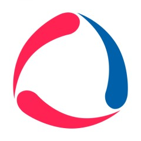

    
  <h2>Informe de Trabajo Final</h2>
  
<strong>Universidad:</strong> Universidad Peruana de Ciencias Aplicadas

  
<strong>Ciclo:</strong> 2026-10

  
<strong>Curso:</strong> Desarrollo de Aplicaciones Open Source

  
<strong>Sección:</strong> 1ASI0729-2610-11959

  
<strong>Profesor:</strong> Hugo Allan Mori Paiva

<h2 align="center">Relación de Integrantes:</h2>

  <table>
    <tr>
      <th><strong>Código</strong></th>
      <th><strong>Apellidos y Nombres</strong></th>
    </tr>
    <tr>
      <td>u20241c630</td>
      <td>Asto Jacome Jose Gustavo</td>
    </tr>
    <tr>
      <td>u</td>
      <td>S</td>
    </tr>
    <tr>
      <td>u</td>
      <td>O</td>
    </tr>
    <tr>
      <td>u202320684</td>
      <td>Ponce Perales Alberto Alejandro</td>
    </tr>
  </table>

<strong>Mes y Año:</strong> Abril 2026

## Registro de Versiones del Informe

<table border>
  <thead>
    <tr>
      <th><b>Versión</b></th>
      <th><b>Fecha</b></th>
      <th><b>Autores</b></th>
      <th><b>Descripción de modificación</b></th>
    </tr>
  </thead>
  <tbody>
    <tr>
      <td>TB1</td>
      <td>30/04/2026</td>
      <td>
        - Asto Jacome Jose Gustavo
        -   
        -   
        - Alberto Alejandro Ponce Perales
      </td>
      <td>
        Se incluyeron los siguientes capítulos:  
        • Estructura del informe  
        • Capítulo I: Introducción  
        • Capítulo II: Requirements Elicitation & Analysis  
        • Capítulo III: Requirements Specification  
        • Capítulo IV: Product Design  
        • Capítulo V: Product Implementation, Validation & Deployment  
        • Configuración inicial del repositorio y de la Landing Page  
        • Aplicación de GitFlow y conventional commits
      </td>
    </tr>
    <tr>
    <tr>
  </tbody>
</table>

## Project Report Collaboration Insights

**Link del repositorio del informe:**  

**Link del repositorio de la Landing Page:**  

**Link del repositorio del fronted:**  

**Link del repositorio del backend:**  

**Link de los repositorios de la organización:**  

Este informe ha sido desarrollado de forma colaborativa mediante GitHub, empleando GitFlow y Conventional Commits. Cada miembro del equipo ha contribuido con commits y ramas durante el desarrollo del proyecto.

**Participación por miembro**

A continuación, se muestra un gráfico de barras con la cantidad de commits realizados por cada integrante del equipo:

**Evolución temporal de commits**

El siguiente gráfico muestra una línea de tiempo con la evolución semanal de los commits realizados por todos los miembros:

## Contenido

- [Capítulo I: Introducción](#capítulo-i-introducción)
  - [1.1 Startup Profile](#11-startup-profile)
    - [1.1.1 Descripción de la Startup](#111-descripción-de-la-startup)
    - [1.1.2 Perfiles de integrantes del equipo](#112-perfiles-de-integrantes-del-equipo)
  - [1.2 Solution Profile](#12-solution-profile)
    - [1.2.1 Antecedentes y problemática](#121-antecedentes-y-problemática)
    - [1.2.2 Lean UX Process](#122-lean-ux-process)
      - [1.2.2.1 Lean UX Problem Statements](#1221-lean-ux-problem-statements)
      - [1.2.2.2 Lean UX Assumptions](#1222-lean-ux-assumptions)
      - [1.2.2.3 Lean UX Hypothesis Statements](#1223-lean-ux-hypothesis-statements)
      - [1.2.2.4 Lean UX Canvas](#1224-lean-ux-canvas)
  - [1.3 Segmentos objetivos](#13-segmentos-objetivos)
- [Capítulo II: Requirements Elicitation \& Analysis](#capítulo-ii-requirements-elicitation--analysis)
  - [2.1. Competidores.](#21-competidores)
    - [2.1.1. Análisis competitivo.](#211-análisis-competitivo)
    - [2.1.2. Estrategias y tácticas frente a competidores.](#212-estrategias-y-tácticas-frente-a-competidores)
      - [a. Diferenciación a través de especialización](#a-diferenciación-a-través-de-especialización)
      - [b. Innovación en la interfaz de usuario y experiencia](#b-innovación-en-la-interfaz-de-usuario-y-experiencia)
      - [c. Flexibilidad en precios y modelo SaaS escalable](#c-flexibilidad-en-precios-y-modelo-saas-escalable)
      - [d. Aprovechamiento de la digitalización en la logística](#d-aprovechamiento-de-la-digitalización-en-la-logística)
      - [e. Expansión hacia mercados internacionales](#e-expansión-hacia-mercados-internacionales)
  - [2.2. Entrevistas.](#22-entrevistas)
    - [2.2.1. Diseño de entrevistas.](#221-diseño-de-entrevistas)
    - [2.2.2 Registro de entrevistas](#222-registro-de-entrevistas)
    - [2.2.3 Análisis de entrevistas](#223-análisis-de-entrevistas)
  - [2.3 Needfinding](#23-needfinding)
    - [2.3.1 User Personas](#231-user-personas)
    - [2.3.2 User Task Matrix](#232-user-task-matrix)
    - [2.3.3 User Journey Mapping](#233-user-journey-mapping)
    - [2.3.4 Empathy Mapping](#234-empathy-mapping)
  - [2.4 Big Picture Event Storming](#24-big-picture-event-storming)
  - [2.5 Ubiquitous Language](#25-ubiquitous-language)
- [Capítulo III: Requirements Specification](#capítulo-iii-requirements-specification)
  - [3.1 User Stories](#31-user-stories)
  - [3.2 Impact Mapping](#32-impact-mapping)
- [Capítulo IV: Product Design](#capítulo-iv-product-design)
  - [4.1 Style Guidelines](#41-style-guidelines)
    - [4.1.1 General Style Guidelines](#411-general-style-guidelines)
    - [4.1.2 Web Style Guidelines](#412-web-style-guidelines)
  - [4.2 Information Architecture](#42-information-architecture)
    - [4.2.1 Organization Systems](#421-organization-systems)
    - [4.2.2 Labeling Systems](#422-labeling-systems)
    - [4.2.3 SEO Tags and Meta Tags](#423-seo-tags-and-meta-tags)
    - [4.2.4 Searching Systems](#424-searching-systems)
    - [4.2.5 Navigation Systems](#425-navigation-systems)
  - [4.3 Landing Page UI Design](#43-landing-page-ui-design)
    - [4.3.1 Landing Page Wireframe](#431-landing-page-wireframe)
    - [4.3.2 Landing Page Mock-up](#432-landing-page-mock-up)
  - [4.4 Web Applications UX/UI Design](#44-web-applications-uxui-design)
    - [4.4.1 Web Applications Wireframes](#441-web-applications-wireframes)
    - [4.4.2 Web Applications Wireflow Diagrams](#442-web-applications-wireflow-diagrams)
    - [4.4.3 Web Applications Mock-ups](#443-web-applications-mock-ups)
    - [4.4.4 Web Applications User Flow Diagrams](#444-web-applications-user-flow-diagrams)
  - [4.5 Web Applications Prototyping](#45-web-applications-prototyping)
  - [4.6 Domain-Driven Software Architecture](#46-domain-driven-software-architecture)
    - [4.6.1 Design-Level Event Storming](#461-design-level-event-storming)
    - [4.6.2 Software Architecture Context Diagram](#462-software-architecture-context-diagram)
    - [4.6.3 Software Architecture Container Diagrams](#463-software-architecture-container-diagrams)
    - [4.6.4 Software Architecture Components Diagrams](#464-software-architecture-components-diagrams)
  - [4.7 Software Object-Oriented Design](#47-software-object-oriented-design)
    - [4.7.1 Class Diagrams](#471-class-diagrams)
  - [4.8 Database Design](#48-database-design)
    - [4.8.1 Database Diagrams](#481-database-diagrams)

## Student Outcome

<table border>
  <thead>
    <tr>
      <th width="25%"><b>Criterio Específico</b></th>
      <th><b>Acciones Realizadas</b></th>
      <th><b>Conclusiones</b></th>
    </tr>
  </thead>
  <tbody>
    <tr>
      <td width="25%"><b>Comunica oralmente con efectividad a rangos de audiencia</b></td>
      <td>
        <b>Jose Asto</b> 
        TB1: . 
        <b>A</b> 
        TB1: . 
        <b>A</b> 
        TB1: . 
        <b>Alberto Ponce</b> 
        TB1: . 
      </td>
      <td>
        Consideramos que la comunicación oral fue aplicada de manera clara y estratégica, logrando exponer hallazgos, transmitir insights y sostener discusiones con efectividad frente a diferentes audiencias. Gracias a ello, se alcanzó una comprensión común del problema y se sentaron bases sólidas para proponer soluciones innovadoras en el marco del Lean UX Process.
      </td>
    </tr>
    <tr>
      <td width="25%"><b>Comunica por escrito con efectividad a diferentes rangos de audiencia</b></td>
      <td>
        <b>Jose Asto</b> 
        TB1: . 
        <b>A</b> 
        TB1: . 
        <b>A</b> 
        TB1: . 
        <b>Alberto Ponce</b> 
        TB1: . 
      </td>
      <td>
        La comunicación escrita se utilizó de forma clara y estratégica, adaptando el nivel de detalle y el lenguaje según la audiencia. Esto permitió documentar hallazgos, explicar la problemática y presentar propuestas de manera efectiva, logrando que toda la información fuera comprendida y validada en el marco del Lean UX Process.
      </td>
    </tr>
  </tbody>
</table>

 

# Capítulo I: Introducción

## 1.1 Startup Profile

### 1.1.1 Descripción de la Startup

**Prime Fuel**: Startup innovador dedicado a la gestión de la compraventa de combustible entre empresas solicitantes y proveedores. Fundada por estudiantes de la Universidad Peruana de Ciencias Aplicadas, nuestra propuesta se centra en la digitalización de un sector tradicionalmente dependiente de procesos manuales, brindando una solución tecnológica que garantiza eficiencia, transparencia y un control más riguroso de las operaciones. 

**Misión**: Nuestra misión es desarrollar soluciones tecnológicas avanzadas que transformen el mercado de combustible, eliminando los medios informales y reduciendo el margen de error, mediante una plataforma web intuitiva y accesible. 

**Visión**: Nuestra visión es posicionarnos como líderes en la digitalización del sector energético, ofreciendo a las empresas una herramienta que facilite una gestión más eficiente, segura y sostenible, contribuyendo al progreso tecnológico y a la mejora de la competitividad del sector. 

### 1.1.2 Perfiles de integrantes del equipo

<table border>
  <thead>
    <tr>
      <th>Foto</th>
      <th>Nombre completo</th>
      <th>Código</th>
      <th>Carrera</th>
      <th>Habilidades técnicas</th>
    </tr>
  </thead>
  <tbody>
    <tr>
      <td></td>
      <td>Jose Gustavo Asto Jacome</td>
      <td>u20241c630</td>
      <td>Ingeniería de Software</td>
      <td>C.</td>
    </tr>
    <tr>
      <td></td>
      <td>Nombre</td>
      <td>u</td>
      <td>Ingeniería de Software</td>
      <td>Estudiante de la carrera de Ingenieria de software en la UPC. Actualmente cuento con conocimientos en herramientas Office, como tambien en diferentes lenguajes de programacion como C++,C,Java, JavaScript. Mis mayores virtudes son: innovador, capacidad de liderar y adaptacion constante</td>
    </tr>
    <tr>
      <td></td>
      <td>Nombre</td>
      <td>u</td>
      <td>Ingeniería de Software</td>
      <td>S. </td>
    </tr>
    <tr>
      <td></td>
      <td>Alberto Alejandro Ponce Perales</td>
      <td>u202320684</td>
      <td>Ingeniería de Software</td>
      <td>Estudiante de la carrera de Ingeniería de Software en la UPC. Actualmente cuento con conocimientos en lenguajes de programación como C + + y manejo de Java. Considero que mis mayores virtudes son: la responsabilidad, capacidad de adaptarme, trabajar en equipo y la resiliencia.</td>
    </tr>
  </tbody>
</table>

---

## 1.2 Solution Profile

### 1.2.1 Antecedentes y problemática

- **What? (¿Qué?)**  
  La problemática principal es la falta de un sistema centralizado y digital para gestionar los pedidos de combustible, lo que genera errores humanos, duplicación de esfuerzos y retrasos en las entregas.

- **When? (¿Cuándo?)**  
  El problema se presenta constantemente en el proceso de gestión de pedidos, especialmente cuando hay un alto volumen de solicitudes o múltiples pedidos a coordinar.

- **Where? (¿Dónde?)**  
  El problema ocurre en empresas solicitantes de combustible y proveedores, tanto en áreas urbanas como rurales, donde la infraestructura digital aún no está optimizada.

- **Who? (¿Quién?)**  
  Los principales afectados son las empresas solicitantes (medianas y grandes), los proveedores de combustible y los encargados de la logística y gestión de pedidos.

- **Why? (¿Por qué?)**  
  El problema radica en la falta de integración entre los métodos actuales de gestión (como correos y aplicaciones de mensajería), que dificultan un control centralizado y preciso de los pedidos.

- **How? (¿Cómo?)**  
  Los procesos actuales son desorganizados, utilizando diversas plataformas desconectadas, lo que impide tener un flujo de trabajo eficiente y controlado.

- **How Much? (¿Cuánto?)**  
  La magnitud del problema es considerable, pues cada día se pierden horas valiosas debido a la ineficiencia y los errores, lo que incrementa los costos operativos y puede generar pérdidas económicas significativas.

### 1.2.2 Lean UX Process

Para el desarrollo de la Startup, utilizamos el enfoque Lean UX, que nos permite validar nuestras hipótesis, enfocarnos en la experiencia del usuario y reducir riesgos desde las etapas iniciales. A través de prototipos, pruebas con empresas, simulaciones y ciclos de retroalimentación continua, adaptamos nuestra plataforma a las necesidades reales del mercado de combustible.

#### 1.2.2.1 Lean UX Problem Statements
 
**Solicitantes de Combustible (Empresas Compradoras)**
- **Problema:** Empresas de sectores industriales, mineros y de construcción coordinan sus pedidos de combustible mediante canales informales (llamadas, correos, mensajería), lo que genera desorganización, errores y ausencia de trazabilidad. 
- **Impacto:** Incertidumbre sobre el estado de los despachos y posibles interrupciones en sus operaciones debido a errores por mala coordinación.  
- **Riesgo:** La facilidad a la adaptación puede verse afectada si la plataforma no es intuitiva o no se adapta a procesos actuales.  
- **How Might We...?:** ¿Cómo podemos diseñar una experiencia que permita registrar y gestionar pedidos en menos de 3 minutos, con tasa de error <5% y adopción del 80% en el primer mes?  

**Proveedores de Combustible (Empresas Distribuidoras)**
- **Problema:** Gestionan múltiples pedidos, conciliaciones y despachos con procesos manuales, lo que aumenta la carga administrativa (asumida por los operadores del área) y el riesgo de errores logísticos.  
- **Impacto:** Baja eficiencia operativa y menor satisfacción del cliente.  
- **Riesgo:** Posible resistencia a la implementación si los beneficios no son inmediatos.  
- **How Might We...?:** ¿Cómo podemos demostrar que nuestra plataforma reduce el tiempo de gestión en un 40%, disminuye errores logísticos en un 60% y mejora la satisfacción del cliente en +1 punto en encuestas durante los primeros 3 meses?  

#### 1.2.2.2 Lean UX Assumptions

**Business Assumptions (Suposiciones de Negocio)**

* Las empresas están buscando formas de reducir errores y retrasos logísticos para optimizar sus costos operativos.
* Los proveedores estan dispuestos a invertir para mejorar su nivel de servicio y aumentar su competitividad en el mercado.
* Las empresas usuarias apreciarán tener un mayor control sobre sus órdenes y ser capaces de seguirlas en una plataforma centralizada.
* La dificil trazabilidad de los pedidos y las fallas en la comunicación hace que dejar los métodos informales sea una necesidad crítica para todo el sector.

**User Assumptions (Suposiciones de Usuario)**

* *¿Quién es el usuario?*
  Los usuarios principales serían los encargados logísticos de los proveedores y las empresas solicitantes de combustible.
* *¿Dónde encaja nuestro producto en su trabajo o vida?*
  FuelTracks encajaría en el día a día de los usuarios como una plataforma de gestión centralizada, que ayudaría a coordinar, rastrear y organizar pedidos de combustible. Reemplazando así los sistemas no ligados que se utilizan hoy en día.
* *¿Qué problemas tiene nuestro producto que resolver?*
  FuelTracks debe resolver la desorganización causada por métodos informales de venta, reducir errores humanos y mejorar la experiencia del cliente.
* *¿Cuándo y cómo es nuestro producto usado?*
  Será utilizado diariamente por solicitantes y los proveedores por igual. Por el lado de los usuarios solicitantes, usarán la plataforma para registrar y monitorear pedidos de combustible, y por el lado de proveedores para gestionar la recepción, programación y entrega de dichos pedidos.
* *¿Qué características son importantes?*
  El seguimiento de pedidos en tiempo real, actualizaciones de estado mediante notificiaciones, historial de entregas, paneles de control y una interfaz clara y rápida.
* *¿Cómo debe verse nuestro producto y cómo debe comportarse?*
  El producto debe presentar una interfaz limpia y profesional. Adaptada al perfil corporativo de los clientes objetivos. Debe ser eficiente, permitiendo la creación, modificación y seguimiento de pedidos en pocos clics. También debe ser altamente confiable, debido al alto valor y magnitud de las órdenes que se realizarán en la plataforma

**Feature Assumptions**

* Creemos que al proporcionar una plataforma centralizada con trazabilidad en tiempo real, ayudaremos a las empresas a reducir errores y mejorar la eficiencia logística.
* Creemos que al ofrecer una interfaz clara y rápida con funciones de seguimiento, aumentaremos la adopción entre proveedores y solicitantes.
* Creemos que al automatizar la gestión de pedidos, los usuarios reducirán su dependencia de métodos informales y ganarán en control y visibilidad.
* Creemos que al integrar notificaciones en tiempo real sobre estados de pedido, mejoraremos la coordinación entre actores y reduciremos los retrasos.
*  Creemos que al incluir visualización de métricas, facilitaremos la toma de decisiones y la optimización operativa de los proveedores.

#### 1.2.2.3 Lean UX Hypothesis Statements

**Hypothesis Statement 01:**
* *Creemos* que la centralización de los pedidos en nuestra plataforma reducirá el margen de errores causados por problemas de coordinación entre las empresas solicitantes y los proveedores drásticamente.
* *Sabremos* que hemos tenido éxito
* *Cuando* luego de los primeros tres meses de uso se reporte que más de un 70% de los pedidos realizados fueron confirmados sin necesidad de correcciones posteriores.

**Hypothesis Statement 02:**
* *Creemos* que ofrecer más herramientas para el control y seguimiento de pedidos mejorará la satisfacción de los clientes solicitantes.
* *Sabremos* que hemos tenido éxito
* *Cuando* se observe una reducción del 30% en llamadas de seguimiento.

**Hypothesis Statement 03:**
* *Creemos* que la plataforma permitirá a los proveedores optimizar el proceso de gestión de los pedidos y reducir el tiempo que toma cumplir con cada uno.
* *Sabremos* que hemos tenido éxito
* *Cuando* los proveedores logren reducir en un 20% el tiempo promedio entre confirmación y entrega de pedidos.

**Hypothesis Statement 04:**
* *Creemos* que las notificaciones automáticas sobre el estado de los pedidos reducirán la necesidad de una gran cantidad de operadores comerciales de alta disponibilidad.
* *Sabremos* que hemos tenido éxito
* *Cuando* las solicitudes de información por parte de clientes disminuyan en un 40% y el tiempo promedio de atención se reduzca en un 60% tras el primer trimestre de uso.

#### 1.2.2.4 Lean UX Canvas

## 1.3 Segmentos objetivos

**A. Empresas solicitantes de combustible**

Empresas medianas y grandes que requieren de combustible de forma constante para el desarrollo de sus operaciones. Utilizan este recurso para alimentar maquinaria, vehículos o equipos, y buscan procesos más ágiles, ordenados y confiables para su gestión de pedidos. Además, mantienen un contrato de exclusividad con un proveedor de combustible, lo que les permite tener un flujo constante de pedidos y una relación comercial estable.

*Necesidades:*
* Asegurar el abastecimiento oportuno de combustible.
* Reducir errores derivados de la informalidad en los procesos.
* Mantener constante comunicación con proveedores.
  
**B. Proveedores de combustible**

Son empresas dedicadas a la distribución de combustibles, atendiendo principalmente a clientes corporativos o industriales. Buscan herramientas que les permitan, optimizar sus operaciones y diferenciarse en un mercado cada vez más competitivo.

*Motivaciones:*
* Mejorar la experiencia del cliente mediante canales digitales.
* Reducir errores en la entrega por información incompleta o mal gestionada.
* Optimizar la planificación logística y distribución.

# Capítulo II: Requirements Elicitation & Analysis

## 2.1. Competidores.

En el mercado existen diversas soluciones digitales enfocadas en la gestión de combustible y flotas que compiten de manera directa o indirecta con lo propuesto. Entre ellas destaca **Zavgar**, una plataforma SaaS que ayuda a las empresas con flotas vehiculares a optimizar costos y controlar el consumo de combustible. Otro competidor importante es **FuelCloud**, que ofrece una solución integrada de hardware y software para garantizar seguridad y precisión en el despacho de combustible, principalmente en empresas con tanques propios. Finalmente, **Wialon** se presenta como una plataforma internacional de gestión de flotas que combina monitoreo GPS, análisis operativos y control de combustible, dirigida a compañías logísticas y de transporte.

### 2.1.1. Análisis competitivo.

<table border="2">
  <tr>
    <th colspan="6" style="text-align:left">Competitive Analysis Landscape</th>
  </tr>
  <tr>
    <td colspan="1"><strong>¿Por qué llevar a cabo este análisis?</strong></td>
    <td colspan="5">Este análisis se está llevando a cabo porque queremos conocer las ventajas y desventajas de nuestra aplicación frente a la competencia, y cómo nos diferenciamos de ellas.</td>
  </tr>
  <tr>
    <td colspan="2"><strong></strong></td>
    <td><strong>NombredelaStartup</strong> </td>
    <td><strong>Zavgar</strong> </td>
    <td><strong>FuelCloud</strong> </td>
    <td><strong>Wialon</strong> </td>
  </tr>

  <tr>
    <th rowspan="3">Perfil</th>
    <td><strong>Visión general</strong></td>
    <td>Plataforma web que digitaliza y estructura el proceso completo de pedido de combustible entre empresas y proveedores.</td>
    <td>SaaS para la gestión de consumo de combustible de flotas, con enfoque en eficiencia, monitoreo y costos.</td>
    <td>Solución con hardware/software para el control físico del despacho de combustible.</td>
    <td>Plataforma de gestión de flotas con control de combustible, GPS y reportes operativos.</td>
  </tr>
  <tr>
    <td><strong>Ventaja competitiva</strong></td>
    <td>Especialización en el flujo completo de pedido, despacho y análisis; integración de pagos y logística; UI intuitiva.</td>
    <td>No requiere hardware; ofrece métricas, control de gastos y reportes sobre consumo.</td>
    <td>Control físico preciso del combustible, monitoreo en tiempo real.</td>
    <td>Seguimiento en tiempo real, visualización de rutas, integración con sensores de combustible.</td>
  </tr>
  <tr>
    <td><strong>¿Qué valor ofrece al cliente?</strong></td>
    <td>Trazabilidad total, eficiencia operativa, reportes de consumo y validación segura de pedidos.</td>
    <td>Optimización de costos y control sobre el uso de combustible en flotas.</td>
    <td>Seguridad y precisión operativa en el control de combustible.</td>
    <td>Trazabilidad de flotas, alertas automáticas, análisis de rutas y consumo de combustible.</td>
  </tr>
  <tr>
    <th rowspan="2">Perfil de Marketing</th>
    <td><strong>Mercado objetivo</strong></td>
    <td>Empresas que solicitan combustible a proveedores.</td>
    <td>Empresas con flotas vehiculares que desean monitorear y reducir el consumo de combustible.</td>
    <td>Empresas con tanques de combustible propios.</td>
    <td>Empresas logísticas, distribuidoras y de transporte de combustible.</td>
  </tr>
  <tr>
    <td><strong>Estrategias de marketing</strong></td>
    <td>Alianzas con proveedores, demostraciones de ahorro, marketing de contenido enfocado en eficiencia.</td>
    <td>Enfoque digital, contenido técnico, integración con proveedores de tarjetas de combustible.</td>
    <td>Ferias industriales, distribuidores, venta consultiva entre empresas.</td>
    <td>Alianzas con distribuidores de GPS, marketing técnico, ferias de transporte.</td>
  </tr>
  <tr>
    <th rowspan="3">Perfil de Producto</th>
    <td><strong>Productos & Servicios</strong></td>
    <td>Plataforma para gestión completa de pedidos, seguimiento, reportes, validación y alertas.</td>
    <td>Plataforma web con módulo de abastecimiento, reportes de consumo, integración GPS y tarjetas.</td>
    <td>Hardware IoT y software para gestión, y control de combustible.</td>
    <td>Plataforma SaaS + app móvil con monitoreo, alertas, mapas y módulos personalizables.</td>
  </tr>
  <tr>
    <td><strong>Precios & Costos</strong></td>
    <td>Modelo SaaS con suscripción escalable según volumen y servicios.</td>
    <td>SaaS con modelos por flota activa o vehículos monitoreados.</td>
    <td>Venta e instalación de hardware + licencias de software.</td>
    <td>Modelo SaaS modular, basado en vehículos activos y funcionalidades activadas.</td>
  </tr>
  <tr>
    <td><strong>Canales de distribución</strong></td>
    <td>Web app responsive, potencial app móvil futura.</td>
    <td>Web app, marketing digital y comunidad de flotas.</td>
    <td>Plataforma web + hardware instalado en sitio.</td>
    <td>Red de partners global, distribuidores locales e integradores de sistemas GPS.</td>
  </tr>
  <tr>
    <th rowspan="4">Análisis SWOT</th>
    <td><strong>Fortalezas</strong></td>
    <td>Enfoque especializado, experiencia de usuario optimizada, integraciones clave, análisis avanzado de consumo.</td>
    <td>Implementación ágil, sin hardware, fácil adopción en empresas medianas.</td>
    <td>Control físico riguroso, solución probada en industrias exigentes.</td>
    <td>Plataforma robusta, cobertura internacional, integración con más de 2,400 dispositivos GPS.</td>
  </tr>
  <tr>
    <td><strong>Debilidades</strong></td>
    <td>Nueva en el mercado, menor reconocimiento de marca, necesita consolidar confianza.</td>
    <td>No gestiona el flujo completo del pedido, enfoque parcial en flotas.</td>
    <td>Alto costo, dependencia de hardware, menor adaptabilidad en mercados emergentes.</td>
    <td>No gestiona pedidos entre proveedor y solicitante, requiere configuración técnica inicial.</td>
  </tr>
  <tr>
    <td><strong>Oportunidades</strong></td>
    <td>Alta informalidad en el sector, digitalización creciente en logística, necesidad de trazabilidad y control.</td>
    <td>Mayor conciencia en eficiencia de flotas y digitalización de costos operativos.</td>
    <td>Nuevos mercados industriales con enfoque en seguridad y control.</td>
    <td>Creciente necesidad de control logístico y monitoreo de distribución en países en desarrollo.</td>
  </tr>
  <tr>
    <td><strong>Amenazas</strong></td>
    <td>Aparición de soluciones similares, resistencia al cambio en empresas tradicionales, competencia ERP.</td>
    <td>SaaS especializados con mayor cobertura funcional (ERP, proveedores, logística).</td>
    <td>SaaS ágiles y sin hardware físico, que ofrecen soluciones más accesibles.</td>
    <td>SaaS más específicos y ligeros, enfocados exclusivamente en la trazabilidad de entregas.</td>
  </tr>
</table>

### 2.1.2. Estrategias y tácticas frente a competidores.

**PrimeFuel** aplicará diversas estrategias para afrontar la competencia y aprovechar las oportunidades que ofrece el sector.

#### a. Diferenciación a través de especialización
Una de las principales estrategias de **PrimeFuel** es la **especialización en el flujo completo de pedido de combustible**. A diferencia de soluciones como **Zavgar**, que están orientadas principalmente al control y análisis del consumo de combustible en flotas, nuestra plataforma se enfoca en las **interacciones B2B** entre empresas solicitantes y proveedores. Esto nos permite ofrecer un control dedicado del pedido, gestión de la logística, y reportes detallados de consumo y entregas, lo cual no está presente en la mayoría de las plataformas competidoras.

- **Táctica**: Desarrollar funcionalidades para la validación automática de pagos, gestión de stock en tiempo real y la optimización del transporte logrando la automatización de procesos que solo eran logrados de forma manual. Esto crea una ventaja frente a competidores como **FuelCloud**, que se centran más en el control físico del combustible y menos en la administración a nivel operativo.

#### b. Innovación en la interfaz de usuario y experiencia

El sistema de **PrimeFuel** está diseñado para ofrecer una **experiencia de usuario optimizada**, algo que **Wialon**, **FuelCloud** y la propia **OSINERGMIN** no abordan en sus plataformas. Al ser una solución especializada y dirigida a una tarea específica, podemos dedicar más recursos en crear una interfaz intuitiva y procesos bien definidos brindando comodidad y seguridad a nuestros usuarios.

- **Táctica**: Diseñar una **interfaz intuitiva y consistente** que permita a los usuarios acceder a reportes de consumo, validar pedidos y coordinar logística con facilidad. Además, ofrecer **soporte y formación continua** para asegurar que los usuarios aprovechen al máximo todas las funcionalidades del sistema.

#### c. Flexibilidad en precios y modelo SaaS escalable
El modelo de precios de **PrimeFuel** ofrece **planes escalables basados en suscripción**, lo que hace que sea más accesible para medianas y grandes empresas. Esto es más competitivo frente a **Wialon**, que puede no ser una opción viable para empresas que solo requieren una solución de pedidos de combustible. También es más asequible que **FuelCloud**, que requiere una inversión considerable en hardware, instalación y mantenimiento.

- **Táctica**: Ofrecer un modelo de suscripción flexible y **precios competitivos**, con **múltiples niveles de suscripción** adaptados a las necesidades de diferentes empresas. Esto permitirá que empresas de menor tamaño puedan acceder a la plataforma sin comprometer su presupuesto, a la vez que se asegura el crecimiento a largo plazo a medida que la empresa crece.

#### d. Aprovechamiento de la digitalización en la logística
El sector de la logística está experimentando una transformación digital acelerada. **PrimeFuel** se aprovechará de esta tendencia buscando la integración de la plataforma con otras soluciones logísticas (como los sistemas de gestión de vehículos o flotas). De esta forma podemos ofrecer una solución más completa y eficiente.

- **Táctica**: Colaborar con empresas de **gestión de flotas** para optimizar el proceso de asignación de vehículos, cisternas y choferes. También se considerará la posibilidad de integrar **sensores IoT** en los camiones de reparto para un control más preciso sobre el combustible transportado y la entrega.

#### e. Expansión hacia mercados internacionales
Si bien **PrimeFuel** está inicialmente orientada a empresas locales, el modelo de negocio y la flexibilidad de la plataforma la hacen ideal para expandirse a **mercados internacionales**. Competidores como **Wialon** ya tienen presencia en mercados globales, pero su enfoque en empresas grandes y sus altos costos de implementación pueden ser una barrera para empresas de menor tamaño, limitando su alcance.

- **Táctica**: Iniciar la expansión en mercados emergentes donde la digitalización en la logística es una necesidad creciente. Esto incluirá la **localización de la plataforma** (idioma, moneda, regulaciones locales) para facilitar la adaptabilidad de los nuevos mercados.

## 2.2. Entrevistas.

### 2.2.1. Diseño de entrevistas.

**A. Proveedores de Combustible**

**Preguntas:**

1. ¿Cuál es su cargo dentro de la empresa proveedora?
2. ¿Qué tipos de clientes atienden principalmente (logística, construcción, minería, agroindustria)?
3. ¿Qué volumen de operaciones realizan mensualmente?
4. ¿Cómo gestionan actualmente los pedidos y contratos de sus clientes?
5. ¿Qué problemas han experimentado con los métodos tradicionales (llamadas, correos, planillas)?
6. ¿Utilizan algún software especializado para ventas o logística? 
7. ¿Qué características valoraría más en una plataforma digital para gestionar pedidos?
8. ¿Considera que una solución que centralice cotizaciones, contratos y entregas sería útil para su empresa?
9. ¿Qué tan importante es para ustedes tener reportes históricos y comparativos de ventas?
10. ¿Qué estrategias usan actualmente para fidelizar clientes, y cómo cree que una plataforma como NombredelaStartup podría apoyarlos?

---

**B. Empresas Solicitantes**

**Preguntas:**

1. ¿Cuál es su cargo en la empresa? 
2. ¿Hace cuánto tiempo trabaja en el sector energético/logístico? 
3. ¿Qué volumen de combustible gestionan aproximadamente al mes? 
4. ¿Cómo gestionan actualmente la compra y control de combustible? 
5. ¿Qué herramientas usan (Excel, llamadas, correos, sistemas propios)? 
6. ¿Cuáles son los principales problemas que enfrentan con su sistema actual?
7. ¿Qué tan importante es para usted contar con trazabilidad en tiempo real? 
8. ¿Qué dispositivos utilizan para gestionar pedidos (PC, móvil, tablet)? 
9. ¿Qué información considera más valiosa al momento de comprar combustible (precio, tiempo de entrega, historial de proveedor, etc.)? 
10. ¿Cómo afecta la falta de transparencia en los precios a sus decisiones de compra? 
11. ¿Le interesaría recibir notificaciones en tiempo real sobre cambios de precio o estado de sus pedidos? 
12. ¿Qué barreras considera que dificultarían implementar una solución digital como NombredelaStartup en su empresa?

### 2.2.2 Registro de entrevistas
### 2.2.3 Análisis de entrevistas

## 2.3 Needfinding
### 2.3.1 User Personas
### 2.3.2 User Task Matrix
### 2.3.3 User Journey Mapping
### 2.3.4 Empathy Mapping

## 2.4 Big Picture Event Storming

## 2.5 Ubiquitous Language

# Capítulo III: Requirements Specification

## 3.1 User Stories

## 3.2 Impact Mapping

# Capítulo IV: Product Design

## 4.1 Style Guidelines
### 4.1.1 General Style Guidelines
### 4.1.2 Web Style Guidelines

## 4.2 Information Architecture
### 4.2.1 Organization Systems
### 4.2.2 Labeling Systems
### 4.2.3 SEO Tags and Meta Tags
### 4.2.4 Searching Systems
### 4.2.5 Navigation Systems

## 4.3 Landing Page UI Design
### 4.3.1 Landing Page Wireframe
### 4.3.2 Landing Page Mock-up

## 4.4 Web Applications UX/UI Design
### 4.4.1 Web Applications Wireframes
### 4.4.2 Web Applications Wireflow Diagrams
### 4.4.3 Web Applications Mock-ups
### 4.4.4 Web Applications User Flow Diagrams

## 4.5 Web Applications Prototyping

## 4.6 Domain-Driven Software Architecture
### 4.6.1 Design-Level Event Storming
### 4.6.2 Software Architecture Context Diagram
### 4.6.3 Software Architecture Container Diagrams
### 4.6.4 Software Architecture Components Diagrams

## 4.7 Software Object-Oriented Design
### 4.7.1 Class Diagrams

## 4.8 Database Design
### 4.8.1 Database Diagrams
