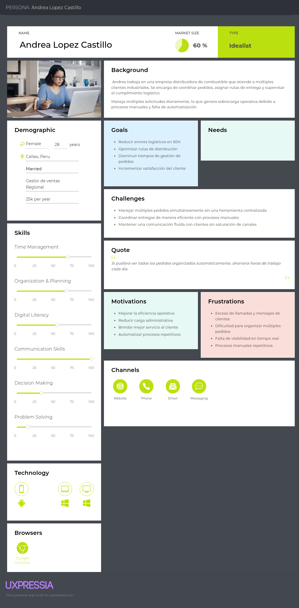
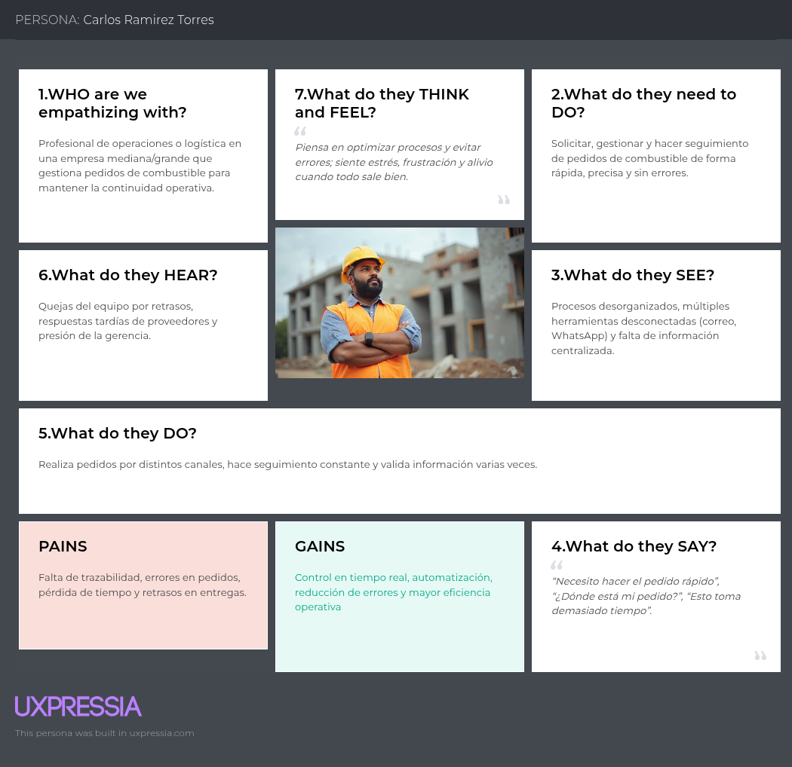
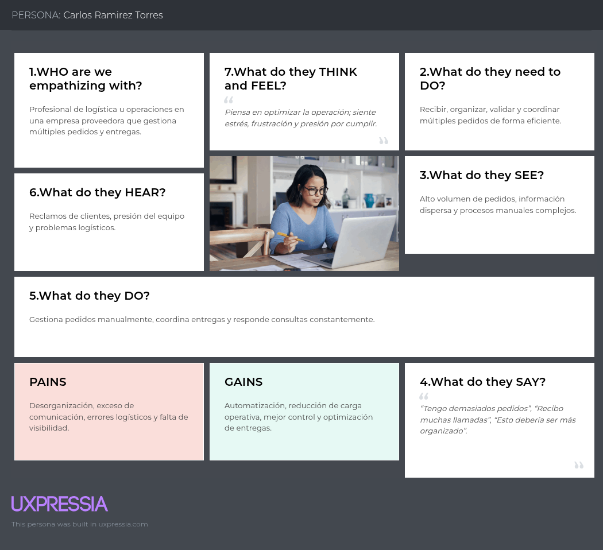
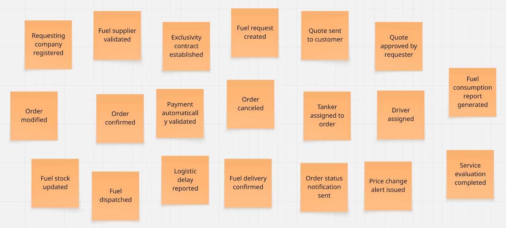

# Capítulo II: Requirements Elicitation & Analysis

## 2.1. Competidores

En el mercado existen diversas soluciones digitales enfocadas en la gestión de combustible y flotas que compiten de manera directa o indirecta con lo propuesto. Entre ellas destaca **Zavgar**, una plataforma SaaS que ayuda a las empresas con flotas vehiculares a optimizar costos y controlar el consumo de combustible. Otro competidor importante es **FuelCloud**, que ofrece una solución integrada de hardware y software para garantizar seguridad y precisión en el despacho de combustible, principalmente en empresas con tanques propios. Finalmente, **Wialon** se presenta como una plataforma internacional de gestión de flotas que combina monitoreo GPS, análisis operativos y control de combustible, dirigida a compañías logísticas y de transporte.

### 2.1.1. Análisis competitivo.

<table border="2">
  <tr>
    <th colspan="6" style="text-align:left">Competitive Analysis Landscape</th>
  </tr>
  <tr>
    <td colspan="1"><strong>¿Por qué llevar a cabo este análisis?</strong></td>
    <td colspan="5">Este análisis se está llevando a cabo porque queremos conocer las ventajas y desventajas de nuestra aplicación frente a la competencia, y cómo nos diferenciamos de ellas.</td>
  </tr>
  <tr>
    <td colspan="2"><strong></strong></td>
    <td><strong>Tank Master</strong> </td>
    <td><strong>Zavgar</strong> </td>
    <td><strong>FuelCloud</strong> </td>
    <td><strong>Wialon</strong> </td>
  </tr>

  <tr>
    <th rowspan="3">Perfil</th>
    <td><strong>Visión general</strong></td>
    <td>Plataforma web que digitaliza y estructura el proceso completo de pedido de combustible entre empresas y proveedores.</td>
    <td>SaaS para la gestión de consumo de combustible de flotas, con enfoque en eficiencia, monitoreo y costos.</td>
    <td>Solución con hardware/software para el control físico del despacho de combustible.</td>
    <td>Plataforma de gestión de flotas con control de combustible, GPS y reportes operativos.</td>
  </tr>
  <tr>
    <td><strong>Ventaja competitiva</strong></td>
    <td>Especialización en el flujo completo de pedido, despacho y análisis; integración de pagos y logística; UI intuitiva.</td>
    <td>No requiere hardware; ofrece métricas, control de gastos y reportes sobre consumo.</td>
    <td>Control físico preciso del combustible, monitoreo en tiempo real.</td>
    <td>Seguimiento en tiempo real, visualización de rutas, integración con sensores de combustible.</td>
  </tr>
  <tr>
    <td><strong>¿Qué valor ofrece al cliente?</strong></td>
    <td>Trazabilidad total, eficiencia operativa, reportes de consumo y validación segura de pedidos.</td>
    <td>Optimización de costos y control sobre el uso de combustible en flotas.</td>
    <td>Seguridad y precisión operativa en el control de combustible.</td>
    <td>Trazabilidad de flotas, alertas automáticas, análisis de rutas y consumo de combustible.</td>
  </tr>
  <tr>
    <th rowspan="2">Perfil de Marketing</th>
    <td><strong>Mercado objetivo</strong></td>
    <td>Empresas que solicitan combustible a proveedores.</td>
    <td>Empresas con flotas vehiculares que desean monitorear y reducir el consumo de combustible.</td>
    <td>Empresas con tanques de combustible propios.</td>
    <td>Empresas logísticas, distribuidoras y de transporte de combustible.</td>
  </tr>
  <tr>
    <td><strong>Estrategias de marketing</strong></td>
    <td>Alianzas con proveedores, demostraciones de ahorro, marketing de contenido enfocado en eficiencia.</td>
    <td>Enfoque digital, contenido técnico, integración con proveedores de tarjetas de combustible.</td>
    <td>Ferias industriales, distribuidores, venta consultiva entre empresas.</td>
    <td>Alianzas con distribuidores de GPS, marketing técnico, ferias de transporte.</td>
  </tr>
  <tr>
    <th rowspan="3">Perfil de Producto</th>
    <td><strong>Productos & Servicios</strong></td>
    <td>Plataforma para gestión completa de pedidos, seguimiento, reportes, validación y alertas.</td>
    <td>Plataforma web con módulo de abastecimiento, reportes de consumo, integración GPS y tarjetas.</td>
    <td>Hardware IoT y software para gestión, y control de combustible.</td>
    <td>Plataforma SaaS + app móvil con monitoreo, alertas, mapas y módulos personalizables.</td>
  </tr>
  <tr>
    <td><strong>Precios & Costos</strong></td>
    <td>Modelo SaaS con suscripción escalable según volumen y servicios.</td>
    <td>SaaS con modelos por flota activa o vehículos monitoreados.</td>
    <td>Venta e instalación de hardware + licencias de software.</td>
    <td>Modelo SaaS modular, basado en vehículos activos y funcionalidades activadas.</td>
  </tr>
  <tr>
    <td><strong>Canales de distribución</strong></td>
    <td>Web app responsive, potencial app móvil futura.</td>
    <td>Web app, marketing digital y comunidad de flotas.</td>
    <td>Plataforma web + hardware instalado en sitio.</td>
    <td>Red de partners global, distribuidores locales e integradores de sistemas GPS.</td>
  </tr>
  <tr>
    <th rowspan="4">Análisis SWOT</th>
    <td><strong>Fortalezas</strong></td>
    <td>Enfoque especializado, experiencia de usuario optimizada, integraciones clave, análisis avanzado de consumo.</td>
    <td>Implementación ágil, sin hardware, fácil adopción en empresas medianas.</td>
    <td>Control físico riguroso, solución probada en industrias exigentes.</td>
    <td>Plataforma robusta, cobertura internacional, integración con más de 2,400 dispositivos GPS.</td>
  </tr>
  <tr>
    <td><strong>Debilidades</strong></td>
    <td>Nueva en el mercado, menor reconocimiento de marca, necesita consolidar confianza.</td>
    <td>No gestiona el flujo completo del pedido, enfoque parcial en flotas.</td>
    <td>Alto costo, dependencia de hardware, menor adaptabilidad en mercados emergentes.</td>
    <td>No gestiona pedidos entre proveedor y solicitante, requiere configuración técnica inicial.</td>
  </tr>
  <tr>
    <td><strong>Oportunidades</strong></td>
    <td>Alta informalidad en el sector, digitalización creciente en logística, necesidad de trazabilidad y control.</td>
    <td>Mayor conciencia en eficiencia de flotas y digitalización de costos operativos.</td>
    <td>Nuevos mercados industriales con enfoque en seguridad y control.</td>
    <td>Creciente necesidad de control logístico y monitoreo de distribución en países en desarrollo.</td>
  </tr>
  <tr>
    <td><strong>Amenazas</strong></td>
    <td>Aparición de soluciones similares, resistencia al cambio en empresas tradicionales, competencia ERP.</td>
    <td>SaaS especializados con mayor cobertura funcional (ERP, proveedores, logística).</td>
    <td>SaaS ágiles y sin hardware físico, que ofrecen soluciones más accesibles.</td>
    <td>SaaS más específicos y ligeros, enfocados exclusivamente en la trazabilidad de entregas.</td>
  </tr>
</table>

### 2.1.2. Estrategias y tácticas frente a competidores.

**PrimeFuel** aplicará diversas estrategias para afrontar la competencia y aprovechar las oportunidades que ofrece el sector.

#### a. Diferenciación a través de especialización
Una de las principales estrategias de **PrimeFuel** es la **especialización en el flujo completo de pedido de combustible**. A diferencia de soluciones como **Zavgar**, que están orientadas principalmente al control y análisis del consumo de combustible en flotas, nuestra plataforma se enfoca en las **interacciones B2B** entre empresas solicitantes y proveedores. Esto nos permite ofrecer un control dedicado del pedido, gestión de la logística, y reportes detallados de consumo y entregas, lo cual no está presente en la mayoría de las plataformas competidoras.

- **Táctica**: Desarrollar funcionalidades para la validación automática de pagos, gestión de stock en tiempo real y la optimización del transporte logrando la automatización de procesos que solo eran logrados de forma manual. Esto crea una ventaja frente a competidores como **FuelCloud**, que se centran más en el control físico del combustible y menos en la administración a nivel operativo.

#### b. Innovación en la interfaz de usuario y experiencia

El sistema de **PrimeFuel** está diseñado para ofrecer una **experiencia de usuario optimizada**, algo que **Wialon**, **FuelCloud** y la propia **OSINERGMIN** no abordan en sus plataformas. Al ser una solución especializada y dirigida a una tarea específica, podemos dedicar más recursos en crear una interfaz intuitiva y procesos bien definidos brindando comodidad y seguridad a nuestros usuarios.

- **Táctica**: Diseñar una **interfaz intuitiva y consistente** que permita a los usuarios acceder a reportes de consumo, validar pedidos y coordinar logística con facilidad. Además, ofrecer **soporte y formación continua** para asegurar que los usuarios aprovechen al máximo todas las funcionalidades del sistema.

#### c. Flexibilidad en precios y modelo SaaS escalable
El modelo de precios de **PrimeFuel** ofrece **planes escalables basados en suscripción**, lo que hace que sea más accesible para medianas y grandes empresas. Esto es más competitivo frente a **Wialon**, que puede no ser una opción viable para empresas que solo requieren una solución de pedidos de combustible. También es más asequible que **FuelCloud**, que requiere una inversión considerable en hardware, instalación y mantenimiento.

- **Táctica**: Ofrecer un modelo de suscripción flexible y **precios competitivos**, con **múltiples niveles de suscripción** adaptados a las necesidades de diferentes empresas. Esto permitirá que empresas de menor tamaño puedan acceder a la plataforma sin comprometer su presupuesto, a la vez que se asegura el crecimiento a largo plazo a medida que la empresa crece.

#### d. Aprovechamiento de la digitalización en la logística
El sector de la logística está experimentando una transformación digital acelerada. **PrimeFuel** se aprovechará de esta tendencia buscando la integración de la plataforma con otras soluciones logísticas (como los sistemas de gestión de vehículos o flotas). De esta forma podemos ofrecer una solución más completa y eficiente.

- **Táctica**: Colaborar con empresas de **gestión de flotas** para optimizar el proceso de asignación de vehículos, cisternas y choferes. También se considerará la posibilidad de integrar **sensores IoT** en los camiones de reparto para un control más preciso sobre el combustible transportado y la entrega.

#### e. Expansión hacia mercados internacionales
Si bien **PrimeFuel** está inicialmente orientada a empresas locales, el modelo de negocio y la flexibilidad de la plataforma la hacen ideal para expandirse a **mercados internacionales**. Competidores como **Wialon** ya tienen presencia en mercados globales, pero su enfoque en empresas grandes y sus altos costos de implementación pueden ser una barrera para empresas de menor tamaño, limitando su alcance.

- **Táctica**: Iniciar la expansión en mercados emergentes donde la digitalización en la logística es una necesidad creciente. Esto incluirá la **localización de la plataforma** (idioma, moneda, regulaciones locales) para facilitar la adaptabilidad de los nuevos mercados.

## 2.2. Entrevistas.

### 2.2.1. Diseño de entrevistas.

**A. Proveedores de Combustible**

**Preguntas:**

1. ¿Cuál es su cargo dentro de la empresa proveedora?
2. ¿Qué tipos de clientes atienden principalmente (logística, construcción, minería, agroindustria)?
3. ¿Qué volumen de operaciones realizan mensualmente?
4. ¿Cómo gestionan actualmente los pedidos y contratos de sus clientes?
5. ¿Qué problemas han experimentado con los métodos tradicionales (llamadas, correos, planillas)?
6. ¿Utilizan algún software especializado para ventas o logística? 
7. ¿Qué características valoraría más en una plataforma digital para gestionar pedidos?
8. ¿Considera que una solución que centralice cotizaciones, contratos y entregas sería útil para su empresa?
9. ¿Qué tan importante es para ustedes tener reportes históricos y comparativos de ventas?
10. ¿Qué estrategias usan actualmente para fidelizar clientes, y cómo cree que una plataforma como NombredelaStartup podría apoyarlos?

---

**B. Empresas Solicitantes**

**Preguntas:**

1. ¿Cuál es su cargo en la empresa? 
2. ¿Hace cuánto tiempo trabaja en el sector energético/logístico? 
3. ¿Qué volumen de combustible gestionan aproximadamente al mes? 
4. ¿Cómo gestionan actualmente la compra y control de combustible? 
5. ¿Qué herramientas usan (Excel, llamadas, correos, sistemas propios)? 
6. ¿Cuáles son los principales problemas que enfrentan con su sistema actual?
7. ¿Qué tan importante es para usted contar con trazabilidad en tiempo real? 
8. ¿Qué dispositivos utilizan para gestionar pedidos (PC, móvil, tablet)? 
9. ¿Qué información considera más valiosa al momento de comprar combustible (precio, tiempo de entrega, historial de proveedor, etc.)? 
10. ¿Cómo afecta la falta de transparencia en los precios a sus decisiones de compra? 
11. ¿Le interesaría recibir notificaciones en tiempo real sobre cambios de precio o estado de sus pedidos? 
12. ¿Qué barreras considera que dificultarían implementar una solución digital como NombredelaStartup en su empresa?

### 2.2.2 Registro de entrevistas

**1. Segmento 1: Empresas solicitantes de combustible**

- Entrevista 1:

| Campo                    | Detalle |
|-------------------------|---------|
| **Nombre entrevistado** | Kevyn Anthony Asto Jacome |
| **Edad**               | 32 |
| **Departamento**       | Lima |
| **Inicio del video**   | 00:00 |
| **Fin del video**      | 06:57 |
| **Link del video**     | https://upcedupe-my.sharepoint.com/:v:/g/personal/u20241c630_upc_edu_pe/IQCKV9lpC3LTSYq8V0HBefpVAS_fcsy2aqA-XEwNtES_c3g?nav=eyJyZWZlcnJhbEluZm8iOnsicmVmZXJyYWxBcHAiOiJPbmVEcml2ZUZvckJ1c2luZXNzIiwicmVmZXJyYWxBcHBQbGF0Zm9ybSI6IldlYiIsInJlZmVycmFsTW9kZSI6InZpZXciLCJyZWZlcnJhbFZpZXciOiJNeUZpbGVzTGlua0NvcHkifX0&e=uQEHe9 |
| **Foto entrevista**    |  |
| **Resumen**           | El entrevistado se desempeña como analista y asignador de control de producción, con experiencia en logística y operaciones desde 2017. Gestiona un volumen aproximado de 20,000 a 21,000 m³ de combustible mensuales destinados tanto a calderas como a equipos móviles (montacargas). Actualmente, la gestión se realiza mediante proveedores específicos, utilizando gas natural para planta y tanques para equipos móviles, coordinado principalmente por correos y llamadas, con planificación diaria, semanal y mensual que requiere verificación manual constante. Entre los principales problemas destacan los desabastecimientos, tanto por factores externos (escasez nacional) como por fallas del proveedor, generando paralizaciones operativas. La trazabilidad en tiempo real es clave por su impacto en la continuidad operativa. En la toma de decisiones, se priorizan el tiempo de entrega y el compromiso del proveedor sobre el precio, aunque este último cobra relevancia en escenarios de escasez (ej. GLP). Muestra interés en soluciones digitales, especialmente notificaciones sobre estado de pedidos y tiempos de entrega, sin percibir grandes barreras de implementación. |

- Entrevista 2:

| Campo                    | Detalle |
|-------------------------|---------|
| **Nombre entrevistado** | Renato Guillermo Calvo Yalan |
| **Edad**               | 22 |
| **Departamento**       | Lima |
| **Inicio del video**   | 00:00 |
| **Fin del video**      | 07:17 |
| **Link del video**     | https://upcedupe-my.sharepoint.com/:v:/g/personal/u20241c630_upc_edu_pe/IQDS2Yop64CbRLtW82ISOuc4AU56u40anOCvBotRFMydvE4?nav=eyJyZWZlcnJhbEluZm8iOnsicmVmZXJyYWxBcHAiOiJTdHJlYW1XZWJBcHAiLCJyZWZlcnJhbFZpZXciOiJTaGFyZURpYWxvZy1MaW5rIiwicmVmZXJyYWxBcHBQbGF0Zm9ybSI6IldlYiIsInJlZmVycmFsTW9kZSI6InZpZXcifX0%3D&e=Jgu6ZG |
| **Foto entrevista**    |  |
| **Resumen**           | El entrevistado se desempeña como asistente de logística en una empresa de transporte de carga mediana, con más de dos años de experiencia en el sector, y gestiona un volumen aproximado de 8,000 a 12,000 unidades de combustible mensuales, dependiendo de la demanda operativa. Su labor principal consiste en coordinar pedidos y realizar el seguimiento de entregas, utilizando actualmente un sistema basado en contratos directos con proveedores, gestionado mediante llamadas, WhatsApp y registros en Excel, sin el uso de un sistema integrado. Entre los principales problemas identificados destacan la desorganización de la información, errores en los pedidos, falta de claridad en los datos, inconsistencias en los precios y una considerable pérdida de tiempo en la verificación y validación manual de la información. La trazabilidad en tiempo real es considerada muy importante, ya que permitiría un mayor control sobre los pedidos y el suministro. El uso de dispositivos se centra principalmente en teléfonos móviles para la comunicación y gestión operativa. En cuanto a los factores de decisión, el precio y el tiempo de entrega son los más relevantes, seguidos por la confianza en el proveedor. La falta de transparencia en los precios genera desconfianza y dificulta la comparación entre opciones, afectando negativamente la toma de decisiones. El entrevistado muestra interés en recibir notificaciones en tiempo real, especialmente sobre cambios de precios, para poder reaccionar oportunamente. Finalmente, identifica como principales barreras para la adopción de una solución digital la resistencia al cambio del personal y el tiempo requerido para adaptarse a una nueva forma de trabajo. |

- Entrevista 3:

| Campo                    | Detalle |
|-------------------------|---------|
| **Nombre entrevistado** | Denis Paul Requejo Sanchez |
| **Edad**               | 34 |
| **Departamento**       | Lima |
| **Inicio del video**   | 00:00 |
| **Fin del video**      | 05:35 |
| **Link del video**     | https://upcedupe-my.sharepoint.com/:v:/g/personal/u20241c630_upc_edu_pe/IQD9W1DrB9WQS4N8_M5GJPorAXnVh-sF_SPbza6v5m4C4_A?nav=eyJyZWZlcnJhbEluZm8iOnsicmVmZXJyYWxBcHAiOiJPbmVEcml2ZUZvckJ1c2luZXNzIiwicmVmZXJyYWxBcHBQbGF0Zm9ybSI6IldlYiIsInJlZmVycmFsTW9kZSI6InZpZXciLCJyZWZlcnJhbFZpZXciOiJNeUZpbGVzTGlua0NvcHkifX0&e=YbIC1j |
| **Foto entrevista**    |  |
| **Resumen**           | El entrevistado se desempeña como jefe de operaciones logísticas, con aproximadamente 8 años de experiencia en el sector, enfocado en la coordinación del abastecimiento y distribución de combustible, gestionando un volumen mensual que oscila entre 40,000 y 60,000 galones según la demanda. Actualmente, la gestión de compra y control se realiza mediante un enfoque tradicional basado en correos, llamadas y registros en hojas de Excel, complementado con el uso de WhatsApp para coordinaciones rápidas, sin contar con un sistema integrado. Entre los principales problemas identificados destacan el desorden en la información, la duplicidad de datos y la presencia de errores en los pedidos, lo que evidencia limitaciones en la eficiencia operativa. La trazabilidad en tiempo real es considerada altamente importante, ya que permitiría mejorar el control de los procesos y facilitar una respuesta oportuna ante incidencias. En cuanto a herramientas, se utilizan principalmente computadoras en oficina y dispositivos móviles en campo, reflejando una operación híbrida. Los factores más relevantes en la toma de decisiones son el precio, el tiempo de entrega y el historial de cumplimiento del proveedor. Asimismo, la falta de transparencia en los precios genera desconfianza y dificulta la comparación entre opciones. El entrevistado muestra una actitud positiva hacia el uso de notificaciones en tiempo real, destacando su utilidad para mejorar la planificación y la toma de decisiones. Finalmente, identifica como principales barreras para la adopción de una solución digital la resistencia al cambio por parte del personal y el tiempo requerido para su capacitación. |

**2. Segmento 2: Proveedores de combustible**

- Entrevista 1:

| Campo                    | Detalle |
|-------------------------|---------|
| **Nombre entrevistado** | Franceso |
| **Edad**               | 20 |
| **Departamento**       | Lima |
| **Inicio del video**   | 00:00 |
| **Fin del video**      | 05:48 |
| **Link del video**     | https://upcedupe-my.sharepoint.com/:v:/g/personal/u20241c630_upc_edu_pe/IQDS2Yop64CbRLtW82ISOuc4AU56u40anOCvBotRFMydvE4?nav=eyJyZWZlcnJhbEluZm8iOnsicmVmZXJyYWxBcHAiOiJPbmVEcml2ZUZvckJ1c2luZXNzIiwicmVmZXJyYWxBcHBQbGF0Zm9ybSI6IldlYiIsInJlZmVycmFsTW9kZSI6InZpZXciLCJyZWZlcnJhbFZpZXciOiJNeUZpbGVzTGlua0NvcHkifX0&e=0GD1zP |
| **Foto entrevista**    |  |
| **Resumen**           | El entrevistado se desempeña como asistente comercial en una empresa distribuidora de combustibles B2B, con aproximadamente un año de experiencia, encargándose de la gestión de clientes, cotizaciones y seguimiento de pedidos, atendiendo principalmente a empresas de transporte y logística, y en menor medida del sector construcción. La empresa maneja un volumen mensual de entre 10,000 y 18,000 galones, dependiendo de la demanda. Actualmente, los pedidos se gestionan mediante WhatsApp y correo electrónico, registrándose posteriormente en hojas de Excel, mientras que los contratos se almacenan en documentos separados, sin integración entre estos elementos. Entre los principales problemas identificados destacan la presencia de errores debido a información incompleta o mal registrada, la pérdida de tiempo en la búsqueda y validación de datos, y la falta de claridad sobre el estado de los pedidos. No cuentan con un sistema especializado, utilizando únicamente herramientas básicas como Excel y canales de comunicación tradicionales. El entrevistado valora especialmente que una solución digital sea sencilla, centralice la información, reduzca errores y permita visualizar el estado de las entregas en tiempo real. Asimismo, considera que integrar cotizaciones, contratos y pedidos en una sola plataforma sería altamente beneficioso para mejorar el control y la organización. Destaca también la importancia de contar con reportes históricos y comparativos para analizar el comportamiento de los clientes y optimizar la planificación de ventas. Finalmente, señala que la fidelización de clientes se basa en la rapidez de atención y el cumplimiento, y que una plataforma digital podría contribuir a mejorar la transparencia, profesionalizar el servicio y fortalecer la relación con los clientes. |

- Entrevista 2:

| Campo                    | Detalle |
|-------------------------|---------|
| **Nombre entrevistado** | Carlos Mendoza |
| **Edad**               | 50 |
| **Departamento**       | Lima |
| **Inicio del video**   | 00:00 |
| **Fin del video**      | 04:41 |
| **Link del video**     | https://upcedupe-my.sharepoint.com/:v:/g/personal/u20241c630_upc_edu_pe/IQAc_YdFgDxbSIN6wUPQrIZ-ARLL0hIcgJwoS9AJHEcnpD4?e=fdVXa8&nav=eyJyZWZlcnJhbEluZm8iOnsicmVmZXJyYWxBcHAiOiJTdHJlYW1XZWJBcHAiLCJyZWZlcnJhbFZpZXciOiJTaGFyZURpYWxvZy1MaW5rIiwicmVmZXJyYWxBcHBQbGF0Zm9ybSI6IldlYiIsInJlZmVycmFsTW9kZSI6InZpZXcifX0%3D |
| **Foto entrevista**    |  |
| **Resumen**           | El entrevistado se desempeña como jefe de logística y operaciones comerciales, con responsabilidad sobre todo el flujo desde la solicitud del cliente hasta la entrega final del combustible, atendiendo principalmente a clientes de gran volumen en sectores como minería y agroindustria, que representan cerca del 90% de su cartera. Maneja un volumen mensual de entre 40,000 y 60,000 galones, operando bajo contratos marco anuales donde los pedidos se reciben mediante órdenes de compra enviadas por correo electrónico. El proceso incluye validaciones internas como revisión de crédito en sistemas ERP y posterior programación de la flota, lo que introduce múltiples puntos de fricción. Entre los principales problemas destacan la falta de trazabilidad en tiempo real, retrasos por burocracia interna, dependencia de correos que pueden quedar sin atención, y la necesidad constante de coordinar manualmente información con choferes para responder a clientes, lo que genera ineficiencia y sobrecarga operativa. Aunque cuentan con sistemas para contabilidad y GPS para flota, estos no están integrados, lo que limita la visibilidad completa del proceso. El entrevistado valora altamente soluciones que integren automáticamente pedidos, validaciones y despachos, permitiendo al cliente subir órdenes, validar condiciones y rastrear entregas en tiempo real sin intermediación. Asimismo, considera clave contar con reportes dinámicos para análisis de desempeño, consumo por zonas y tiempos de entrega. Señala que una plataforma centralizada representaría un salto importante en la madurez digital de la empresa, permitiendo escalar operaciones sin incrementar significativamente el personal. Finalmente, destaca que la fidelización en su sector depende del cumplimiento estricto y la ausencia de fallas, y que una solución digital podría convertirse en una ventaja competitiva al ofrecer mayor transparencia, control y posicionamiento como socio tecnológico ante sus clientes. |

- Entrevista 3:

| Campo                    | Detalle |
|-------------------------|---------|
| **Nombre entrevistado** | Lucia Fernandez |
| **Edad**               | 21 |
| **Departamento**       | Lima |
| **Inicio del video**   | 00:00 |
| **Fin del video**      | 04:44 |
| **Link del video**     | https://upcedupe-my.sharepoint.com/:v:/g/personal/u20241c630_upc_edu_pe/IQAVGJhcIxtqRpfX4RZjsRWyASN4B5-P0T-EiUi1238xlu4?e=X46Kf3&nav=eyJyZWZlcnJhbEluZm8iOnsicmVmZXJyYWxBcHAiOiJTdHJlYW1XZWJBcHAiLCJyZWZlcnJhbFZpZXciOiJTaGFyZURpYWxvZy1MaW5rIiwicmVmZXJyYWxBcHBQbGF0Zm9ybSI6IldlYiIsInJlZmVycmFsTW9kZSI6InZpZXcifX0%3D |
| **Foto entrevista**    |  |
| **Resumen**           | La entrevistada se desempeña como gerenta de ventas en una empresa proveedora de combustible, asumiendo además funciones relacionadas con operaciones y cobranzas, atendiendo principalmente a clientes del sector transporte y logística, como flotas de camiones y talleres con tanques propios. Maneja un volumen mensual de entre 25,000 y 40,000 galones, con una gestión de pedidos altamente dependiente de canales informales como WhatsApp y llamadas telefónicas, mientras que la información se transfiere manualmente a hojas de Excel compartidas con el área de despacho. Los contratos de mayor escala se gestionan por correo, pero la operación diaria se basa principalmente en comunicación directa. Entre los principales problemas identificados destacan la pérdida de pedidos por saturación de mensajes, errores al transcribir información al sistema, y demoras en procesos como facturación y coordinación interna. Aunque cuentan con un sistema contable, no disponen de herramientas integradas para la gestión logística, dependiendo en gran medida de Excel y la memoria operativa del equipo. La entrevistada valora especialmente soluciones digitales que sean simples e intuitivas, adaptadas a usuarios no técnicos, permitiendo registrar pedidos de forma rápida y visualizar la información organizada por prioridad. Considera que una plataforma que centralice pedidos, contratos y entregas sería altamente beneficiosa, ya que reduciría errores y optimizaría el tiempo de gestión. Asimismo, destaca la importancia de contar con reportes históricos para mejorar la planificación y negociación con proveedores, y señala que la fidelización de clientes se basa en el trato directo y el acceso a crédito, pudiendo fortalecerse mediante herramientas que brinden mayor transparencia, visibilidad del estado de cuenta y seguimiento en tiempo real de los pedidos. |

### 2.2.3 Análisis de entrevistas
En esta sección se presenta el análisis detallado de la información recolectada. Para cada segmento, se explican los hallazgos objetivos y subjetivos, seguidos de su interpretación para el desarrollo de la solución.

### Segmento 1: Empresas Solicitantes de Combustible

**Análisis de Características Objetivas y Subjetivas:** El análisis evidencia una digitalización parcial pero desarticulada. El 100% de los entrevistados gestiona sus pedidos mediante herramientas informales como llamadas, correos electrónicos y WhatsApp, mientras que el 100% utiliza Excel como principal herramienta de registro. Sin embargo, no existe integración entre estas herramientas, lo que genera duplicidad de información y procesos manuales constantes. En términos operativos, los volúmenes gestionados son altos y críticos para la continuidad del negocio, con casos que superan los 20,000 m³ mensuales.

A nivel subjetivo, el 100% de los entrevistados identifica problemas de desorganización, errores en pedidos y pérdida de tiempo en validaciones. Asimismo, el 100% considera la trazabilidad en tiempo real como un factor clave, especialmente debido al impacto directo que tiene el desabastecimiento en sus operaciones, pudiendo generar paralizaciones completas. En cuanto a la toma de decisiones, el 100% prioriza el tiempo de entrega y la confiabilidad del proveedor por encima del precio en contextos críticos. Finalmente, existe una alta disposición a adoptar soluciones digitales, aunque con la condición implícita de que sean intuitivas y no generen fricción en su flujo actual.

### Segmento 2: Proveedores de Combustible

**Análisis de Características Objetivas y Subjetivas:** El análisis revela una operación altamente fragmentada y dependiente de procesos manuales. El 100% de los proveedores recibe pedidos mediante canales informales como WhatsApp, llamadas o correos, y el 100% utiliza Excel como herramienta principal de registro. Asimismo, el 100% gestiona contratos, pedidos y despachos en sistemas separados o documentos independientes, evidenciando una falta total de integración. En algunos casos, existen sistemas adicionales como ERP o GPS, pero estos operan de forma aislada, sin conexión con la gestión comercial o logística.

Desde una perspectiva subjetiva, el 100% de los entrevistados identifica errores frecuentes derivados de información incompleta o mal registrada, así como una pérdida significativa de tiempo en la búsqueda y validación de datos. Además, el 100% señala la falta de visibilidad del estado de los pedidos como un problema crítico, lo que obliga a realizar coordinaciones manuales constantes con clientes y operadores. A nivel estratégico, el 100% reconoce la importancia de contar con reportes históricos y métricas para mejorar la planificación y la toma de decisiones. Existe también un consenso en que una solución digital integrada representaría una mejora significativa en eficiencia operativa, escalabilidad y percepción de valor frente al cliente.

### Análisis Comparativo

**Contrastación de Segmentos:**

Al comparar ambos segmentos, se identifican coincidencias clave que validan la necesidad de la solución. En primer lugar, el 100% de ambos grupos depende de herramientas informales y no integradas (WhatsApp, correos y Excel), lo que genera ineficiencias estructurales en toda la cadena de valor. Asimismo, el 100% coincide en la necesidad de centralizar la información y mejorar la trazabilidad de los pedidos.

Sin embargo, existen diferencias importantes en la percepción del problema. Mientras que las empresas solicitantes experimentan el problema como un riesgo operativo crítico, donde el desabastecimiento puede detener completamente sus operaciones, los proveedores lo perciben como un problema de eficiencia y escalabilidad, relacionado con la sobrecarga operativa, errores y limitaciones para crecer sin aumentar recursos humanos.

Esta diferencia define claramente la propuesta de valor:

- Para los solicitantes: continuidad operativa y reducción de riesgo
- Para los proveedores: eficiencia, control y escalabilidad del negocio

### Conclusiones y Definición de Arquetipos

Basado en el análisis de las entrevistas, se definen los siguientes perfiles de usuario:

**User Persona Solicitante ("El Operador Crítico")**
- Rasgo clave: Prioriza la continuidad operativa y la confiabilidad por encima del costo.
- Sustento: El 100% considera la trazabilidad en tiempo real como crítica y prioriza el tiempo de entrega frente al precio.
- Necesidad principal: Evitar desabastecimientos y tener visibilidad inmediata del estado de sus pedidos.

**User Persona Proveedor ("El Gestor Saturado")**
- Rasgo clave: Busca orden y automatización para reducir carga operativa y escalar.
- Sustento: El 100% reporta desorganización, errores y procesos manuales intensivos, además de la necesidad de integrar sistemas.
- Necesidad principal: Centralizar la gestión de pedidos, contratos y despachos en una sola plataforma.

## 2.3 Needfinding
### 2.3.1 User Personas
- Segmento 1: Empresas solicitantes de combustible
  

- Segmento 2: Proveedores de Combustible
  

### 2.3.2 User Task Matrix

El User Task Matrix presenta las tareas que realizan los User Persona para cumplir sus objetivos en su día a día, independientemente de si usan nuestro software o no. Se evalúa la frecuencia y la importancia de cada tarea para identificar dónde aportar valor.

<table border="1">
  <thead>
    <tr>
      <th rowspan="2">Tarea (Task)</th>
      <th colspan="2">Empresas Solicitantes</th>
      <th colspan="2">Proveedores de Combustible</th>
    </tr>
    <tr>
      <th>Frecuencia</th>
      <th>Importancia</th>
      <th>Frecuencia</th>
      <th>Importancia</th>
    </tr>
  </thead>
  <tbody>
    <tr>
      <td>Registrar / recibir pedidos</td>
      <td>Alta</td>
      <td>Alta</td>
      <td>Alta</td>
      <td>Alta</td>
    </tr>
    <tr>
      <td>Validar información del pedido</td>
      <td>Media</td>
      <td>Alta</td>
      <td>Alta</td>
      <td>Alta</td>
    </tr>
    <tr>
      <td>Consultar / actualizar estado del pedido</td>
      <td>Alta</td>
      <td>Alta</td>
      <td>Alta</td>
      <td>Alta</td>
    </tr>
    <tr>
      <td>Modificar pedido</td>
      <td>Media</td>
      <td>Alta</td>
      <td>Baja</td>
      <td>Media</td>
    </tr>
    <tr>
      <td>Programar y planificar entregas</td>
      <td>Baja</td>
      <td>Media</td>
      <td>Alta</td>
      <td>Alta</td>
    </tr>
    <tr>
      <td>Gestionar múltiples pedidos</td>
      <td>Media</td>
      <td>Media</td>
      <td>Alta</td>
      <td>Alta</td>
    </tr>
    <tr>
      <td>Comunicarse entre cliente y proveedor</td>
      <td>Alta</td>
      <td>Alta</td>
      <td>Alta</td>
      <td>Alta</td>
    </tr>
    <tr>
      <td>Recibir / enviar notificaciones</td>
      <td>Alta</td>
      <td>Alta</td>
      <td>Alta</td>
      <td>Alta</td>
    </tr>
    <tr>
      <td>Revisar historial de pedidos</td>
      <td>Media</td>
      <td>Media</td>
      <td>Media</td>
      <td>Media</td>
    </tr>
    <tr>
      <td>Monitorear desempeño / consumo</td>
      <td>Baja</td>
      <td>Media</td>
      <td>Media</td>
      <td>Media</td>
    </tr>
    <tr>
      <td>Generar reportes y métricas</td>
      <td>Baja</td>
      <td>Media</td>
      <td>Media</td>
      <td>Media</td>
    </tr>
  </tbody>
</table>

### 2.3.3 User Journey Mapping

-Segmento 1: Empresas solicitantes de combustible

El User Journey Mapping de Carlos representa el recorrido actual que experimenta como responsable en una empresa constructora, en la gestión del abastecimiento de combustible necesario para la operación de maquinaria pesada. El mapa ilustra el proceso end-to-end, desde la identificación de la necesidad de combustible hasta la evaluación de la entrega y desempeño del proveedor.

En la situación As-Is, Carlos enfrenta un flujo de trabajo manual y poco estructurado: detecta necesidades sin apoyo de alertas, busca proveedores de manera informal, realiza pedidos mediante canales como WhatsApp o correo y da seguimiento a través de llamadas constantes. Esto genera desorden en la información, falta de trazabilidad, retrasos y una alta dependencia de la comunicación manual.

El Journey busca evidenciar los puntos críticos de su experiencia actual, identificando emociones, tareas, fricciones y oportunidades de mejora a lo largo de cada etapa (Awareness, Data Collection, Daily Management, Communication, Reporting y Evaluation). Este análisis servirá como base para diseñar una solución que centralice la información, automatice el registro de pedidos y permita el seguimiento en tiempo real.

 

-Segmento 2: Proveedores de Combustible

El User Journey Mapping de Andrea representa el recorrido actual que experimenta como coordinadora en una empresa distribuidora de combustible, encargada de gestionar múltiples pedidos, coordinar entregas y asegurar el cumplimiento logístico. El mapa ilustra el proceso end-to-end, desde la recepción de pedidos hasta la evaluación del desempeño operativo.

En la situación As-Is, Andrea enfrenta un flujo de trabajo altamente demandante y fragmentado: recibe pedidos por diversos canales, valida información manualmente, organiza rutas sin herramientas automatizadas y mantiene comunicación constante con clientes mediante llamadas y mensajes. Esto genera sobrecarga operativa, errores en la planificación, saturación en la comunicación y limitada visibilidad de métricas clave.

El Journey busca evidenciar los puntos críticos de su experiencia actual, identificando emociones, tareas, fricciones y oportunidades de mejora a lo largo de cada etapa (Awareness, Data Collection, Daily Management, Communication, Reporting y Evaluation). Este análisis servirá como base para diseñar una solución tecnológica que centralice pedidos, automatice la planificación logística y mejore la visibilidad operativa mediante indicadores y dashboards.

 

### 2.3.4 Empathy Mapping

Para la elaboración de los Empathy Maps, el equipo partió del conocimiento y observaciones recolectadas durante el análisis de los User Persona. Se colocó al centro de cada mapa al usuario correspondiente (Carlos y Andrea) y se respondieron las preguntas claves sobre su entorno, emociones, comportamientos y necesidades.

-Segmento 1: Empresas solicitantes de combustible

 

-Segmento 2: Proveedores de Combustible

 

## 2.4 Big Picture Event Storming

Para comprender a profundidad el dominio del negocio de **Prime Fuel** y alinear la visión tecnológica con las operaciones reales de compraventa y distribución de combustible, el equipo llevó a cabo una sesión de **Event Storming**. Esta técnica colaborativa nos permitió identificar los hitos clave del sistema sin adelantarnos a detalles técnicos.

### Step 1 – Free Exploration (Exploración Libre)

En esta primera etapa, el equipo realizó una lluvia de ideas desestructurada para capturar todos los **Eventos de Dominio** relevantes de la operativa logística y comercial. Utilizando notas de color naranja (*post-its*), registramos hechos que ya ocurrieron en el negocio, redactados estrictamente en tiempo pasado (ej. *Fuel request created*, *Fuel dispatched*). 

El objetivo principal fue plasmar sobre el lienzo la realidad del negocio, desde el registro de usuarios hasta el despacho físico en las cisternas, priorizando la cantidad de eventos sobre el orden cronológico o la jerarquía.

  
  
<em>Figura X: Step 1 - Exploración libre de eventos de dominio.</em>

### Step 2 – Structured Organization (Líneas de Tiempo)

Tras listar los eventos de dominio, procedimos a organizar el caos inicial estructurando los *post-its* en un flujo lógico de negocio de izquierda a derecha. Agrupamos los eventos en cuatro grandes bloques temporales que reflejan el ciclo de vida real de una operación de abastecimiento de combustible:

1. **Onboarding & Contracting:** Abarca el registro de las empresas y la formalización de los contratos de exclusividad.
2. **Order Management:** Contiene el núcleo transaccional administrativo, desde la creación de la solicitud y envío de cotizaciones, hasta la confirmación y validación financiera.
3. **Logistics & Dispatch:** Refleja la operativa física, incluyendo la asignación de cisternas (*Tanker assigned to order*), actualización de inventarios y la entrega del combustible.
4. **Monitoring & Analytics:** Agrupa los eventos asíncronos de valor agregado, como el envío de notificaciones, alertas de precios y reportes de consumo.

Esta estructura temporal nos ayudó a identificar claramente las áreas críticas donde la digitalización eliminará los actuales cuellos de botella del sector.

  
  
<em>Figura Y: Step 2 - Organización temporal por flujos de negocio.</em>

## 2.5 Ubiquitous Language

En este proyecto, cuyo objetivo principal es mejorar la eficiencia, la trazabilidad y la comunicación en la gestión y distribución de combustible a través de una plataforma web, se ha definido el siguiente lenguaje común para garantizar la claridad y la coherencia entre usuarios, desarrolladores y partes interesadas:

<table border="1">
  <thead>
    <tr>
      <th>Term</th>
      <th>Definition</th>
    </tr>
  </thead>
  <tbody>
    <tr>
      <td>Fuel Request</td>
      <td>Order generated by a client company specifying type, quantity, and delivery details of fuel.</td>
    </tr>
    <tr>
      <td>Client Company</td>
      <td>Organization that requires fuel for its operations and uses the platform to place and track orders.</td>
    </tr>
    <tr>
      <td>Fuel Supplier</td>
      <td>Company responsible for receiving, validating, and fulfilling fuel requests.</td>
    </tr>
    <tr>
      <td>Order Status</td>
      <td>Current stage of a request (e.g., pending, validated, scheduled, in delivery, completed).</td>
    </tr>
    <tr>
      <td>Order Tracking</td>
      <td>Real-time monitoring of the progress and location of a fuel delivery.</td>
    </tr>
    <tr>
      <td>Delivery Scheduling</td>
      <td>Process of assigning date, time, and logistics resources to fulfill a fuel request.</td>
    </tr>
    <tr>
      <td>Centralized Dashboard</td>
      <td>Main interface where users visualize orders, metrics, and operational status.</td>
    </tr>
    <tr>
      <td>Notification</td>
      <td>Automated message informing users about updates or changes in their fuel requests.</td>
    </tr>
    <tr>
      <td>Order History</td>
      <td>Record of past fuel requests, including details and outcomes.</td>
    </tr>
    <tr>
      <td>Logistics Planning</td>
      <td>Organization and optimization of routes, deliveries, and operational resources.</td>
    </tr>
    <tr>
      <td>Validation Process</td>
      <td>Step where the supplier confirms availability, accuracy, and feasibility of a request.</td>
    </tr>
    <tr>
      <td>Integrated Communication</td>
      <td>Built-in chat or messaging system enabling direct interaction between clients and suppliers.</td>
    </tr>
    <tr>
      <td>Operational Metrics</td>
      <td>Indicators such as delivery time, efficiency, and error rates used for performance evaluation.</td>
    </tr>
    <tr>
      <td>Report</td>
      <td>Generated document or dashboard summarizing fuel consumption, deliveries, and performance data.</td>
    </tr>
    <tr>
      <td>Session</td>
      <td>Authenticated period in which a user accesses the platform with secure credentials.</td>
    </tr>
    <tr>
      <td>Roles and Permissions</td>
      <td>Access controls that define what actions each type of user (client or supplier) can perform.</td>
    </tr>
  </tbody>
</table>

Beneficios esperados del lenguaje común:

- Facilita la comunicación entre desarrolladores, usuarios y partes interesadas del sistema.

- Mejora la comprensión de los procesos y funcionalidades principales del sistema.

- Reduce la ambigüedad y las malas interpretaciones durante el diseño y el desarrollo.

- Garantiza la coherencia en la documentación, las interfaces y la implementación.
