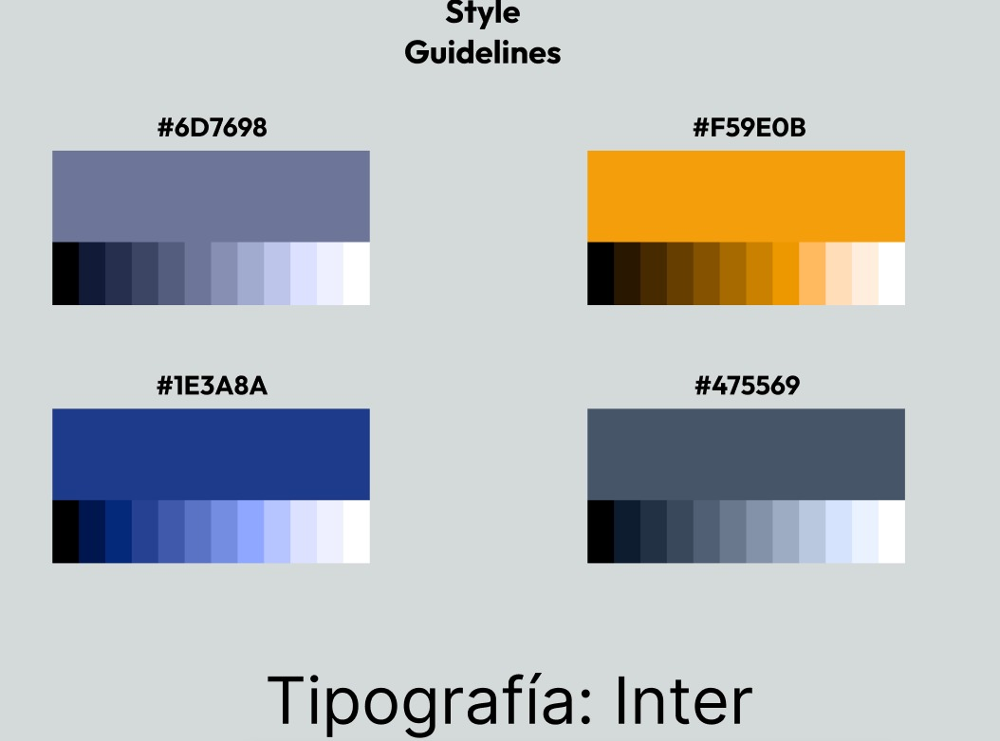

# Capítulo IV: Product Design

## 4.1 Style Guidelines
En esta sección el equipo presenta la Guía de Estilos de Prime-Fuel.

### 4.1.1 General Style Guidelines
En esta sección se definen los aspectos visuales y comunicativos que garantizan una experiencia consistente en todos los puntos de contacto de la solución TankMaster. Nuestras decisiones de diseño se basan en los principios de Material Design, adaptándolos para transmitir confianza, eficiencia y modernidad en el sector energético.

**Branding**

El logotipo de TankMaster es el eje central de nuestra identidad.

- **Concepto:** La integración de las iniciales "TM" con un indicador circular (que evoca tanto un reloj como un manómetro de combustible) simboliza los dos pilares de nuestra propuesta de valor: precisión operativa y trazabilidad en tiempo real.
  
- **Identidad Visual:** El diseño utiliza líneas geométricas sólidas para transmitir robustez y confiabilidad, características esenciales para un sistema que gestiona recursos críticos en sectores como minería y construcción.
  

  

**Typography**

Se ha seleccionado la familia tipográfica Inter para toda la plataforma.

- **Sustento:** Inter es una fuente sans-serif diseñada específicamente para pantallas de computadoras. Su alta legibilidad en tamaños pequeños es crucial para los tableros de control (dashboards) donde los usuarios deben leer cifras y estados de pedidos rápidamente sin fatiga visual.

- **Jerarquía Tipográfica:** 
  - **Headlines (Inter Bold):** Se utiliza para títulos de sección y métricas clave (KPIs), estableciendo una jerarquía visual clara.
  - **Body (Inter Regular):** Para descripciones, tablas de datos e información general.
  - **Labels (Inter Medium):** Para etiquetas de formularios y metadatos, diferenciándose sutilmente del texto de cuerpo.

**Colors**

Nuestra paleta de colores equilibra el profesionalismo corporativo con la identidad del sector energético:

- **Primary (#1E3A8A):** Un azul profundo que transmite seguridad, confianza y autoridad. Es el color base para la navegación y acciones principales, alineado al perfil B2B de la startup.
- **Secondary (#6D7698):** Un tono pizarra que aporta estabilidad visual y se utiliza en elementos de soporte para no saturar al usuario.
- **Tertiary/Accent (#F59E0B):** El color del "combustible" y la energía. Se utiliza estratégicamente para botones de acción (Call to Action), alertas críticas y estados que requieren atención inmediata.
- **Neutral (#475569):** Utilizado para textos secundarios y fondos, garantizando un contraste adecuado para la accesibilidad.
  

**Estilos**

  

**Spacing**

Siguiendo los lineamientos de Material Design, implementamos un sistema de rejilla basado en una unidad base de 8dp.

- **Decisión:** Todos los márgenes, rellenos (padding) y dimensiones de componentes son múltiplos de 8. Esto asegura que la interfaz sea adaptable (responsive) y que los elementos tengan "aire" suficiente, reduciendo la carga cognitiva de los operadores logísticos que manejan múltiples pedidos simultáneamente.
  

**Tone of Voice and Language**

Dado que interactuamos con gerentes de logística y proveedores industriales, el tono de TankMaster se define en las siguientes dimensiones:

- **Serio:** El manejo de combustibles implica altos costos y riesgos; la comunicación debe ser precisa y técnica.
- **Formal:** Mantenemos un estándar corporativo para generar respeto y profesionalismo entre empresas (B2B).
- **Respetuoso:** Las notificaciones y mensajes de error son constructivos y amables, evitando tecnicismos innecesarios que confundan al usuario.
- **Sereno:** Buscamos transmitir calma y control, especialmente en situaciones de retrasos logísticos, mediante interfaces limpias y mensajes directos.

### 4.1.2 Web Style Guidelines
Esta sección detalla los estándares de diseño de interfaz y comportamiento de interacción para la plataforma web de TankMaster, asegurando una experiencia fluida tanto en navegadores de escritorio como en dispositivos móviles.

**1. Grid and Breakpoints**
  - Para garantizar que la interfaz sea responsive, adoptamos el sistema de rejilla de Material Design basado en columnas:

  - **Desktop (1200px)**: Layout de 12 columnas con márgenes laterales de 24dp.

  - **Mobile (360px - 599px)**: Layout de 4 columnas, donde los elementos se apilan verticalmente para facilitar el scroll con una sola mano.

  - **Spacing**: Se mantiene la unidad base de 8dp para todos los componentes, asegurando consistencia visual en cualquier resolución.
  
**2. UI Components (Angular Material)**

Se utiliza la biblioteca de componentes de Angular Material para estandarizar la interacción:

- **Buttons:** Los botones principales (como Create Order) utilizan el estilo mat-raised-button con nuestro color primario (#1E3A8A). Los botones de advertencia o acciones secundarias utilizan mat-stroked-button.

- **Form Fields:** Los campos de entrada de datos emplean el estilo "Outline" para mejorar la legibilidad en entornos industriales, incluyendo iconos descriptivos para guiar al usuario.

- **Cards:** La información de los pedidos se organiza en mat-card para separar visualmente cada transacción y permitir una lectura rápida.

**3. Interaction States and Feedback**

Los estándares de interacción definen cómo responde el sistema a las acciones del usuario:

- **Hover States:** En la versión Desktop, los elementos interactuables (botones, filas de tabla) cambian su elevación o tono de color ligeramente al pasar el cursor, indicando que son clickeables.

- **Active/Focus States:** Siguiendo las guías de accesibilidad, cada elemento enfocado mediante el teclado tendrá un anillo de enfoque claro.

- **Loading States:** Durante la carga de datos masivos de combustible, se utilizarán mat-progress-spinner o skeletons para informar al usuario que el proceso está en curso.

**4. Responsive Navigation**

- **Desktop:** Se utiliza un Sidebar (menú lateral) fijo para acceso rápido a Dashboard, Orders, e History.

- **Mobile:** El Sidebar se oculta automáticamente y es accesible a través de un "hamburger menu" en la parte superior izquierda, maximizando el espacio para la visualización de datos críticos.

## 4.2 Information Architecture
Esta sección describe los aspectos clave de la estructura y el etiquetado del aplicativo.

### 4.2.1. Organization Systems

En la plataforma TankMaster, se emplean distintos sistemas de organización del contenido con el objetivo de optimizar la navegación y facilitar la gestión de pedidos de combustible tanto para solicitantes como para proveedores. Estos sistemas permiten estructurar la información de manera clara, asegurando que los usuarios puedan interactuar con la plataforma de forma eficiente. A continuación, se describen los enfoques utilizados:

#### Organización Visual del Contenido

**Jerárquica (Visual Hierarchy):**
La organización jerárquica se aplica en secciones clave como el dashboard, formularios de registro de pedidos y paneles de gestión. Se priorizan visualmente elementos como estados de pedidos, KPIs y botones de acción (por ejemplo, “Registrar pedido” o “Aprobar pedido”), utilizando tamaños de texto, colores y distribución espacial para guiar la atención del usuario hacia las acciones más relevantes.

**Secuencial (Step-by-Step to Accomplish):**
En procesos que requieren múltiples pasos, como el registro de empresas, la creación de pedidos o la asignación logística (vehículo y conductor), se utiliza un flujo secuencial. Esto permite que los usuarios completen cada etapa de forma ordenada, reduciendo errores y asegurando la correcta ejecución de las operaciones dentro del sistema.

#### Esquemas de Categorización de Contenido

**Por Audiencia (Roles de Usuario):**
TankMaster distingue principalmente entre dos tipos de usuarios: solicitantes y proveedores.

- Los solicitantes tienen acceso a funcionalidades como registro de pedidos, seguimiento de estado, historial y pagos.
- Los proveedores gestionan pedidos, validan pagos, asignan recursos logísticos y generan reportes.

La interfaz y navegación se adaptan según el rol, mostrando únicamente las opciones relevantes para cada tipo de usuario, lo que mejora la usabilidad y reduce la complejidad.

**Por Tópicos:**
El contenido también se organiza por categorías funcionales dentro de la plataforma, tales como:

- Gestión de pedidos
- Logística y despacho
- Reportes y analytics
- Soporte y contacto

Esto permite a los usuarios localizar rápidamente las herramientas o información que necesitan, especialmente en módulos como soporte o reportes.

#### Implementación en la Interfaz

La organización jerárquica y secuencial se refleja en dashboards estructurados, formularios progresivos y vistas detalladas de pedidos, donde la información se presenta de forma clara y priorizada.

Por otro lado, la categorización por audiencia y por tópicos se implementa mediante menús de navegación dinámicos, paneles diferenciados por rol y secciones claramente delimitadas. El uso de componentes visuales como tarjetas, tablas y estados (pendiente, aprobado, despachado, etc.) permite una lectura rápida y eficiente del sistema.

Este enfoque garantiza que la experiencia en TankMaster sea intuitiva, escalable y alineada con las necesidades operativas de cada tipo de usuario, facilitando tanto la gestión como la toma de decisiones dentro de la plataforma.

### 4.2.2 Labeling Systems
En TankMaster, el sistema de etiquetado ha sido diseñado priorizando la simplicidad y la reducción de la carga cognitiva de los operadores logísticos y proveedores. Se han seleccionado etiquetas descriptivas de una o dos palabras para evitar confusión y agilizar la navegación.

1. **Landing Page Labels**
Las etiquetas del sitio web estático buscan guiar al visitante rápidamente hacia la propuesta de valor y la conversión:

- **Home**: Representa la página principal y el resumen de la propuesta de valor.

- **About Us**: Agrupa la información sobre la misión, visión y el equipo detrás de Prime Fuel.

- **Frecuency Asked Questions**: Agrupa las preguntas frecuentes sobre el servicio.

- **Pricing**: Agrupa los planes de suscripción y costos del servicio SaaS.

- **Contact Us**: Indica el espacio para canales de comunicación directa (correo, teléfono).
  
2. **Web Application Labels (Dashboard & Navigation)**
Las etiquetas dentro de la aplicación están diseñadas para que perfiles como Carlos o Andrea encuentren las funcionalidades operativas sin esfuerzo:

- **Dashboard**: Representa el panel principal con los KPIs y métricas clave resumidas.

- **Orders**: Etiqueta general que agrupa tanto el historial como la creación de nuevos pedidos de combustible.

- **Fleet / Vehicles**: Agrupa la gestión de las cisternas y conductores asignados para los despachos.

- **Reports**: Asocia las funcionalidades de descarga de documentos en PDF, gráficos de consumo y análisis de ventas.

- **Settings**: Representa las configuraciones de perfil de usuario, seguridad y preferencias de la cuenta.

3. **Status Labels (Estados de Pedido)**
Para evitar confusiones en el seguimiento en tiempo real, se estandarizan las siguientes etiquetas de estado:

- **Pending**: Pedido creado pero aún no revisado/aprobado por el proveedor.

- **Approved**: Pagos validados y pedido aceptado.

- **In Transit**: El vehículo con el combustible ha sido despachado.

- **Completed**: El cliente ha confirmado la recepción satisfactoria del combustible.

### 4.2.3. SEO Tags and Meta Tags

En la plataforma TankMaster, se implementan etiquetas SEO (Search Engine Optimization) y Meta Tags dentro del < head > del sitio web con el objetivo de mejorar la visibilidad en motores de búsqueda como Google, así como optimizar la presentación de la página en diferentes dispositivos y contextos.

Estas etiquetas permiten describir el contenido del sitio, definir su comportamiento en navegadores y facilitar que los usuarios encuentren la plataforma cuando buscan soluciones relacionadas con la gestión de pedidos de combustible.

A continuación, se describen las principales etiquetas utilizadas:

**Meta Tags Básicas**

- charset="utf-8": Define la codificación de caracteres, asegurando que el contenido se muestre correctamente (incluyendo acentos y caracteres especiales).
- viewport: Permite que la página sea responsive, adaptándose a dispositivos móviles, tablets y desktops.

**SEO Tags**

- title: Define el título de la página que aparece en los resultados de búsqueda. Es clave para atraer la atención del usuario.
- meta description: Proporciona un resumen del contenido del sitio. Influye directamente en el CTR (Click Through Rate).
- meta keywords: Incluye palabras clave relacionadas con el sistema, facilitando su indexación en buscadores.
- meta author: Indica el equipo o autor responsable del desarrollo del sitio.

**Optimización de Recursos**

- Preconnect (Google Fonts): Mejora el rendimiento al establecer conexiones anticipadas con servidores externos.
- CSS e íconos: Se integran librerías como Bootstrap e iconos para mantener consistencia visual.
- Favicon: Representa visualmente la plataforma en pestañas del navegador.

Estructura esperada:

    < head>
    < meta charset="utf-8">
    < meta name="viewport" content="width=device-width, initial-scale=1">

    <title>TankMaster - Gestión inteligente de pedidos de combustible</title>
    <meta name="description" content="TankMaster optimiza la gestión de pedidos de combustible entre empresas solicitantes y proveedores. Control, trazabilidad y eficiencia en un solo sistema.">
    <meta name="keywords" content="TankMaster, combustible, gestión de pedidos, logística, proveedores de combustible, distribución, empresas, pedidos de combustible">
    <meta name="author" content="Equipo TankMaster">

    <!-- CSS & Icons -->
    <link href="https://cdn.jsdelivr.net/npm/bootstrap@5.3.3/dist/css/bootstrap.min.css" rel="stylesheet">
    <link rel="stylesheet" href="https://cdn.jsdelivr.net/npm/bootstrap-icons@1.11.3/font/bootstrap-icons.min.css">
    
    <!-- Fonts -->
    <link rel="preconnect" href="https://fonts.googleapis.com">
    <link rel="preconnect" href="https://fonts.gstatic.com" crossorigin>
    <link href="https://fonts.googleapis.com/css2?family=Inter&display=swap" rel="stylesheet">
    
    <!-- Custom Styles -->
    <link rel="stylesheet" href="css/style.css">

    <!-- Favicon -->
    <link rel="icon" href="/images/Tanklogo.png">
    < /head>

### 4.2.4. Searching Systems

En la plataforma TankMaster, se implementa un sistema de búsqueda y filtrado que permite a los usuarios encontrar información relevante de manera rápida y eficiente, evitando la sobrecarga de información dentro del sistema. Este sistema está diseñado considerando los dos tipos de usuarios principales: solicitantes y proveedores, adaptando las opciones de búsqueda a sus necesidades específicas.

**Búsqueda y filtros en gestión de pedidos**

**Solicitantes:**

- Búsqueda por código de pedido: Permite localizar rápidamente un pedido específico ingresando su identificador.
- Filtrar por estado: "Pendiente", "Aprobado", "Despachado", "Entregado", "Rechazado".
- Filtrar por fecha: Permite visualizar pedidos dentro de un rango de tiempo específico.
- Historial de pedidos: Acceso a pedidos anteriores con posibilidad de filtrado por tipo de combustible o estado.

**Proveedores:**

- Filtrar pedidos pendientes: Visualización de pedidos que requieren acción inmediata.
- Filtrar por cliente (empresa): Permite ubicar pedidos asociados a una empresa específica.
- Filtrar por estado del pedido: "Pendiente", "Aprobado", "Despachado", "Finalizado", "Rechazado".
- Filtrar por rango de fechas: Para análisis operativo y generación de reportes.

**Búsqueda en módulos adicionales**

- Gestión de flota: Búsqueda de vehículos por placa. Filtro por disponibilidad.
- Gestión de conductores: Búsqueda por nombre o DNI. Filtro por disponibilidad o asignación.
- Empresas (clientes): Búsqueda por nombre de empresa. Visualización de historial asociado.

**Visualización de resultados**

Los resultados de búsqueda se presentan en forma de listas estructuradas dentro de tablas dinámicas, mostrando información clave como estado del pedido, fechas, cliente asociado y detalles logísticos.

Cada resultado permite acceder a una vista de detalle, donde el usuario puede revisar información completa del elemento seleccionado.

En caso de no existir coincidencias, el sistema muestra mensajes informativos como “No se encontraron resultados”, evitando confusión en el usuario.

**Flujo de búsqueda**

El sistema de búsqueda está integrado dentro de cada módulo relevante mediante barras de búsqueda y filtros visibles. Los usuarios pueden aplicar, combinar o eliminar filtros fácilmente, permitiendo una navegación fluida y eficiente dentro de la plataforma.

### 4.2.5 Navigation Systems

En TankMaster, hemos diseñado un sistema de localización de datos mediante texto y categorías, pensado especialmente para que los proveedores gestionen sus pedidos activos e históricos con agilidad:

Búsqueda por texto: Las tablas de pedidos integrarán buscadores inteligentes en cada columna (razón social, número de pedido, entidad bancaria, etc.). El sistema detectará automáticamente el tipo de información y filtrará los resultados en tiempo real. Asimismo, se incluirá una función de "Búsqueda Avanzada" para consultas de alta precisión que requieran completar múltiples criterios técnicos.

Filtrado por categorías: Se ofrecerá un sistema de filtrado automatizado basado en los datos existentes para ahorrar tiempo en tareas operativas. Por ejemplo, la plataforma agrupará automáticamente todas las ubicaciones detectadas en los pedidos para que el usuario pueda seleccionarlas y filtrar su vista con un solo clic.

## 4.3 Landing Page UI Design
### 4.3.1 Landing Page Wireframe
### 4.3.2 Landing Page Mock-up

## 4.4 Web Applications UX/UI Design
### 4.4.1 Web Applications Wireframes
### 4.4.2 Web Applications Wireflow Diagrams
### 4.4.3 Web Applications Mock-ups
### 4.4.4 Web Applications User Flow Diagrams

## 4.5 Web Applications Prototyping

## 4.6 Domain-Driven Software Architecture
### 4.6.1 Design-Level Event Storming
### 4.6.2 Software Architecture Context Diagram
### 4.6.3 Software Architecture Container Diagrams
### 4.6.4 Software Architecture Components Diagrams

## 4.7 Software Object-Oriented Design
### 4.7.1 Class Diagrams

## 4.8 Database Design
### 4.8.1 Database Diagrams