# Capitulo V: Product Implementation, Validation & Deployment.
## 5.1. Software Configuration Management.
### 5.1.1. Software Development Environment Configuration.

### Project Management

- **WhatsApp**: Aplicación de mensajería instantánea que fue utilizada para coordinar tareas del equipo, interca,biar ideas y brindar soporte continuo durante el desarrollo del proyecto.
- **Google Meet**: Herramienta de videoconferencias de Google empleada para mantener una comunicación verbal y directa, permitiendo la planificación colaborativa de actividades y la toma de decisiones en tiempo real.
- **Microsoft 365**: Servicio en la nube que integra herramientas clásicas como Word y Excel, ofreciendo acceso desde cualquier lugar y permitiendo la colaboración en tiempo real. Permitió la supervisión continua de los avances de los miembros.

### Requirements Management

- **UXPressia**: Herramienta utilizada para la elaboración de User Personas, User Journey Maps e Impact Maps, lo que permite comprender mejor las necesidades de los usuarios y definir funcionalidades centradas en ellos.
- **Zoom**: Aplicación de Google empleada para la toma de entrevistas a potenciales usuarios, facilitando la recopilación de información valiosa para la definición y validación de requisitos.

### Product UX/UI Design

- **Figma**: Plataforma colaborativa utilizada para el diseño de wireframes, wireflows, mockups y prototipos interactivos, garantizando una visión clara y alineada de la interfaz del producto.

### Software Development

- **Visual Studio Code**: Editor de código utilizado para la implementación de la Landing Page, gracias a sus extensiones y soporte para diversas tecnologías web.
- **Google Chrome**: Navegador utilizado para la ejecución de pruebas de visualización y funcionalidad de la landing page y el frontend, asegurando su correcto comportamiento en entornos reales.

### Software Deployment

- **Github Pages**: Servicio de hosting utilizado para el despliegue de la landing page del proyecto.

### Software Documentation

- **Structurizr**: Plataforma empleada para la creación de diagramas C4, permitiendo representar visualmente la arquitectura del software en distintos niveles de abstracción.
- **GitHub**: Plataforma utilizada para la gestión de repositorios de código y documentación del proyecto, incluyendo la landing page, el frontend, el backend y los documentos técnicos, facilitando el trabajo colaborativo y el control de versiones.
- **Vertabelo**: Herramienta especializada en el modelado de bases de datos, utilizada para diseñar diagramas entidad-relación (ERD), permitiendo estructurar de manera clara y eficiente la arquitectura de datos del sistema.
- **Trello**: Herramienta de gestión ágil utilizada para la organización del Product Backlog y Sprint Backlog, permitiendo priorizar tareas, hacer seguimiento del progreso y coordinar el trabajo del equipo de manera colaborativa.

### 5.1.2. Source Code Management.

El proyecto utiliza GitHub como repositorio para administrar y estructurar los avances. Implementamos el flujo de trabajo **Gitflow**, siguiendo la metodología propuesta por Vincent Driessen, para mantener versiones estables y trabajo colaborativo ordenado.

**Main branch:** Rama principal donde se almacena el código de producción estable.

**Develop branch:** Rama de integración donde se fusionan las nuevas funcionalidades desarrolladas.

**Chapter branches:** Ramas creadas a partir de `develop` para seccionar los avances del proyecto por capítulo. Cada chapter se trabaja de forma aislada para evitar conflictos.

**Conventional Commits:** Estándar aplicado en los mensajes de commit para mantener un historial de cambios claro, comprensible y trazable, mejorando además la automatización de flujos de despliegue.

### 5.1.3. Source Code Style Guide & Conventions.

**HTML:**

Seguimos las convenciones descritas en la guía oficial HTML Style Guide and Coding Conventions para fomentar una estructura limpia, semántica y predecible:

- Usar nombres de elementos en minúsculas.
- Cerrar todos los elementos HTML, incluso los que son opcionales.
- Usar nombres de atributos en minúsculas.
- Incluir siempre los atributos requeridos en elementos clave, especialmente en imágenes (alt) y formularios (name, id, etc.).
- Evitar líneas de código largas para mejorar la legibilidad.
- Utilizar sintaxis simplificada y estándar para hojas de estilo (link) y scripts externos (script).

**CSS:**

Aplicamos las siguientes convenciones para lograr un estilo consistente, ordenado y fácil de mantener:

- Usar minúsculas y guiones para los nombres de clases y selectores.
- Escribir un espacio después de los dos puntos y cerrar cada declaración con punto y coma.
- Agrupar reglas CSS relacionadas y separarlas con una línea en blanco para mejorar la claridad visual.
- Utilizar nombres de clases descriptivos, que reflejen la función o apariencia del elemento.
- Organizar el CSS por bloques lógicos o módulos.

**JavaScript:**

Definimos las siguientes convenciones para asegurar un código robusto, eficiente y comprensible:

- Declarar las variables al inicio del ámbito correspondiente, evitando la redeclaración innecesaria.
- Preferir el uso de const y let en lugar de var para controlar mejor el ámbito y la mutabilidad de las variables.
- Incluir comentarios descriptivos para explicar la funcionalidad de componentes, servicios, validaciones y lógica compleja.
- Mantener las funciones pequeñas y con una única responsabilidad.
- Aplicar principios de programación funcional y reactiva, así como patrones de diseño adecuados.

### 5.1.4. Software Deployment Configuration.

#### Entorno de Desarrollo

Tecnologías utilizadas:
- HTML5
- CSS3
- Javascript

#### Estrategia de Deployment

- Github Pages
- Repositorio principal en GitHub

Flujo Gitflow:

- main: rama principal de producción
- develop: rama de integración principal
- chapter-n*: desarrollo de los chapters sobre develop
- Pull Requests se realizan desde chapter-n hacia develop

## 5.2. Landing Page, Services & Applications Implementation.

### 5.2.1. Sprint 1

#### 5.2.1.1. Sprint Planning 1.

<table border>
    <tr align="center">
        <td><strong>Sprint #</strong></td>
        <td><strong>Sprint 1</strong></td>
    </tr>
    <tr>
        <td colspan="2" align="center"><strong>Sprint Planning Background</strong></td>
    </tr>
    <tr align="center">
        <td>Date</td>
        <td>09/04/2026</td>
    </tr>
    <tr align="center">
        <td>Time</td>
        <td>15:00 PM</td>
    </tr>
    <tr align="center">
        <td>Location</td>
        <td>Meet</td>
    </tr>
    <tr align="center">
        <td>Prepared by</td>
        <td>Milenko Cayanchi</td>
    </tr>
    <tr align="center">
        <td>Attendess (to planning meeting)</td>
        <td>
          Milenko Rubén Cayanchi Avila - u202312566 
          Jose Gustavo Asto Jacome - u20241c630 
          Alberto Alejandro Ponce Perales - u202320684 
          Diego Fernando Herrera Enriquez - u202319027 
          Brayan Alexis Corvacho Damian - u20231a257
        </td>
    </tr>
    <tr align="center">
        <td>Sprint 0 Review Summary</td>
        <td>No hubo sprint previo</td>
    </tr>
    <tr align="center">
        <td>Sprint 0 Retrospective Summary</td>
        <td>No hubo sprint previo</td>
    </tr>
    <tr>
        <td colspan="2" align="center"><strong>Sprint Goal & User Stories</strong></td>
    </tr>
    <tr>
        <td align="center">Sprint 1 Goal</td>
        <td>Nuestro objetivo es comunicar la propuesta de valor de FullTank a clientes y proveedores potenciales
            mediante una página de destino funcional. Creemos que esto genera conocimiento de la marca e interés en
            la conversión entre las empresas que solicitan combustible y los proveedores. Esto se confirmará cuando 
            los visitantes puedan navegar por todas las secciones, cambiar de idioma y acceder al formulario de registro
            sin errores.
        </td>
    </tr>
    <tr align="center">
        <td>Sprint 1 Velocity</td>
        <td>17</td>
    </tr>
    <tr align="center">
        <td>Sum of Story Point</td>
        <td>17</td>
    </tr>
</table>

#### 5.2.1.2. Aspect Leaders and Collaborators.

<table border="1" cellspacing="0" cellpadding="6">
  <thead>
    <tr>
      <th>Team Member</th>
      <th>GitHub Username</th>
      <th>Landing Page</th>
      <th>Documentation</th>
    </tr>
  </thead>
  <tbody>
    <tr>
      <td>Milenko Rubén Cayanchi Avila</td>
      <td>MaxghZZ</td>
      <td>L</td>
      <td>L</td>
    </tr>
    <tr>
      <td>Jose Gustavo Asto Jacome</td>
      <td>DhudsQ</td>
      <td>C</td>
      <td>C</td>
    </tr>
    <tr>
      <td>Diego Fernando Herrera Enriquez</td>
      <td>DerDFHE</td>
      <td>C</td>
      <td>C</td>
    </tr>
    <tr>
      <td>Alberto Alejandro Ponce Perales</td>
      <td>aponceperales</td>
      <td>C</td>
      <td>C</td>
    </tr>
    <tr>
      <td>Brayan Alexis Corvacho Damian</td>
      <td>BralexCD</td>
      <td>C</td>
      <td>C</td>
    </tr>
  </tbody>
</table>

#### 5.2.1.3. Sprint Backlog 1.

<table border>
    <tr align="center">
        <td colspan="2"><strong>Sprint #</strong></td>
        <td colspan="6"><strong>Sprint 1</strong></td>
    </tr>
    <tr align="center">
        <td colspan="2"><strong>User Story</strong></td>
        <td colspan="6"><strong>Work-Item / Task</strong></td>
    </tr>
    <tr align="center">
        <td><strong>Id</strong></td>
        <td><strong>Title</strong></td>
        <td><strong>Id</strong></td>
        <td><strong>Title</strong></td>
        <td><strong>Description</strong></td>
        <td><strong>Estimation (Hours)</strong></td>
        <td><strong>Assigned to</strong></td>
        <td><strong>Status (To do / In process / To review / Done)</strong></td>
    </tr>
    <tr align="center">
        <td>US-01</td>
        <td>Ver sección Home</td>
        <td>W-01</td>
        <td>Sección Home</td>
        <td>Como visitante (proveedor), quiero ver una sección de inicio que resuma el valor de FullTank para comprender rápidamente el objetivo del sistema</td>
        <td>5 horas</td>
        <td>Milenko</td>
        <td>Done</td>
    </tr>
    <tr align="center">
        <td>US-02</td>
        <td>Ver sección About Us</td>
        <td>W-02</td>
        <td>Sección About Us</td>
        <td>Como visitante de ambos segmentos, quiero conocer quiénes están detrás de FullTank para confiar en el sistema</td>
        <td>4 horas</td>
        <td>Alberto</td>
        <td>Done</td>
    </tr>
    <tr align="center">
        <td>US-03</td>
        <td>Ver sección How it Works?</td>
        <td>W-03</td>
        <td>Sección How it works?</td>
        <td>Como visitante de ambos segmentos, quiero entender cómo funciona FullTank paso a paso para evaluar si se ajusta a mis necesidades</td>
        <td>5 horas</td>
        <td>Jose</td>
        <td>Done</td>
    </tr>
    <tr align="center">
        <td>US-36</td>
        <td>Ver sección Benefits</td>
        <td>W-04</td>
        <td>Sección Beneficios</td>
        <td>Como visitante de ambos segmentos, quiero conocer las principales ventajas con las que puedo contar para evaluar la implementación de la plataforma</td>
        <td>4 horas</td>
        <td>Jose</td>
        <td>Done</td>
    </tr>
    <tr align="center">
        <td>US-37</td>
        <td>Ver sección Lo que Dicen Nuestros Clientes</td>
        <td>W-05</td>
        <td>Sección Testimonios</td>
        <td>Como visitante de ambos segmentos, quiero conocer los testimonios de los usuarios de FullTank para tener confianza en la plataforma y saber que otras empresas ya la están usando.</td>
        <td>6 horas</td>
        <td>Alberto</td>
        <td>Done</td>
    </tr>
    <tr align="center">
        <td>US-04</td>
        <td>Enviar mensaje de contacto</td>
        <td>W-06</td>
        <td>Contacto</td>
        <td>Como visitante de ambos segmentos, quiero enviar un mensaje desde Contact Us para solicitar más información</td>
        <td>5 horas</td>
        <td>Brayan</td>
        <td>In Process</td>
    </tr>
    <tr align="center">
        <td>US-38</td>
        <td>Ver sección Planes y Precios</td>
        <td>W-07</td>
        <td>Sección Planes y Precios</td>
        <td>Como visitante (ambos segmentos), quiero saber que planes se adecuan a mis necesidades para poder iniciar un proceso de registro o solicitud.</td>
        <td>6 horas</td>
        <td>Milenko</td>
        <td>Done</td>
    </tr>
    <tr align="center">
        <td>US-39</td>
        <td>Cambiar idioma</td>
        <td>W-08</td>
        <td>Idioma</td>
        <td>Como visitante de ambos segmentos, quiero poder cambiar entre inglés y español para entender la plataforma en mi idioma preferido</td>
        <td>8 horas</td>
        <td>Diego</td>
        <td>In Process</td>
    </tr>
</table>

#### 5.2.1.4. Development Evidence for Sprint Review.

Durante el Sprint 1, nuestro equipo culminó la implementación de la Landing Page de FullTank, cumpliendo con las User Stories priorizadas. Se trabajó en la maquetación de las secciones principales, implementación de estilos CSS, diseño responsive para diferentes dispositivos y subida de los cambios al repositorio grupal. Los commits fueron realizados en la rama main, cada uno agregando una sección de la Landing Page

<table border>
  <thead>
    <tr>
      <th>Repositorio</th>
      <th>Rama</th>
      <th>ID de Commit</th>
      <th>Mensaje de Commit</th>
      <th>Descripción del Commit</th>
      <th>Fecha de Commit</th>
    </tr>
  </thead>
<tbody>
  <tr>
    <td>PrimeFuel/FullTank_LandingPage</td>
    <td>main</td>
    <td>5596c00</td>
    <td>feat: add initial landing page structure for FullTank web platform</td>
    <td>-</td>
    <td>24/04/2026</td>
  </tr>
  <tr>
    <td>PrimeFuel/FullTank_LandingPage</td>
    <td>main</td>
    <td>6c22e93</td>
    <td>feat: implement landing page interactivity including navigation, scroll effects, FAQ accordion, and animations</td>
    <td>-</td>
    <td>24/04/2026</td>
  </tr>
  <tr>
    <td>PrimeFuel/FullTank_LandingPage</td>
    <td>main</td>
    <td>02df602</td>
    <td>feat: add styles for metrics, FAQ accordion, step cards, and responsive navbar components</td>
    <td>-</td>
    <td>24/04/2026</td>
  </tr>
  <tr>
    <td>PrimeFuel/FullTank_LandingPage</td>
    <td>main</td>
    <td>25bd1bf</td>
    <td>feat: add styling for testimonials, pricing, FAQ, footer, about, and team sections</td>
    <td>-</td>
    <td>24/04/2026</td>
  </tr>
  <tr>
    <td>PrimeFuel/FullTank_LandingPage</td>
    <td>feat/about us</td>
    <td>0408f5d</td>
    <td>docs: improved the spelling</td>
    <td>-</td>
    <td>25/04/2026</td>
  </tr>
  <tr>
    <td>PrimeFuel/FullTank_LandingPage</td>
    <td>feat/about us</td>
    <td>389615f</td>
    <td>docs: added images file</td>
    <td>-</td>
    <td>25/04/2026</td>
  </tr>
  <tr>
    <td>PrimeFuel/FullTank_LandingPage</td>
    <td>main</td>
    <td>771e406</td>
    <td>add team profiles and about-the-team video section</td>
    <td>-</td>
    <td>25/04/2026</td>
  </tr>
  <tr>
    <td>PrimeFuel/FullTank_LandingPage</td>
    <td>main</td>
    <td>68e2115</td>
    <td>docs: fix landing page text</td>
    <td>-</td>
    <td>25/04/2026</td>
  </tr>
  <tr>
    <td>PrimeFuel/FullTank_LandingPage</td>
    <td>main</td>
    <td>3ce5d9d</td>
    <td>feat(about the product): add stakeholder video for the future</td>
    <td>-</td>
    <td>26/04/2026</td>
  </tr>
  <tr>
    <td>PrimeFuel/FullTank_LandingPage</td>
    <td>main</td>
    <td>d6c516c</td>
    <td>fix(english switched): everything is now translated to english</td>
    <td>-</td>
    <td>26/04/2026</td>
  </tr>
  <tr>
    <td>PrimeFuel/FullTank_LandingPage</td>
    <td>main</td>
    <td>bc61806</td>
    <td>fix(responsive design):responsive design corrected</td>
    <td>-</td>
    <td>26/04/2026</td>
  </tr>
  <tr>
    <td>PrimeFuel/FullTank_LandingPage</td>
    <td>main</td>
    <td>bae9d2d</td>
    <td>fix(main.js): minor translation problems solved</td>
    <td>-</td>
    <td>26/04/2026</td>
  </tr>
</tbody>

</table>

#### 5.2.1.5. Execution Evidence for Sprint Review.

En el sprint 1 se diseñó el primer modelo de la landing page. Esta cuenta con diferentes secciones para acceso de los usuarios. Algunas evidencias son:
- **Home:** Presenta de manera rápida el propósito y valor de FullTank para captar la atención del visitante.
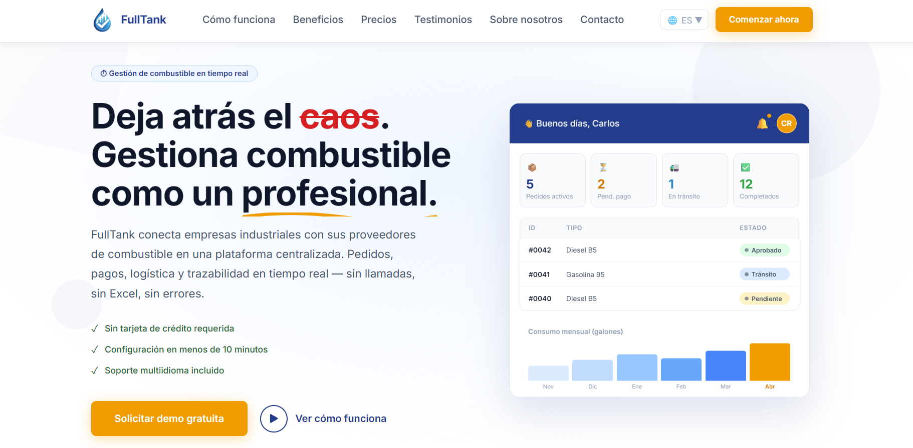

- **About Us:** Explica quiénes somos y nuestra misión para generar confianza.
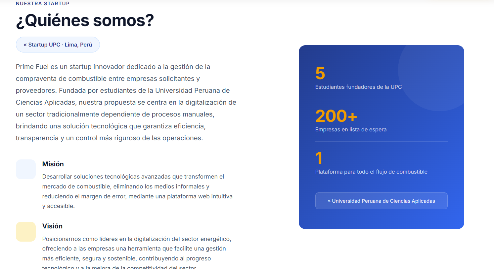
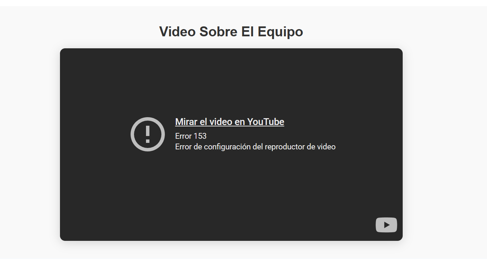
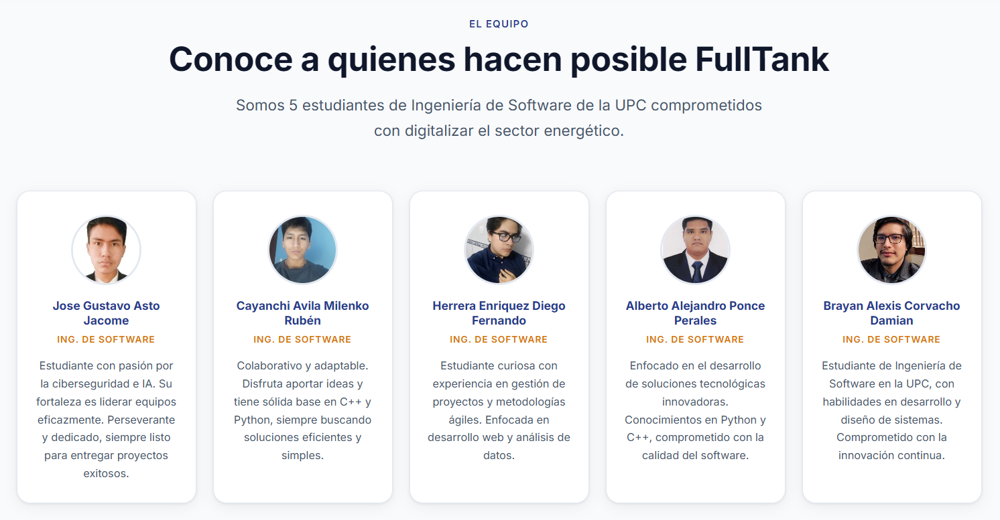

- **Benefits:** Explica los beneficios de implementar FullTank en el área logística de la empresa.
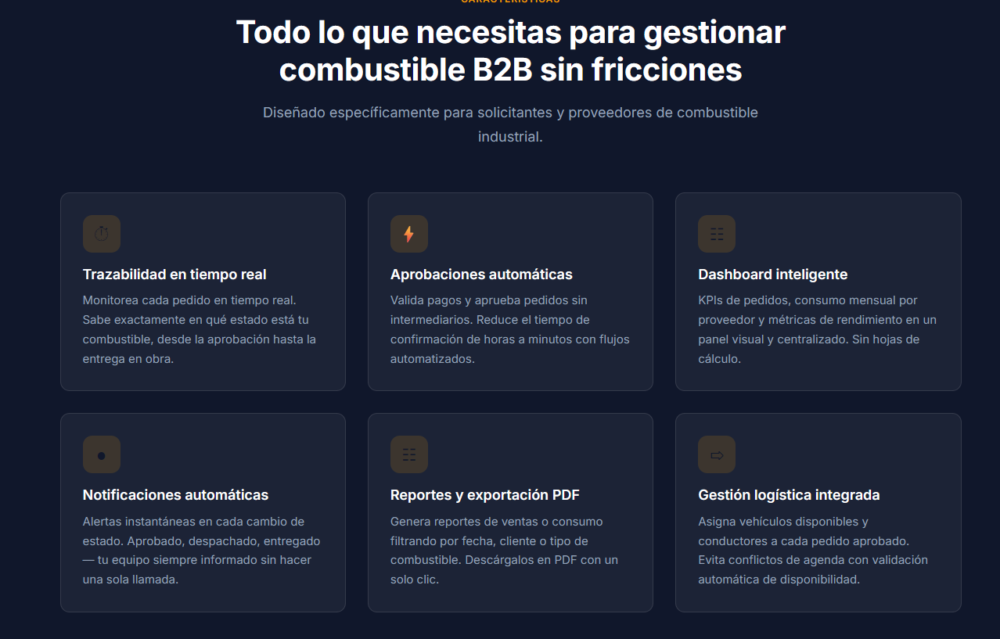

- **How it works?:** Describe de forma sencilla y visual el funcionamiento de FullTank paso a paso.
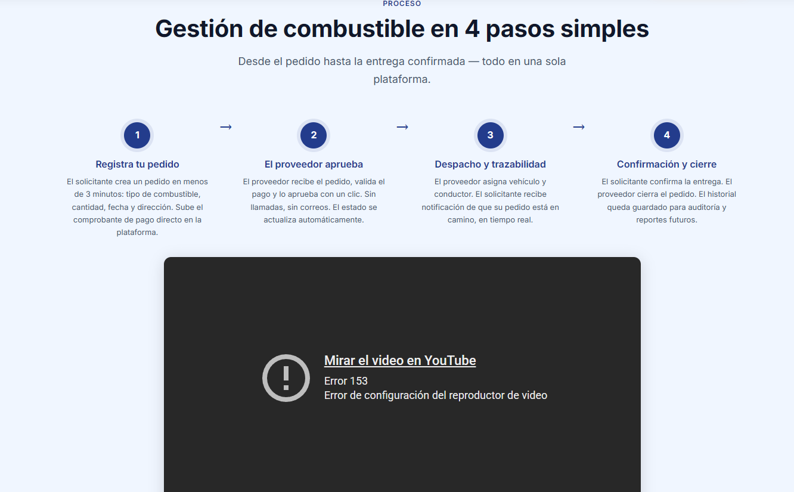

- **Testimonials:** Muestra algunas de las empresas o usuarios que confían en FullTank como referencia de credibilidad.
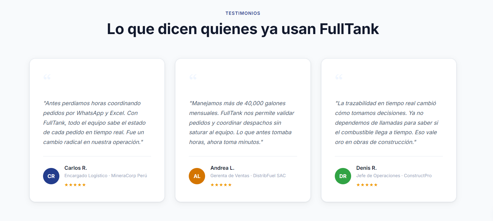

- **Pricing:** Propone planes y precios que puedan acomodarse a las necesidades del usuario.
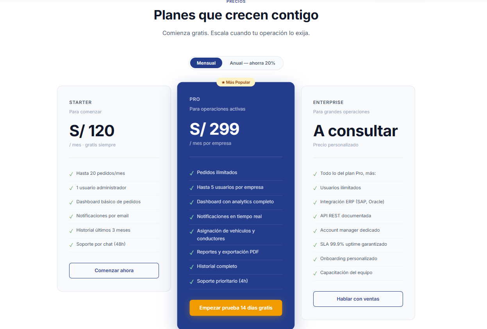

- **Contact Us:** Ofrece un formulario y datos de contacto directo para resolver dudas o solicitar soporte.

#### 5.2.1.6. Services Documentation Evidence for Sprint Review.

Durante el Sprint 1, el equipo se enfocó en el desarrollo del Landing Page de FullTank, por lo cual no se implementaron ni documentaron endpoints relacionados a Web Services. Los trabajos de desarrollo backend, integración de API y documentación con OpenAPI están planificados para Sprints posteriores.

#### 5.2.1.7. Software Deployment Evidence for Sprint Review.

    <strong>Resumen:</strong> 
    El despliegue inicial de la Landing Page de FullTank fue realizado exitosamente utilizando Vercel.

<h4>Detalles del Despliegue:</h4>

<ul>
  <li><strong>URL de la Landing Page:</strong> <a href="https://primefuel.github.io/FullTank_LandingPage/" target="_blank">https://primefuel.github.io/FullTank_LandingPage/</a></li>
  <li><strong>Repositorio:</strong> <a href="https://github.com/PrimeFuel/FullTank_LandingPage" target="_blank">https://github.com/PrimeFuel/FullTank_LandingPage</a></li>
</ul>

<h4>Evidencia:</h4>

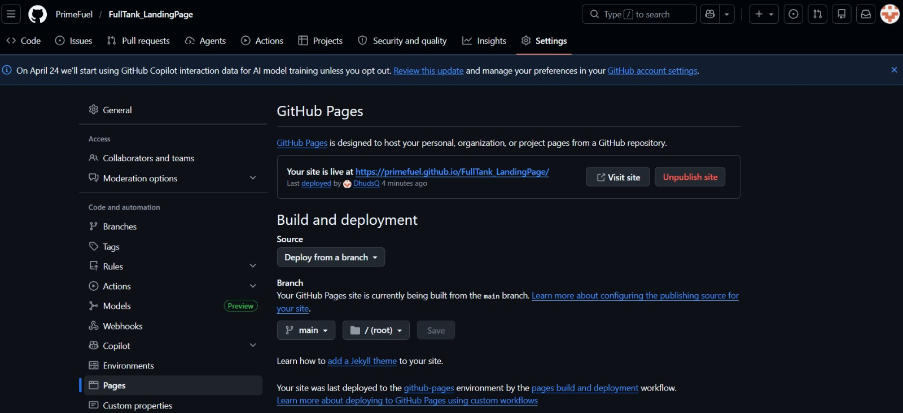

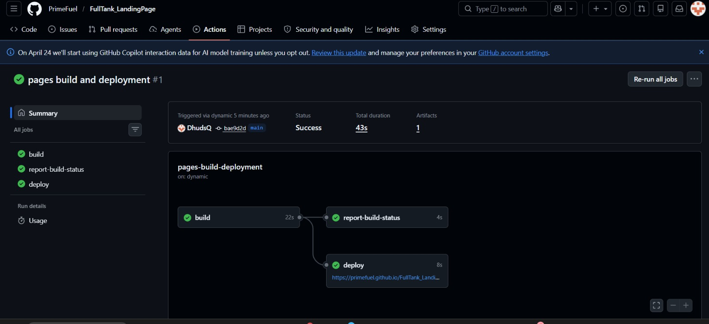

#### 5.2.1.8. Team Collaboration Insights during Sprint. 

    <strong>Resumen:</strong> 
    El equipo colaboró mediante GitHub y WhatsApp durante el Sprint. Las actividades principales se centraron en el desarrollo y despliegue de la Landing Page.

<h4>Evidencia de Colaboración:</h4>
<ul>
  <li>Captura de pantalla de commits en GitHub mostrando contribuciones del equipo.</li>
</ul>

<h4>Principales Herramientas de Comunicación:</h4>
<ul>
  <li>GitHub (control de versiones y manejo de issues)</li>
  <li>WhatsApp (comunicación diaria y aclaraciones rápidas)</li>
  <li>Google Meet (reuniones de planificación de sprint)</li>
</ul>

### 5.2.2. Sprint 2

#### 5.2.2.1.Sprint Planning 2

<table border="1" cellspacing="0" cellpadding="6">
  <tr>
    <td><strong>Sprint #</strong></td>
    <td><strong>Sprint 2</strong></td>
  </tr>
  <tr>
    <td colspan="2" align="center"><strong>Sprint Planning Background</strong></td>
  </tr>
  <tr>
    <td>Date</td>
    <td>04/05/2026</td>
  </tr>
  <tr>
    <td>Time</td>
    <td>15:00 PM</td>
  </tr>
  <tr>
    <td>Location</td>
    <td>Meet / Discord</td>
  </tr>
  <tr>
    <td>Prepared by</td>
    <td>Asto Jacome Jose Gustavo</td>
  </tr>
  <tr>
    <td>Attendees (to planning meeting)</td>
    <td>
      Asto Jacome Jose Gustavo (u20241c630) 
      Cayanchi Avila Milenko Rubén (u202312566) 
      Corvacho Damian Brayan Alexis (u20231a257) 
      Ponce Perales Alberto Alejandro (u202320684) 
      Herrera Enriquez Diego Fernando (u202319027)
    </td>
  </tr>
  <tr>
    <td>Sprint 1 Review Summary</td>
    <td>Se logró desplegar con éxito la Landing Page. Se estableció la arquitectura base del proyecto Angular con estructura por Bounded Contexts (DDD). El feedback fue positivo en cuanto a consistencia de estilos y organización del repositorio.</td>
  </tr>
  <tr>
    <td>Sprint 1 Retrospective Summary</td>
    <td>El equipo trabajó de forma coordinada. Se identificó la necesidad de definir convenciones claras de nomenclatura por módulo y de alinear el uso de Angular Signals y NgRx antes de avanzar con vistas operativas complejas.</td>
  </tr>
  <tr>
    <td colspan="2" align="center"><strong>Sprint Goal &amp; User Stories</strong></td>
  </tr>
  <tr>
    <td>Sprint 2 Goal</td>
    <td>
      Construir y estabilizar la Web Application (Frontend) funcional de FullTank en Angular 17, implementando los módulos operativos principales: inventario, pedidos (solicitudes y órdenes), logística (vehículos, conductores, despacho), dashboard del proveedor y reportes analíticos, conectados a una API fake (json-server) desplegada en Render para simular el flujo completo de negocio.  
      <em>El Sprint Goal se considerará cumplido cuando los usuarios puedan navegar fluidamente entre todos los módulos implementados y ejecutar simulaciones operativas desde la Web App desplegada.</em>
    </td>
  </tr>
  <tr>
    <td>Sprint 2 Velocity</td>
    <td>15</td>
  </tr>
  <tr>
    <td>Sum of Story Points</td>
    <td>55</td>
  </tr>
</table>

#### 5.2.2.2. Aspect Leaders and Collaborators.

<table border="1" cellspacing="0" cellpadding="6">
  <thead>
    <tr>
      <th>Team Member</th>
      <th>GitHub Username</th>
      <th>Landing Page</th>
      <th>Documentation</th>
    </tr>
  </thead>
  <tbody>
    <tr>
      <td>Milenko Rubén Cayanchi Avila</td>
      <td>MaxghZZ</td>
      <td>L</td>
      <td>L</td>
    </tr>
    <tr>
      <td>Jose Gustavo Asto Jacome</td>
      <td>DhudsQ</td>
      <td>C</td>
      <td>C</td>
    </tr>
    <tr>
      <td>Diego Fernando Herrera Enriquez</td>
      <td>DerDFHE</td>
      <td>C</td>
      <td>C</td>
    </tr>
    <tr>
      <td>Alberto Alejandro Ponce Perales</td>
      <td>aponceperales</td>
      <td>C</td>
      <td>C</td>
    </tr>
    <tr>
      <td>Brayan Alexis Corvacho Damian</td>
      <td>BralexCD</td>
      <td>C</td>
      <td>C</td>
    </tr>
  </tbody>
</table>

#### 5.2.2.3.Sprint Backlog 2.

<table border="1" cellspacing="0" cellpadding="6">
  <thead>
    <tr>
      <th colspan="2"><strong>Sprint #</strong></th>
      <th colspan="6"><strong>Sprint 2</strong></th>
    </tr>
    <tr>
      <th colspan="2"><strong>User Story</strong></th>
      <th colspan="6"><strong>Work-Item / Task</strong></th>
    </tr>
    <tr>
      <th><strong>Id</strong></th>
      <th><strong>Title</strong></th>
      <th><strong>Id</strong></th>
      <th><strong>Title</strong></th>
      <th><strong>Description</strong></th>
      <th><strong>Estimation (Hours)</strong></th>
      <th><strong>Assigned to</strong></th>
      <th><strong>Status</strong></th>
    </tr>
  </thead>
  <tbody>
    <tr>
      <td>US-47</td>
      <td>Ver Dashboard principal del proveedor</td>
      <td>W-01</td>
      <td>Dashboard Principal</td>
      <td>Implementación del dashboard con KPIs de combustible vendido, pedidos pendientes, gráfico de tendencia de ventas con filtro diario/semanal/mensual y navegación directa a módulos operativos.</td>
      <td>6</td>
      <td>Asto Jacome Jose Gustavo</td>
      <td>Done</td>
    </tr>
    <tr>
      <td>US-46</td>
      <td>Gestionar inventario de combustibles</td>
      <td>W-02</td>
      <td>Módulo Inventory – CRUD de Productos</td>
      <td>CRUD completo de productos de combustible (fuel-product) con formulario de alta/edición y listado. Incluye assembler, API endpoint, store con Angular Signals y vistas product-form y product-inventory.</td>
      <td>6</td>
      <td>Cayanchi Avila Milenko Rubén</td>
      <td>Done</td>
    </tr>
    <tr>
      <td>US-46</td>
      <td>Gestionar inventario de combustibles</td>
      <td>W-03</td>
      <td>Módulo Inventory – Lista de Stock</td>
      <td>Vista inventory-list que muestra el stock actual por tipo de combustible, con opciones de edición y eliminación de ítems de inventario.</td>
      <td>4</td>
      <td>Cayanchi Avila Milenko Rubén</td>
      <td>Done</td>
    </tr>
    <tr>
      <td>US-10</td>
      <td>Ver pedidos pendientes</td>
      <td>W-04</td>
      <td>Módulo Ordering – Lista de Solicitudes</td>
      <td>Vista request-list con tabla paginada y ordenable de solicitudes pendientes. Incluye filtro por estado, búsqueda por código y chips de estado visual.</td>
      <td>5</td>
      <td>Ponce Perales Alberto Alejandro</td>
      <td>Done</td>
    </tr>
    <tr>
      <td>US-05</td>
      <td>Registrar nuevo pedido</td>
      <td>W-05</td>
      <td>Módulo Ordering – Formulario de Solicitud</td>
      <td>Vista request-form con formulario reactivo para registrar una nueva solicitud de combustible. Incluye validación de campos obligatorios y envío al store.</td>
      <td>4</td>
      <td>Ponce Perales Alberto Alejandro</td>
      <td>Done</td>
    </tr>
    <tr>
      <td>US-11</td>
      <td>Aprobar pedido</td>
      <td>W-06</td>
      <td>Acción Aprobar en request-list</td>
      <td>Implementación de la acción de aprobación de solicitudes desde la vista request-list, actualizando el estado a APPROVED en el store y en la API.</td>
      <td>3</td>
      <td>Ponce Perales Alberto Alejandro</td>
      <td>Done</td>
    </tr>
    <tr>
      <td>US-42</td>
      <td>Rechazar pedido</td>
      <td>W-07</td>
      <td>Acción Rechazar en request-list</td>
      <td>Implementación del flujo de rechazo de solicitudes con actualización de estado a REJECTED en el store, incluyendo diálogo de confirmación.</td>
      <td>3</td>
      <td>Ponce Perales Alberto Alejandro</td>
      <td>Done</td>
    </tr>
    <tr>
      <td>US-06</td>
      <td>Consultar estado del pedido</td>
      <td>W-08</td>
      <td>Módulo Ordering – Lista de Órdenes</td>
      <td>Vista order-list con tabla paginada y ordenable de órdenes. Muestra estado actualizado (CREATED, DISPATCHED, CLOSED) con chips visuales y navegación al detalle.</td>
      <td>4</td>
      <td>Ponce Perales Alberto Alejandro</td>
      <td>Done</td>
    </tr>
    <tr>
      <td>US-43</td>
      <td>Ver detalle de pedido</td>
      <td>W-09</td>
      <td>Módulo Ordering – Detalle de Orden</td>
      <td>Vista order-detail con información completa de la orden: tipo de combustible, cantidad, estado, fechas y datos de asignación. Incluye restricción de acceso a órdenes ajenas.</td>
      <td>4</td>
      <td>Ponce Perales Alberto Alejandro</td>
      <td>Done</td>
    </tr>
    <tr>
      <td>US-12</td>
      <td>Marcar pedido como despachado</td>
      <td>W-10</td>
      <td>Acción Despachar en order-list</td>
      <td>Acción de cambio de estado de orden a DISPATCHED desde la vista de listado de órdenes, con actualización en store y API.</td>
      <td>2</td>
      <td>Ponce Perales Alberto Alejandro</td>
      <td>Done</td>
    </tr>
    <tr>
      <td>US-13</td>
      <td>Cerrar pedido</td>
      <td>W-11</td>
      <td>Acción Cerrar en order-list</td>
      <td>Acción de cierre de orden (CLOSED) desde la vista de listado, bloqueando modificaciones posteriores en el store.</td>
      <td>2</td>
      <td>Ponce Perales Alberto Alejandro</td>
      <td>Done</td>
    </tr>
    <tr>
      <td>US-27</td>
      <td>Buscar pedido por código</td>
      <td>W-12</td>
      <td>Búsqueda por código en request-list</td>
      <td>Campo de búsqueda en la vista request-list que filtra en tiempo real por ID/código de solicitud usando MatInput y Angular Forms.</td>
      <td>2</td>
      <td>Ponce Perales Alberto Alejandro</td>
      <td>Done</td>
    </tr>
    <tr>
      <td>US-28</td>
      <td>Filtrar pedidos por estado</td>
      <td>W-13</td>
      <td>Filtro por estado en request-list</td>
      <td>Filtrado de solicitudes por estado (PENDING_APPROVAL, APPROVED, REJECTED, CANCELLED) mediante MatChipSet en la vista request-list.</td>
      <td>2</td>
      <td>Ponce Perales Alberto Alejandro</td>
      <td>Done</td>
    </tr>
    <tr>
      <td>US-44</td>
      <td>Gestionar vehículos de flota</td>
      <td>W-14</td>
      <td>Módulo Fulfillment – Vehículos CRUD</td>
      <td>Vistas vehicle-list y vehicle-form con CRUD completo de vehículos de flota. Incluye validación de placa duplicada y disponibilidad para asignación a pedidos.</td>
      <td>5</td>
      <td>Corvacho Damian Brayan Alexis</td>
      <td>Done</td>
    </tr>
    <tr>
      <td>US-45</td>
      <td>Gestionar conductores</td>
      <td>W-15</td>
      <td>Módulo Fulfillment – Conductores CRUD</td>
      <td>Vistas driver-list y driver-form con CRUD completo de conductores. Incluye validación de DNI duplicado y control de disponibilidad operativa.</td>
      <td>5</td>
      <td>Corvacho Damian Brayan Alexis</td>
      <td>Done</td>
    </tr>
    <tr>
      <td>US-22</td>
      <td>Validar disponibilidad de transporte</td>
      <td>W-16</td>
      <td>Módulo Fulfillment – Dispatch Dashboard</td>
      <td>Vista dispatch-dashboard que muestra la disponibilidad en tiempo real de vehículos y conductores, bloqueando selección de recursos con conflictos de agenda.</td>
      <td>4</td>
      <td>Corvacho Damian Brayan Alexis</td>
      <td>Done</td>
    </tr>
    <tr>
      <td>US-49</td>
      <td>Asignar recursos a despacho</td>
      <td>W-17</td>
      <td>Asignación vehículo+conductor en Dispatch</td>
      <td>Implementación de la asignación conjunta de vehículo y conductor a un pedido aprobado en una sola operación desde dispatch-dashboard, con registro de la entidad delivery.</td>
      <td>4</td>
      <td>Corvacho Damian Brayan Alexis</td>
      <td>Done</td>
    </tr>
    <tr>
      <td>US-34</td>
      <td>Ver gráfico de ventas (Proveedor)</td>
      <td>W-18</td>
      <td>Reporting – Gráfico de Ventas Mensuales</td>
      <td>Vista supplier-dashboard con gráfico de barras de ventas mensuales usando Chart.js, integrado al reporting store con datos de sales-metrics.</td>
      <td>4</td>
      <td>Asto Jacome Jose Gustavo</td>
      <td>Done</td>
    </tr>
    <tr>
      <td>US-48</td>
      <td>Ver distribución de ventas por sector</td>
      <td>W-19</td>
      <td>Reporting – Distribución por Sector Industrial</td>
      <td>Sección dentro de supplier-dashboard que muestra la distribución porcentual de ventas por sector industrial (sector-distribution entity) con gráfico analítico.</td>
      <td>3</td>
      <td>Asto Jacome Jose Gustavo</td>
      <td>Done</td>
    </tr>
    <tr>
      <td>US-31</td>
      <td>Ver listado de empresas</td>
      <td>W-20</td>
      <td>Reporting – Portafolio de Clientes</td>
      <td>Vista client-portfolio con listado interactivo de empresas solicitantes mostrando nombre, pedidos activos e historial total por empresa, usando client-portfolio entity.</td>
      <td>4</td>
      <td>Asto Jacome Jose Gustavo</td>
      <td>Done</td>
    </tr>
    <tr>
      <td>US-32</td>
      <td>Ver detalles de empresa</td>
      <td>W-21</td>
      <td>Reporting – Detalle de empresa en Portafolio</td>
      <td>Detalle expandible de cada empresa dentro de client-portfolio que muestra historial de pedidos, cantidades y fechas. Mensaje informativo si no hay historial disponible.</td>
      <td>3</td>
      <td>Asto Jacome Jose Gustavo</td>
      <td>Done</td>
    </tr>
    <tr>
      <td>US-09</td>
      <td>Ver historial de pedidos</td>
      <td>W-22</td>
      <td>Historial en order-list (órdenes cerradas)</td>
      <td>Sección de órdenes cerradas en order-list que permite al solicitante consultar el historial con fecha, tipo y estado. Mensaje informativo si no hay pedidos previos.</td>
      <td>2</td>
      <td>Herrera Enriquez Diego Fernando</td>
      <td>Done</td>
    </tr>
  </tbody>
</table>

#### 5.2.2.4.Development Evidence for Sprint Review.

Durante el Sprint 2, el equipo se enfocó en el desarrollo del repositorio frontend del producto FullTank perteneciente a la startup PrimeFuel. La aplicación fue desarrollada utilizando Angular, Angular Material y TypeScript, siguiendo una arquitectura basada en Bounded Contexts y principios de DDD (Domain-Driven Design). Para el consumo de APIs se utilizó HttpClient conectado a un json-server como Fake API, mientras que para la visualización de métricas y reportes se implementaron gráficas utilizando Chart.js. Además, el proyecto incorporó soporte de internacionalización mediante @ngx-translate/core, utilizando archivos de traducción (en.json y es.json) para ofrecer soporte multilenguaje.

<table border> <thead> <tr> <th>Repositorio</th> <th>Rama</th> <th>ID de Commit</th> <th>Mensaje de Commit</th> </tr> </thead> <tbody> <tr> <td>PrimeFuel/frontend</td> <td>develop</td> <td>f815d0c</td> <td>feat(develop): added dashboard page</td> </tr> <tr> <td>PrimeFuel/frontend</td> <td>develop</td> <td>271c3e4</td> <td>feat(develop): solved hosting problems</td> </tr> <tr> <td>PrimeFuel/frontend</td> <td>develop</td> <td>36bc5a0</td> <td>feat(develop): changed endpoint into the environment one</td> </tr> <tr> <td>PrimeFuel/frontend</td> <td>feature/inventory</td> <td>7a7b178</td> <td>feat(inventory): changed catalog to inventory</td> </tr> <tr> <td>PrimeFuel/frontend</td> <td>feature/fulfillment</td> <td>97d1ecc</td> <td>feat(fulfillment): implement driver list and form presentation views</td> </tr> <tr> <td>PrimeFuel/frontend</td> <td>feature/reporting</td> <td>133904a</td> <td>feat(reporting): connection json server and added statics</td> </tr> <tr> <td>PrimeFuel/frontend</td> <td>feature/shared</td> <td>b720b65</td> <td>feat(shared): move notification button from menu to header</td> </tr> <tr> <td>PrimeFuel/frontend</td> <td>feature/notification</td> <td>23248bf</td> <td>feat(notification): fix server db.json</td> </tr> <tr> <td>PrimeFuel/frontend</td> <td>feature/notification</td> <td>ea54e2d</td> <td>feat(notification): add notification routes and list view</td> </tr> <tr> <td>PrimeFuel/frontend</td> <td>feature/shared</td> <td>03fb1e3</td> <td>feat(shared): add button for clients and providers</td> </tr> <tr> <td>PrimeFuel/frontend</td> <td>feature/i18n</td> <td>9e04917</td> <td>feat(i18n): add en and es translation files</td> </tr> <tr> <td>PrimeFuel/frontend</td> <td>feature/shared</td> <td>fa80d5d</td> <td>chore(environments): add development and production environment configuration</td> </tr> </tbody> </table>

#### 5.2.2.5. Execution Evidence for Sprint Review.

En este sprint se implementaron las siguientes pantallas y módulos clave correspondientes a la Web Application (Frontend) de FullTank:

- **Dashboard Principal (Proveedor):** Muestra KPIs de combustible vendido, pedidos pendientes y navegación directa a módulos operativos.
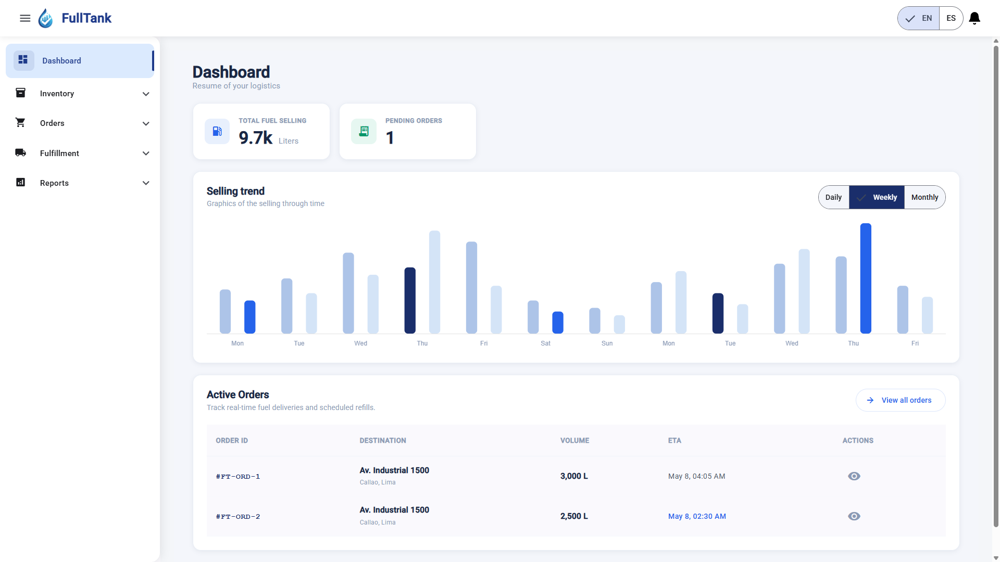

- **Módulo de Inventario (Inventory):** Permite visualizar el stock actual y realizar el CRUD de productos de combustible.
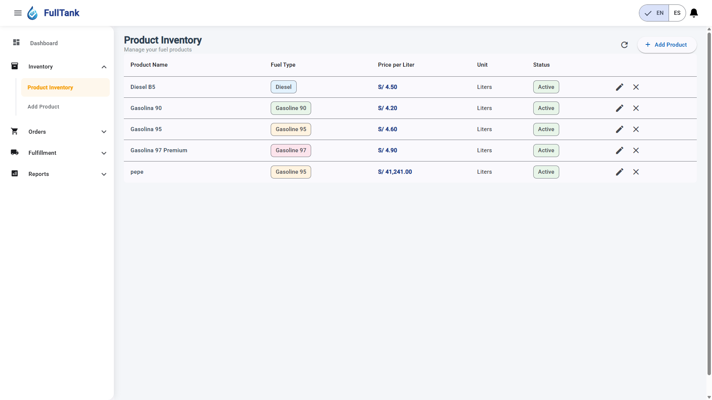

- **Módulo de Pedidos (Ordering - Solicitudes):** Vistas para registrar, listar, buscar, filtrar, aprobar y rechazar solicitudes de combustible.
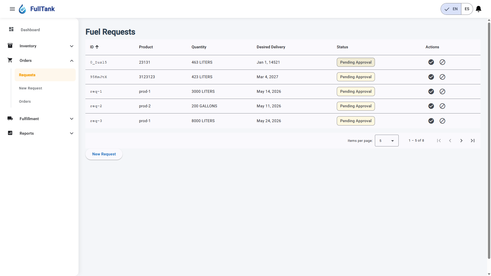

- **Módulo de Pedidos (Ordering - Órdenes):** Listado de órdenes activas e históricas con cambios de estado y detalles de cada pedido.
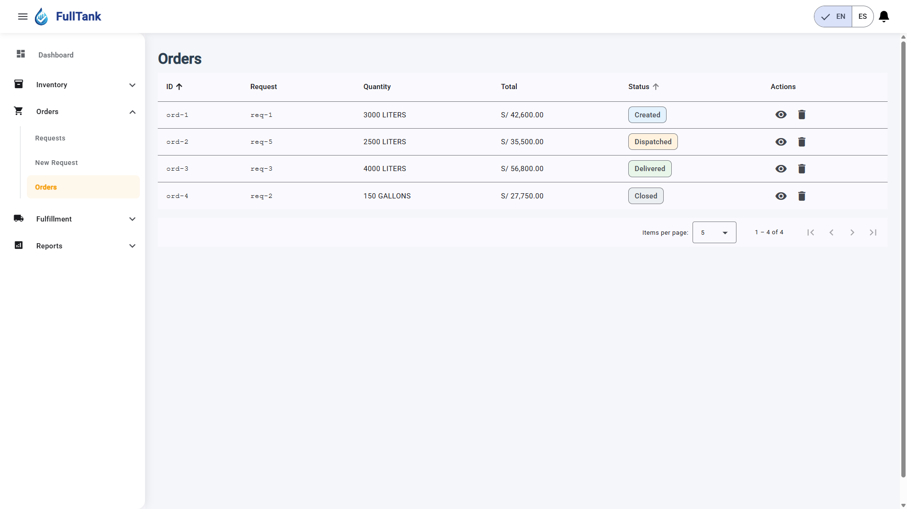

- **Módulo de Logística (Fulfillment - Vehículos):** Gestión (CRUD) de la flota de vehículos con validación de disponibilidad.
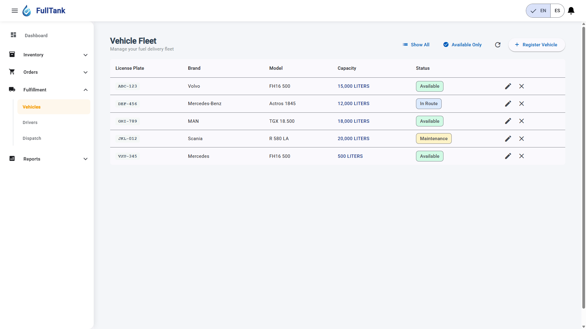

- **Módulo de Logística (Fulfillment - Conductores):** Gestión (CRUD) del registro de conductores.
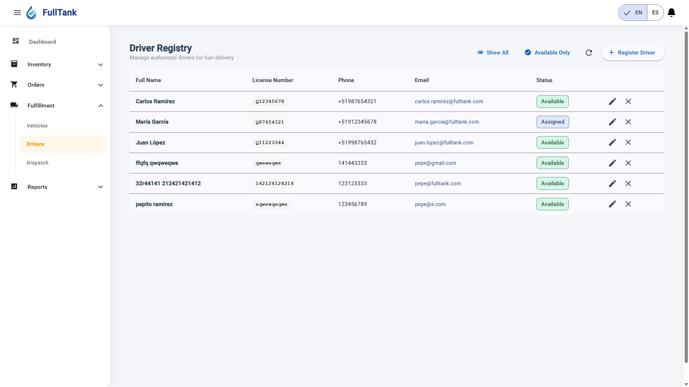

- **Módulo de Logística (Fulfillment - Dispatch Dashboard):** Asignación de vehículos y conductores a pedidos aprobados.
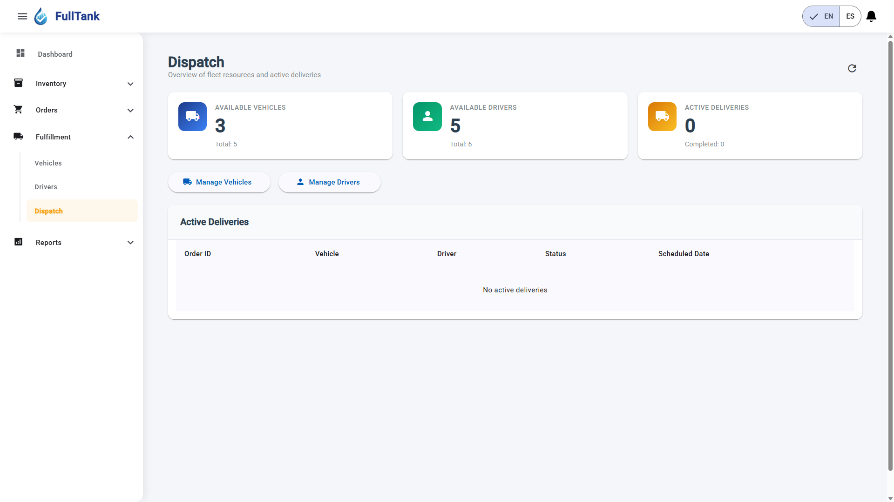

- **Módulo de Reportes (Reporting):** Visualización de gráficos de ventas, distribución por sector y portafolio interactivo de clientes.
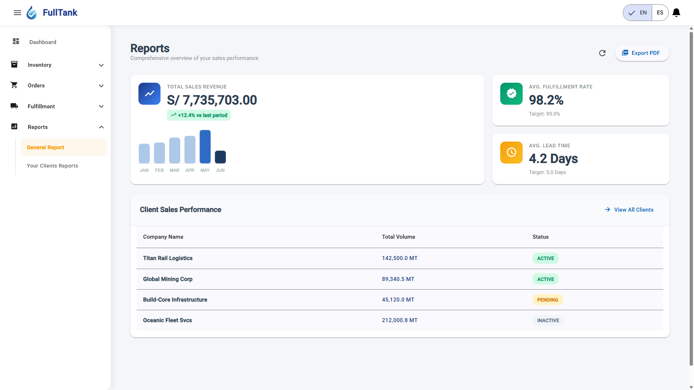

#### 5.2.2.6.Services Documentation Evidence for Sprint Review.

Durante el Sprint 2 utilizamos un **json-server** expuesto en Render (`https://json-server-y51j.onrender.com`) para habilitar la simulación de todas las pantallas operativas sin depender del equipo backend en java. La implementación real del RESTful Web API con Spring Boot y documentación en Swagger será el objetivo principal de los próximos Sprints.

#### 5.2.2.7.Software Deployment Evidence for Sprint Review.

Resumen:
Se logró el despliegue automático de la aplicación Frontend en la nube utilizando Firebase Hosting. El proyecto está configurado a través del archivo `firebase.json` en el workspace `full-tank-open`.

Detalles del Despliegue:
URL del Frontend App: https://fulltank-open.web.app/home

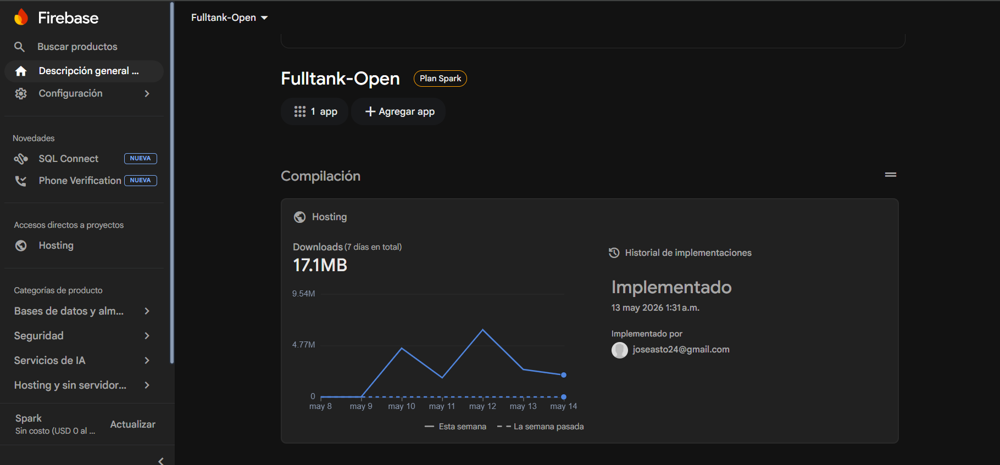

#### 5.2.2.8.Team Collaboration Insights during Sprint

    <strong>Resumen:</strong> 
    La colaboración se estructuró dividiendo los componentes de Angular según los módulos del negocio:
    <b>Cayanchi Avila Milenko Rubén</b> estructuró las bases del proyecto, layout, router y configuración
    del store con Angular Signals; <b>Asto Jacome Jose Gustavo</b> lideró el módulo de dashboard del
    proveedor y los reportes analíticos (ventas, sector y portafolio de clientes); <b>Corvacho Damian
    Brayan Alexis</b> desarrolló el módulo de fulfillment, incluyendo la gestión de vehículos, conductores
    y el dispatch dashboard; <b>Ponce Perales Alberto Alejandro</b> lideró el módulo de ordering,
    implementando las vistas de solicitudes, órdenes y todas las acciones de estado; <b>Herrera Enriquez
    Diego Fernando</b> colaboró en la integración del historial de órdenes y el soporte transversal
    entre módulos.

<h4>Evidencia de Colaboración (GitHub Frontend):</h4>
<ul>
  <li>Captura de los Contribuidores del repositorio Frontend en GitHub.</li>
</ul>

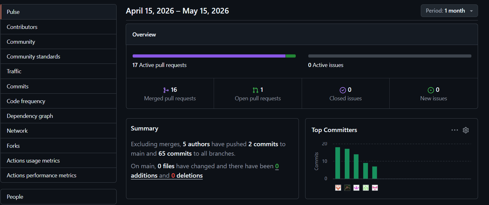

 

### 5.2.3. Sprint 3

#### 5.2.3.1. Sprint Planning 3

<table border="1" cellspacing="0" cellpadding="6">
  <tr>
    <td><strong>Sprint #</strong></td>
    <td><strong>Sprint 3</strong></td>
  </tr>

  <tr>
    <td colspan="2" align="center"><strong>Sprint Planning Background</strong></td>
  </tr>

  <tr>
    <td>Date</td>
    <td>10/06/2026</td>
  </tr>

  <tr>
    <td>Time</td>
    <td>15:00 PM</td>
  </tr>

  <tr>
    <td>Location</td>
    <td>Meet / Discord</td>
  </tr>

  <tr>
    <td>Prepared by</td>
    <td>Asto Jacome Jose Gustavo</td>
  </tr>

  <tr>
    <td>Attendees (to planning meeting)</td>
    <td>
      Asto Jacome Jose Gustavo (u20241c630) 
      Cayanchi Avila Milenko Rubén (u202312566) 
      Corvacho Damian Brayan Alexis (u20231a257) 
      Ponce Perales Alberto Alejandro (u202320684) 
      Herrera Enriquez Diego Fernando (u202319027)
    </td>
  </tr>

  <tr>
    <td>Sprint 2 Review Summary</td>
    <td>
      Se completó el desarrollo de la Web Application de FullTank utilizando Angular 17.
      Se implementaron los principales módulos operativos del sistema, incluyendo
      inventario de combustibles, gestión de pedidos, solicitudes de combustible,
      logística de entregas, gestión de conductores y vehículos, dashboard del proveedor
      y vistas analíticas. Asimismo, se integró una API simulada mediante json-server
      desplegada en Render para validar los flujos de negocio del frontend.
    </td>
  </tr>

  <tr>
    <td>Sprint 2 Retrospective Summary</td>
    <td>
      El equipo logró mantener una distribución equilibrada de tareas durante el desarrollo
      frontend. Como oportunidad de mejora se identificó la necesidad de acelerar la integración
      entre frontend y backend desde etapas más tempranas del proyecto, así como establecer
      contratos de API más detallados para reducir retrabajos durante las fases de integración.
    </td>
  </tr>

  <tr>
    <td colspan="2" align="center"><strong>Sprint Goal &amp; User Stories</strong></td>
  </tr>

  <tr>
    <td>Sprint 3 Goal</td>
    <td>
      Diseñar, implementar y desplegar la arquitectura Backend de FullTank utilizando
      Spring Boot y Domain Driven Design (DDD), desarrollando los servicios REST necesarios
      para soportar la autenticación, gestión de empresas, inventario de combustibles,
      pedidos, logística, pagos, notificaciones y analítica de la plataforma.  
      <em> Sprint Goal se considerará cumplido cuando los principales procesos de negocio
      estén expuestos mediante endpoints funcionales y documentados, permitiendo la
      comunicación entre la Web Application y los servicios backend desplegados.</em>
    </td>

  </tr>

  <tr>
    <td>Sprint 3 Velocity</td>
    <td>21</td>
  </tr>

  <tr>
    <td>Sum of Story Points</td>
    <td>97</td>
  </tr>

</table>

#### 5.2.3.2. Aspect Leaders and Collaborators

<table border="1" cellspacing="0" cellpadding="6">
  <thead>
    <tr>
      <th>Team Member</th>
      <th>GitHub Username</th>
      <th>Landing Page</th>
      <th>Documentation</th>
    </tr>
  </thead>
  <tbody>
    <tr>
      <td>Milenko Rubén Cayanchi Avila</td>
      <td>MaxghZZ</td>
      <td>L</td>
      <td>L</td>
    </tr>
    <tr>
      <td>Jose Gustavo Asto Jacome</td>
      <td>DhudsQ</td>
      <td>C</td>
      <td>C</td>
    </tr>
    <tr>
      <td>Diego Fernando Herrera Enriquez</td>
      <td>DerDFHE</td>
      <td>C</td>
      <td>C</td>
    </tr>
    <tr>
      <td>Alberto Alejandro Ponce Perales</td>
      <td>aponceperales</td>
      <td>C</td>
      <td>C</td>
    </tr>
    <tr>
      <td>Brayan Alexis Corvacho Damian</td>
      <td>BralexCD</td>
      <td>C</td>
      <td>C</td>
    </tr>
  </tbody>
</table>

#### 5.2.3.3.Sprint Backlog 3.

<table border="1" cellspacing="0" cellpadding="6">
  <thead>
    <tr>
      <th colspan="2"><strong>Sprint #</strong></th>
      <th colspan="6"><strong>Sprint 3</strong></th>
    </tr>
    <tr>
      <th colspan="2"><strong>Technical Story</strong></th>
      <th colspan="6"><strong>Work-Item / Task</strong></th>
    </tr>
    <tr>
      <th><strong>Id</strong></th>
      <th><strong>Title</strong></th>
      <th><strong>Id</strong></th>
      <th><strong>Title</strong></th>
      <th><strong>Description</strong></th>
      <th><strong>Estimation (Hours)</strong></th>
      <th><strong>Assigned to</strong></th>
      <th><strong>Status</strong></th>
    </tr>
  </thead>
  <tbody>
    <tr>
      <td>TS-01</td>
      <td>Endpoint: Login</td>
      <td>W-01</td>
      <td>Implementación Sign In</td>
      <td>Desarrollo del endpoint de autenticación utilizando JWT y validación de credenciales.</td>
      <td>2</td>
      <td>Asto Jacome Jose Gustavo</td>
      <td>Done</td>
    </tr>
    <tr>
      <td>TS-02</td>
      <td>Endpoint: Recuperar contraseña</td>
      <td>W-02</td>
      <td>Password Recovery</td>
      <td>Diseño del flujo de recuperación mediante generación de token y envío de correo.</td>
      <td>2</td>
      <td>Herrera Enriquez Diego Fernando</td>
      <td>Pending</td>
    </tr>
    <tr>
      <td>TS-03</td>
      <td>Endpoint: Logout</td>
      <td>W-03</td>
      <td>Logout Service</td>
      <td>Evaluación e implementación del mecanismo de cierre de sesión para JWT.</td>
      <td>1</td>
      <td>Cayanchi Avila Milenko Rubén</td>
      <td>Pending</td>
    </tr>
    <tr>
      <td>TS-04</td>
      <td>Endpoint: Crear pedido</td>
      <td>W-04</td>
      <td>Create Fuel Order</td>
      <td>Implementación del endpoint para registrar pedidos de combustible.</td>
      <td>2</td>
      <td>Ponce Perales Alberto Alejandro</td>
      <td>Done</td>
    </tr>
    <tr>
      <td>TS-05</td>
      <td>Consultar pedidos por usuario</td>
      <td>W-05</td>
      <td>Orders by User</td>
      <td>Consulta de pedidos asociados a un usuario específico.</td>
      <td>2</td>
      <td>Corvacho Damian Brayan Alexis</td>
      <td>In Progress</td>
    </tr>
    <tr>
      <td>TS-06</td>
      <td>Registro de usuario</td>
      <td>W-06</td>
      <td>Sign Up Endpoint</td>
      <td>Implementación del registro de usuarios y persistencia de credenciales.</td>
      <td>2</td>
      <td>Asto Jacome Jose Gustavo</td>
      <td>Done</td>
    </tr>
    <tr>
      <td>TS-07</td>
      <td>Consultar usuarios</td>
      <td>W-07</td>
      <td>User Query Services</td>
      <td>Endpoints para listar usuarios y obtener detalle por identificador.</td>
      <td>1</td>
      <td>Cayanchi Avila Milenko Rubén</td>
      <td>Done</td>
    </tr>
    <tr>
      <td>TS-08</td>
      <td>CRUD Empresas Compradoras</td>
      <td>W-08</td>
      <td>Buyer Companies API</td>
      <td>Servicios CRUD para la gestión de empresas compradoras.</td>
      <td>3</td>
      <td>Herrera Enriquez Diego Fernando</td>
      <td>Done</td>
    </tr>
    <tr>
      <td>TS-09</td>
      <td>CRUD Empresas Proveedoras</td>
      <td>W-09</td>
      <td>Provider Companies API</td>
      <td>Servicios CRUD para empresas proveedoras registradas.</td>
      <td>3</td>
      <td>Ponce Perales Alberto Alejandro</td>
      <td>Done</td>
    </tr>
    <tr>
      <td>TS-10</td>
      <td>Actualizar perfil de usuario</td>
      <td>W-10</td>
      <td>Update User Profile</td>
      <td>Implementación de actualización de datos del usuario autenticado.</td>
      <td>2</td>
      <td>Corvacho Damian Brayan Alexis</td>
      <td>Pending</td>
    </tr>
    <tr>
      <td>TS-11</td>
      <td>CRUD Productos de Combustible</td>
      <td>W-11</td>
      <td>Fuel Products API</td>
      <td>Gestión completa de productos de combustible mediante endpoints REST.</td>
      <td>3</td>
      <td>Asto Jacome Jose Gustavo</td>
      <td>Done</td>
    </tr>
    <tr>
      <td>TS-12</td>
      <td>Actualizar stock</td>
      <td>W-12</td>
      <td>Stock Management</td>
      <td>Actualización de stock disponible para productos registrados.</td>
      <td>1</td>
      <td>Cayanchi Avila Milenko Rubén</td>
      <td>Done</td>
    </tr>
    <tr>
      <td>TS-13</td>
      <td>Consultar pedidos</td>
      <td>W-13</td>
      <td>Fuel Orders Queries</td>
      <td>Listado y consulta de pedidos por distintos criterios.</td>
      <td>2</td>
      <td>Ponce Perales Alberto Alejandro</td>
      <td>Done</td>
    </tr>
    <tr>
      <td>TS-14</td>
      <td>Confirmar / Cancelar pedido</td>
      <td>W-14</td>
      <td>Order State Actions</td>
      <td>Acciones para confirmar y cancelar pedidos existentes.</td>
      <td>2</td>
      <td>Herrera Enriquez Diego Fernando</td>
      <td>Done</td>
    </tr>
    <tr>
      <td>TS-15</td>
      <td>Solicitudes de combustible</td>
      <td>W-15</td>
      <td>Fuel Requests API</td>
      <td>Gestión de solicitudes de combustible y sus estados.</td>
      <td>3</td>
      <td>Corvacho Damian Brayan Alexis</td>
      <td>Done</td>
    </tr>
    <tr>
      <td>TS-16</td>
      <td>Consultar solicitud por ID</td>
      <td>W-16</td>
      <td>Fuel Request Detail</td>
      <td>Consulta detallada de solicitudes mediante identificador.</td>
      <td>1</td>
      <td>Asto Jacome Jose Gustavo</td>
      <td>Pending</td>
    </tr>
    <tr>
      <td>TS-17</td>
      <td>Gestión de entregas</td>
      <td>W-17</td>
      <td>Delivery Management API</td>
      <td>Implementación integral de endpoints de logística y entregas.</td>
      <td>4</td>
      <td>Ponce Perales Alberto Alejandro</td>
      <td>Done</td>
    </tr>
    <tr>
      <td>TS-18</td>
      <td>CRUD Conductores</td>
      <td>W-18</td>
      <td>Drivers API</td>
      <td>Administración de conductores mediante operaciones CRUD.</td>
      <td>2</td>
      <td>Cayanchi Avila Milenko Rubén</td>
      <td>Done</td>
    </tr>
    <tr>
      <td>TS-19</td>
      <td>CRUD Vehículos</td>
      <td>W-19</td>
      <td>Vehicles API</td>
      <td>Administración de flota vehicular mediante endpoints REST.</td>
      <td>2</td>
      <td>Corvacho Damian Brayan Alexis</td>
      <td>Done</td>
    </tr>
    <tr>
      <td>TS-20</td>
      <td>Registrar y procesar pagos</td>
      <td>W-20</td>
      <td>Payments API</td>
      <td>Registro, procesamiento y reembolso de pagos.</td>
      <td>3</td>
      <td>Herrera Enriquez Diego Fernando</td>
      <td>Done</td>
    </tr>
    <tr>
      <td>TS-21</td>
      <td>Consultar pagos</td>
      <td>W-21</td>
      <td>Payments Queries</td>
      <td>Consulta de pagos por empresa, pedido e identificador.</td>
      <td>2</td>
      <td>Asto Jacome Jose Gustavo</td>
      <td>Done</td>
    </tr>
    <tr>
      <td>TS-22</td>
      <td>Calificaciones de proveedores</td>
      <td>W-22</td>
      <td>Provider Ratings API</td>
      <td>Creación y actualización de valoraciones de proveedores.</td>
      <td>2</td>
      <td>Cayanchi Avila Milenko Rubén</td>
      <td>Done</td>
    </tr>
    <tr>
      <td>TS-23</td>
      <td>Gestión de equipos</td>
      <td>W-23</td>
      <td>Equipment Management</td>
      <td>Administración de equipos y consultas por empresa.</td>
      <td>3</td>
      <td>Ponce Perales Alberto Alejandro</td>
      <td>Done</td>
    </tr>
    <tr>
      <td>TS-24</td>
      <td>Asignar proveedor favorito</td>
      <td>W-24</td>
      <td>Favorite Provider</td>
      <td>Asignación de proveedores preferidos para equipos registrados.</td>
      <td>1</td>
      <td>Corvacho Damian Brayan Alexis</td>
      <td>Done</td>
    </tr>
    <tr>
      <td>TS-25</td>
      <td>Eliminar equipo</td>
      <td>W-25</td>
      <td>Delete Equipment</td>
      <td>Implementación de endpoint para eliminación de equipos.</td>
      <td>1</td>
      <td>Herrera Enriquez Diego Fernando</td>
      <td>Pending</td>
    </tr>
    <tr>
      <td>TS-26</td>
      <td>Sistema de notificaciones</td>
      <td>W-26</td>
      <td>Notifications API</td>
      <td>Gestión de notificaciones, lectura y consultas especializadas.</td>
      <td>3</td>
      <td>Asto Jacome Jose Gustavo</td>
      <td>Done</td>
    </tr>
    <tr>
      <td>TS-27</td>
      <td>Reportes y analítica</td>
      <td>W-27</td>
      <td>Analytics Services</td>
      <td>Implementación de métricas generales y reportes por empresa.</td>
      <td>3</td>
      <td>Herrera Enriquez Diego Fernando</td>
      <td>Done</td>
    </tr>
  </tbody>
</table>

#### 5.2.3.4. Development Evidence for Sprint Review

Durante el Sprint 3 se desarrolló la capa backend de FullTank utilizando Spring Boot y una arquitectura basada en Domain Driven Design (DDD), organizada mediante bounded contexts independientes para cada dominio del negocio. Esta estructura permitió mantener una adecuada separación de responsabilidades entre los diferentes módulos del sistema, facilitando la escalabilidad y el mantenimiento del proyecto.

Como parte de la implementación se desarrollaron múltiples APIs REST para soportar los procesos principales de la plataforma, incluyendo autenticación, gestión de empresas, inventario de combustibles, pedidos, logística, pagos, notificaciones y analítica. Cada bounded context fue implementado siguiendo una arquitectura por capas compuesta por Controllers, Services, Commands, Queries, Assemblers, Repositories y entidades de dominio, permitiendo una organización consistente del código fuente.

Asimismo, se definieron agregados y entidades de dominio para representar los conceptos centrales del negocio, implementando Command Services y Query Services para gestionar operaciones de escritura y consulta de datos. La persistencia fue desarrollada mediante Spring Data JPA, estableciendo la integración entre la aplicación y la base de datos relacional. Adicionalmente, se configuró un mecanismo de autenticación y autorización basado en JSON Web Tokens (JWT) para proteger los recursos expuestos por la API.

Las evidencias de desarrollo incluyen los commits realizados por los integrantes del equipo, la implementación de endpoints REST, la creación de componentes de dominio y aplicación, así como la integración de los diferentes módulos que conforman la arquitectura backend de FullTank.

<table border>
  <thead>
    <tr>
      <th>Repositorio</th>
      <th>Rama</th>
      <th>ID de Commit</th>
      <th>Mensaje de Commit</th>
      <th>Descripción del Commit</th>
      <th>Fecha de Commit</th>
    </tr>
  </thead>
<tbody>
  <tr>
    <td>PrimeFuel/backend</td>
    <td>main</td>
    <td>a1f3c02</td>
    <td>feat(shared): set up Spring Boot project structure with DDD bounded contexts</td>
    <td>Configuración inicial del proyecto y organización por bounded contexts.</td>
    <td>10/06/2026</td>
  </tr>
  <tr>
    <td>PrimeFuel/backend</td>
    <td>feat/auth</td>
    <td>7d9e4b1</td>
    <td>feat(auth): implement JWT-based authentication and authorization</td>
    <td>Generación y validación de tokens JWT para proteger los endpoints de la API.</td>
    <td>11/06/2026</td>
  </tr>
  <tr>
    <td>PrimeFuel/backend</td>
    <td>feat/auth</td>
    <td>3c6f8a9</td>
    <td>feat(users): add register and update user profile endpoints</td>
    <td>Command y Query services para registro y actualización de perfil de usuario.</td>
    <td>11/06/2026</td>
  </tr>
  <tr>
    <td>PrimeFuel/backend</td>
    <td>feat/companies</td>
    <td>e2b7d15</td>
    <td>feat(companies): implement CRUD for provider and buyer companies</td>
    <td>Controllers, Services y Repositories del bounded context de empresas.</td>
    <td>12/06/2026</td>
  </tr>
  <tr>
    <td>PrimeFuel/backend</td>
    <td>feat/companies</td>
    <td>9a4c1e6</td>
    <td>feat(companies): add provider ratings command and query services</td>
    <td>Creación y consulta de valoraciones de empresas proveedoras.</td>
    <td>12/06/2026</td>
  </tr>
  <tr>
    <td>PrimeFuel/backend</td>
    <td>feat/inventory</td>
    <td>fb02d74</td>
    <td>feat(inventory): add fuel products REST API with JPA persistence</td>
    <td>Entidades de dominio y repositorios JPA para productos de combustible.</td>
    <td>13/06/2026</td>
  </tr>
  <tr>
    <td>PrimeFuel/backend</td>
    <td>feat/inventory</td>
    <td>5e8a039</td>
    <td>feat(inventory): implement stock update endpoint</td>
    <td>Command service para actualización de stock disponible por producto.</td>
    <td>13/06/2026</td>
  </tr>
  <tr>
    <td>PrimeFuel/backend</td>
    <td>feat/orders</td>
    <td>c4d176a</td>
    <td>feat(orders): add fuel orders aggregate with confirm/cancel actions</td>
    <td>Agregados de pedidos y acciones de cambio de estado.</td>
    <td>15/06/2026</td>
  </tr>
  <tr>
    <td>PrimeFuel/backend</td>
    <td>feat/orders</td>
    <td>813fa2c</td>
    <td>feat(orders): implement fuel requests command and query services</td>
    <td>Gestión de solicitudes de combustible y su consulta por identificador.</td>
    <td>16/06/2026</td>
  </tr>
  <tr>
    <td>PrimeFuel/backend</td>
    <td>feat/logistics</td>
    <td>2f9b6d8</td>
    <td>feat(logistics): add delivery management API with drivers and vehicles</td>
    <td>Endpoints REST para entregas, conductores y flota vehicular.</td>
    <td>17/06/2026</td>
  </tr>
  <tr>
    <td>PrimeFuel/backend</td>
    <td>feat/logistics</td>
    <td>06ce5a3</td>
    <td>feat(logistics): add equipment management and favorite provider assignment</td>
    <td>Administración de equipos y asignación de proveedor favorito.</td>
    <td>18/06/2026</td>
  </tr>
  <tr>
    <td>PrimeFuel/backend</td>
    <td>feat/payments</td>
    <td>b71a8c4</td>
    <td>feat(payments): implement payment registration, processing and refunds</td>
    <td>Command services para registro, procesamiento y reembolso de pagos.</td>
    <td>19/06/2026</td>
  </tr>
  <tr>
    <td>PrimeFuel/backend</td>
    <td>feat/payments</td>
    <td>d50f3e7</td>
    <td>feat(payments): add payment queries by company, order and identifier</td>
    <td>Query services para consulta de pagos bajo distintos criterios.</td>
    <td>19/06/2026</td>
  </tr>
  <tr>
    <td>PrimeFuel/backend</td>
    <td>feat/notifications</td>
    <td>1ac9b40</td>
    <td>feat(notifications): add notifications API with read status tracking</td>
    <td>Gestión de notificaciones, marcado de lectura y consultas especializadas.</td>
    <td>20/06/2026</td>
  </tr>
  <tr>
    <td>PrimeFuel/backend</td>
    <td>feat/analytics</td>
    <td>8e2d671</td>
    <td>feat(analytics): implement general metrics and per-company reporting services</td>
    <td>Servicios de analítica para métricas generales y reportes por empresa.</td>
    <td>20/06/2026</td>
  </tr>
  <tr>
    <td>PrimeFuel/backend</td>
    <td>main</td>
    <td>4b6a9f0</td>
    <td>fix(security): remove unused equipment deletion endpoint pending review</td>
    <td>Corrección menor previa a la integración de todos los bounded contexts en main.</td>
    <td>20/06/2026</td>
  </tr>
</tbody>
</table>

#### 5.2.3.5. Execution Evidence for Sprint Review

La validación funcional se realizó mediante pruebas de ejecución de endpoints utilizando herramientas como Swagger UI y Postman.

Se verificó el correcto funcionamiento de:

* Registro e inicio de sesión de usuarios.
* Gestión de empresas proveedoras y compradoras.
* Gestión de productos de combustible.
* Creación y seguimiento de pedidos.
* Administración de conductores y vehículos.
* Procesamiento de pagos.
* Gestión de notificaciones.
* Generación de métricas y reportes.

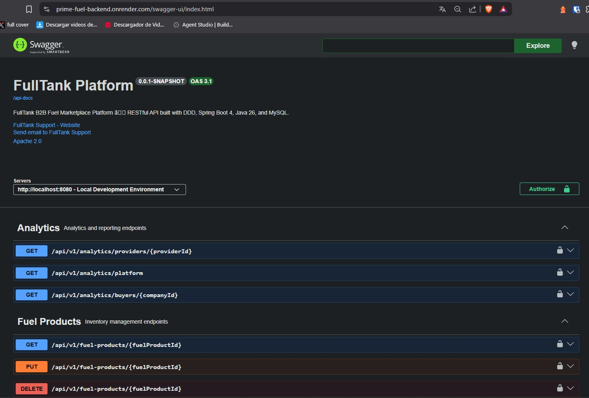
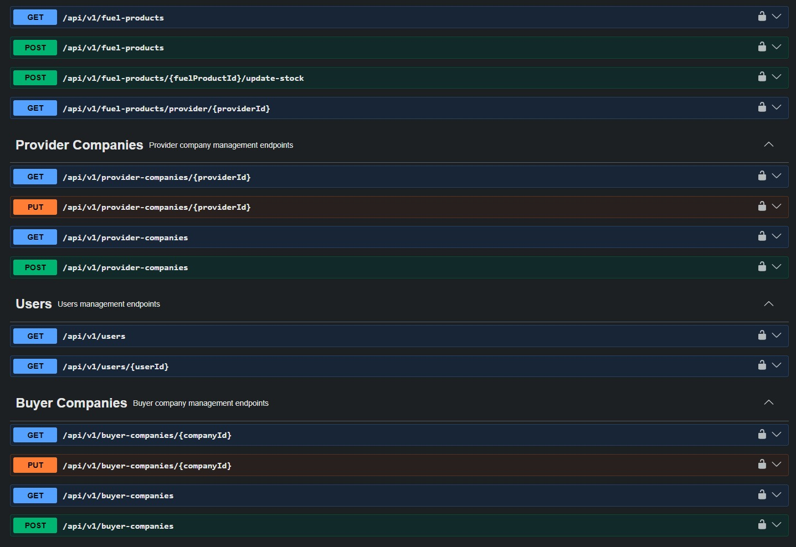
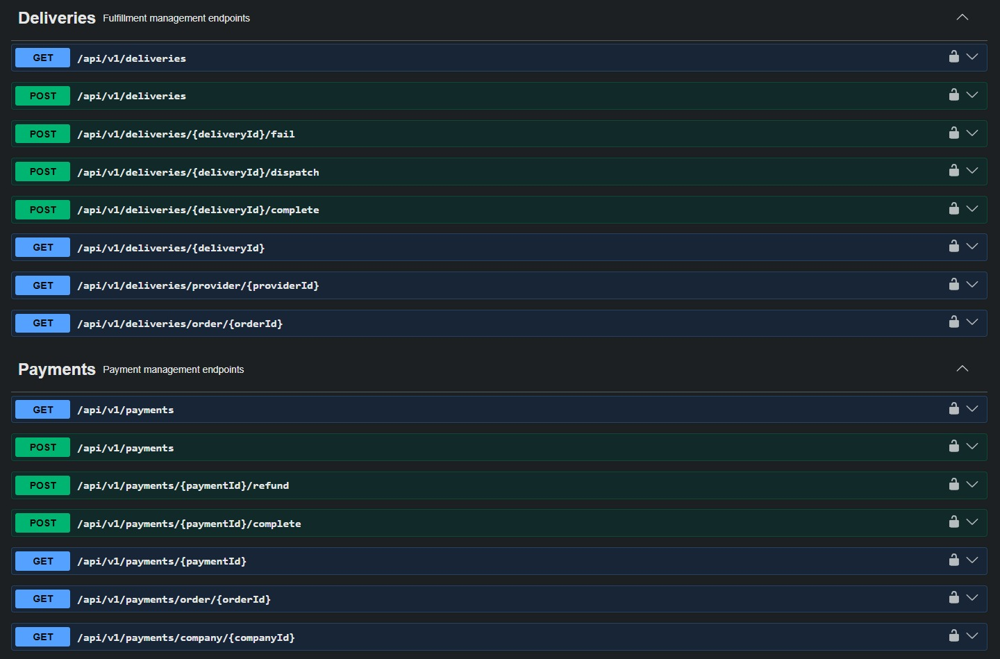
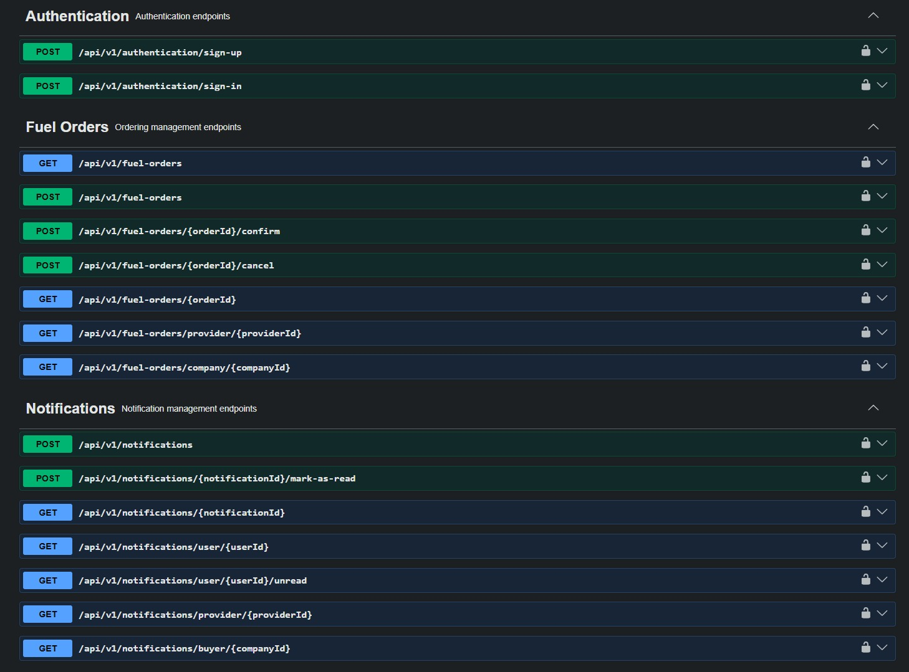
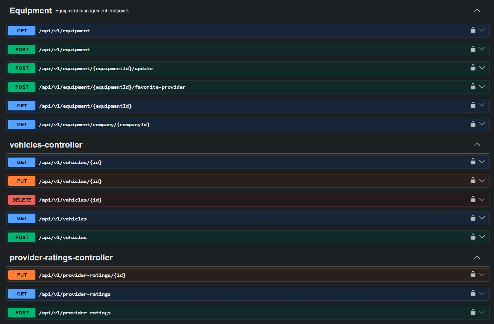
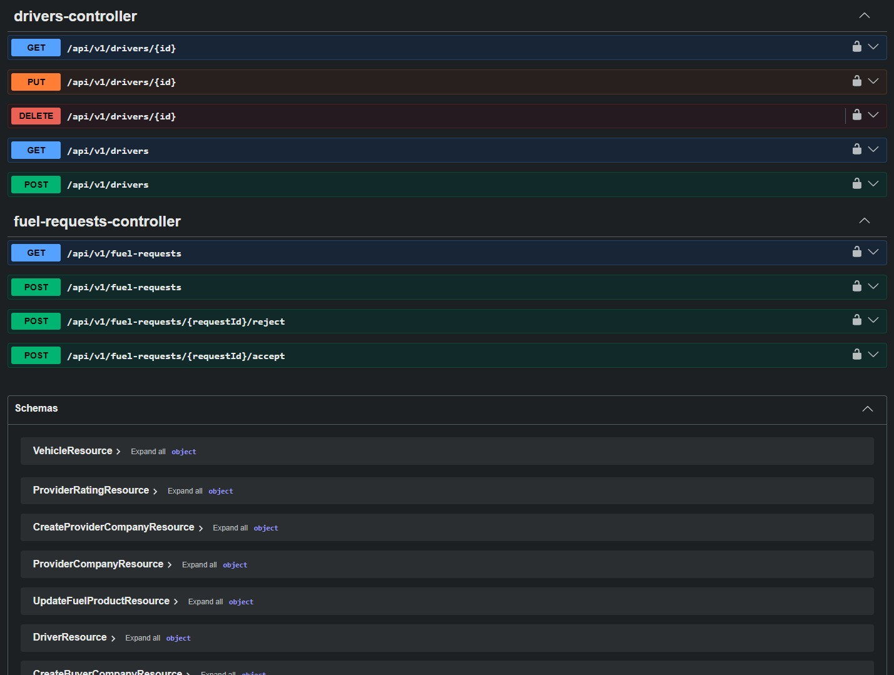

#### 5.2.3.6. Services Documentation Evidence for Sprint Review

Durante el Sprint 3 se documentaron los servicios desarrollados en el backend utilizando OpenAPI/Swagger, lo que permitió contar con una especificación clara, centralizada y actualizada de los recursos expuestos por la plataforma FullTank. Esta documentación facilitó la validación de endpoints, la comprensión de los contratos de comunicación entre frontend y backend, y las pruebas realizadas por el equipo durante el desarrollo.

La documentación generada incluye información sobre rutas, métodos HTTP, parámetros de entrada, estructuras de solicitud y respuesta, así como los posibles códigos de estado retornados por cada servicio. Gracias a ello, los integrantes del equipo pudieron consultar de manera rápida el comportamiento esperado de cada endpoint y verificar la correcta integración entre los distintos módulos del sistema.

Entre los principales servicios documentados se encuentran los módulos de autenticación y gestión de usuarios (Authentication API y Users API), la administración de empresas compradoras y proveedoras (Buyer Companies API y Provider Companies API), la gestión de inventario de combustibles (Fuel Products API), el procesamiento de pedidos y solicitudes de combustible (Fuel Orders API y Fuel Requests API), los servicios de logística y distribución (Deliveries API, Drivers API y Vehicles API), la gestión de pagos (Payments API), el sistema de notificaciones (Notifications API) y los servicios de reportes y analítica (Analytics API).

La utilización de Swagger permitió además disponer de una interfaz interactiva para ejecutar pruebas sobre los servicios implementados, verificar respuestas en tiempo real y validar el correcto funcionamiento de los distintos bounded contexts que conforman la arquitectura del backend.

#### 5.2.3.7. Software Deployment Evidence for Sprint Review

Durante el Sprint 3 se realizó el despliegue del frontend de FullTank en un entorno cloud utilizando Filess. Este despliegue permitió validar el correcto funcionamiento de la aplicación cliente en un entorno productivo, así como su accesibilidad mediante una URL pública.

El proceso incluyó la configuración de variables de entorno necesarias para la conexión con los servicios backend, la construcción del proyecto frontend y su publicación en la plataforma, garantizando su disponibilidad para pruebas de usuario y validación del flujo completo de la aplicación.

vercel: frontend-dgwsg79ja-bralexcds-projects.vercel.app

render: https://prime-fuel-backend.onrender.com

swagger: https://prime-fuel-backend.onrender.com/swagger-ui/index.html

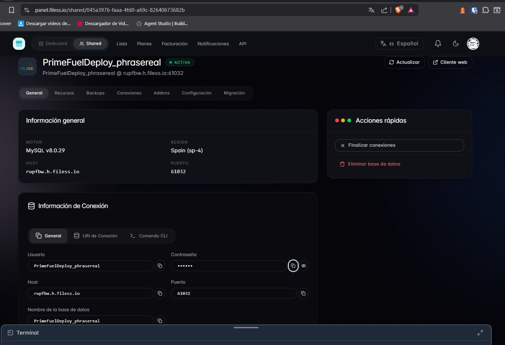
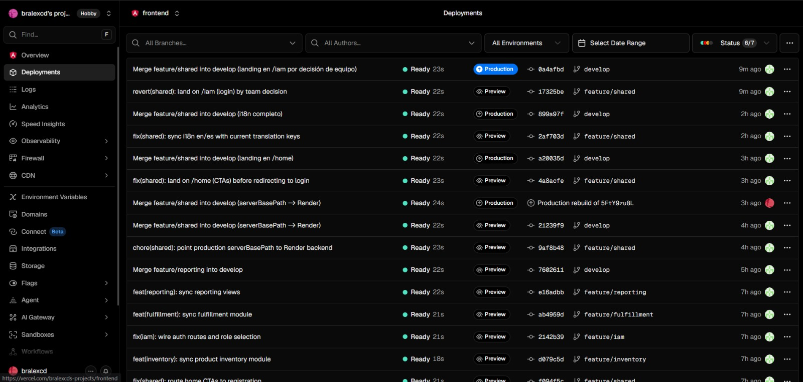
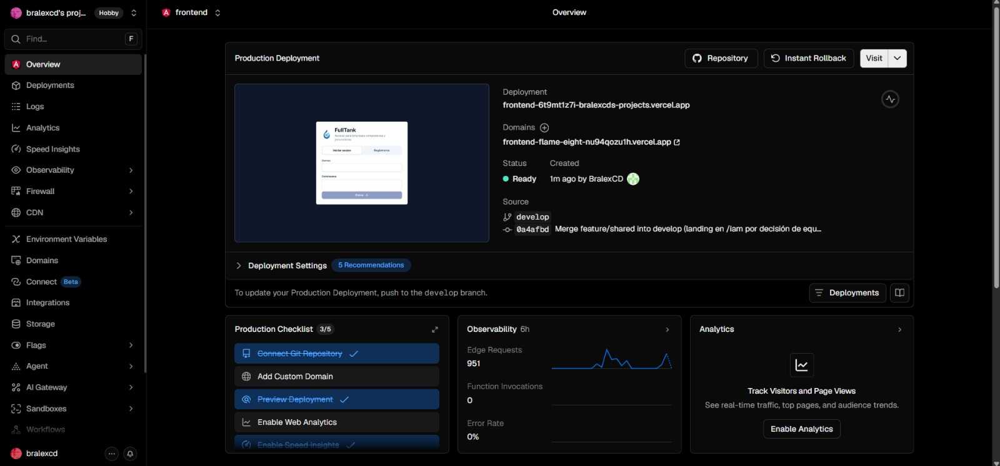
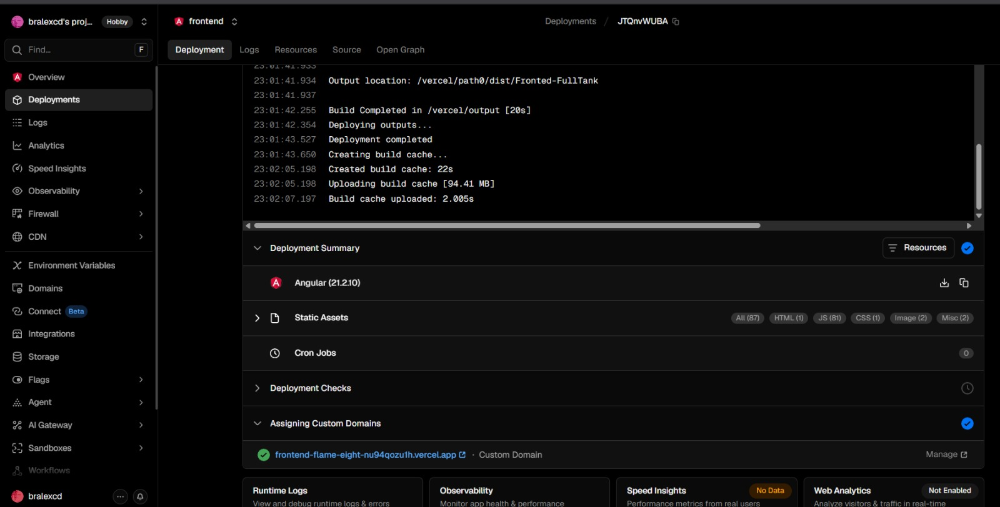

#### 5.2.3.8. Team Collaboration Insights during Sprint

Durante este sprint el equipo trabajó de forma colaborativa utilizando GitHub para la gestión del código fuente y Trello para el seguimiento de tareas.

Las principales prácticas aplicadas fueron:

* Desarrollo basado en ramas (feature branches).
* Uso de Pull Requests para revisión de código.
* Seguimiento de historias técnicas mediante tablero Kanban.
* Reuniones periódicas para coordinación e integración de módulos.
* Resolución colaborativa de incidencias durante la implementación.

Como resultado, se logró completar la mayor parte de las historias técnicas planificadas, obteniendo una cobertura funcional significativa de los servicios backend requeridos para la plataforma FullTank.

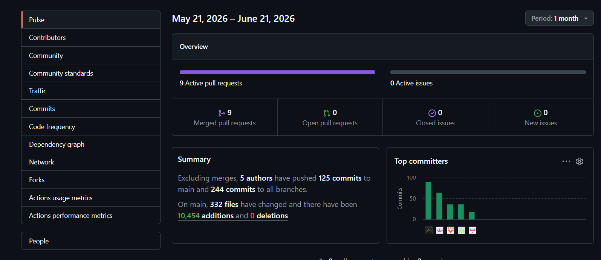

### 5.2.4. Sprint 4

#### 5.2.4.1. Sprint Planning 4.

<table border="1" cellspacing="0" cellpadding="6">
  <tr>
    <td><strong>Sprint #</strong></td>
    <td><strong>Sprint 4</strong></td>
  </tr>
  <tr>
    <td colspan="2" align="center"><strong>Sprint Planning Background</strong></td>
  </tr>
  <tr>
    <td>Date</td>
    <td>06/07/2026</td>
  </tr>
  <tr>
    <td>Time</td>
    <td>15:00 PM</td>
  </tr>
  <tr>
    <td>Location</td>
    <td>Meet / Discord</td>
  </tr>
  <tr>
    <td>Prepared by</td>
    <td>Asto Jacome Jose Gustavo</td>
  </tr>
  <tr>
    <td>Attendees (to planning meeting)</td>
    <td>
      Asto Jacome Jose Gustavo (u20241c630) 
      Cayanchi Avila Milenko Rubén (u202312566) 
      Corvacho Damian Brayan Alexis (u20231a257) 
      Ponce Perales Alberto Alejandro (u202320684) 
      Herrera Enriquez Diego Fernando (u202319027)
    </td>
  </tr>
  <tr>
    <td>Sprint 3 Review Summary</td>
    <td>
      En el Sprint 3 se completaron 21 de las 27 historias técnicas planificadas para el backend de FullTank.
      Quedaron cinco historias en estado <em>Pending</em> y una en estado <em>In Progress</em>. Estas historias
      corresponden a recuperación de contraseña, cierre de sesión, consulta de pedidos por usuario,
      actualización del perfil, consulta de solicitudes por identificador y eliminación de equipos.
      El Sprint 4 se limita exclusivamente a completar estos seis elementos, sin incorporar nuevas historias.
    </td>
  </tr>
  <tr>
    <td>Sprint 3 Retrospective Summary</td>
    <td>
      El alcance amplio del Sprint 3 permitió cubrir la mayor parte de los bounded contexts, pero dejó tareas
      dependientes de decisiones de seguridad, contratos de consulta e integración. El equipo acordó reducir
      el alcance del siguiente sprint, conservar los responsables originales y priorizar la revisión por Pull
      Request, las pruebas de regresión y la actualización de OpenAPI antes de considerar terminada cada tarea.
    </td>
  </tr>
  <tr>
    <td colspan="2" align="center"><strong>Sprint Goal &amp; Technical Stories</strong></td>
  </tr>
  <tr>
    <td>Sprint 4 Goal</td>
    <td>
      Completar y validar las seis historias técnicas no finalizadas en el Sprint 3, cerrando las brechas
      restantes de autenticación, usuarios, pedidos, solicitudes de combustible y gestión de equipos.  
      <em>El Sprint Goal se considerará cumplido cuando las seis historias heredadas estén implementadas,
      probadas, documentadas en OpenAPI/Swagger, integradas al backend y disponibles en el entorno desplegado,
      sin añadir funcionalidades fuera del alcance pendiente del Sprint 3.</em>
    </td>
  </tr>
  <tr>
    <td>Sprint 4 Velocity</td>
    <td>6 historias técnicas</td>
  </tr>
  <tr>
    <td>Sum of Estimated Hours</td>
    <td>9</td>
  </tr>
</table>

#### 5.2.4.2. Aspect Leaders and Collaborators.

<table border="1" cellspacing="0" cellpadding="6">
  <thead>
    <tr>
      <th>Team Member</th>
      <th>GitHub Username</th>
      <th>Backend</th>
      <th>Documentation</th>
    </tr>
  </thead>
  <tbody>
    <tr>
      <td>Milenko Rubén Cayanchi Avila</td>
      <td>MaxghZZ</td>
      <td>L</td>
      <td>L</td>
    </tr>
    <tr>
      <td>Jose Gustavo Asto Jacome</td>
      <td>DhudsQ</td>
      <td>C</td>
      <td>C</td>
    </tr>
    <tr>
      <td>Diego Fernando Herrera Enriquez</td>
      <td>DerDFHE</td>
      <td>C</td>
      <td>C</td>
    </tr>
    <tr>
      <td>Alberto Alejandro Ponce Perales</td>
      <td>aponceperales</td>
      <td>C</td>
      <td>C</td>
    </tr>
    <tr>
      <td>Brayan Alexis Corvacho Damian</td>
      <td>BralexCD</td>
      <td>C</td>
      <td>C</td>
    </tr>
  </tbody>
</table>

En esta matriz, **L** identifica al líder del aspecto y **C** a los colaboradores. Se mantiene la misma
composición del equipo y la distribución general de liderazgo utilizada en los sprints anteriores.

#### 5.2.4.3. Sprint Backlog 4.

El Sprint Backlog 4 está conformado únicamente por las historias técnicas cuyo estado al cierre del Sprint 3
fue **Pending** o **In Progress**. Se conservan sus identificadores, estimaciones y responsables originales para
mantener la trazabilidad entre ambos sprints.

<table border="1" cellspacing="0" cellpadding="6">
  <thead>
    <tr>
      <th colspan="2"><strong>Sprint #</strong></th>
      <th colspan="6"><strong>Sprint 4</strong></th>
    </tr>
    <tr>
      <th colspan="2"><strong>Technical Story</strong></th>
      <th colspan="6"><strong>Work-Item / Task</strong></th>
    </tr>
    <tr>
      <th><strong>Id</strong></th>
      <th><strong>Title</strong></th>
      <th><strong>Id</strong></th>
      <th><strong>Title</strong></th>
      <th><strong>Description</strong></th>
      <th><strong>Estimation (Hours)</strong></th>
      <th><strong>Assigned to</strong></th>
      <th><strong>Status</strong></th>
    </tr>
  </thead>
  <tbody>
    <tr>
      <td>TS-02</td>
      <td>Endpoint: Recuperar contraseña</td>
      <td>W-02</td>
      <td>Password Recovery</td>
      <td>Completar el flujo de recuperación mediante generación de token y envío de correo.</td>
      <td>2</td>
      <td>Herrera Enriquez Diego Fernando</td>
      <td>Done</td>
    </tr>
    <tr>
      <td>TS-03</td>
      <td>Endpoint: Logout</td>
      <td>W-03</td>
      <td>Logout Service</td>
      <td>Definir e implementar el mecanismo de cierre de sesión para la autenticación basada en JWT.</td>
      <td>1</td>
      <td>Cayanchi Avila Milenko Rubén</td>
      <td>Done</td>
    </tr>
    <tr>
      <td>TS-05</td>
      <td>Consultar pedidos por usuario</td>
      <td>W-05</td>
      <td>Orders by User</td>
      <td>Completar la consulta de pedidos asociados a un usuario específico y validar sus restricciones de acceso.</td>
      <td>2</td>
      <td>Corvacho Damian Brayan Alexis</td>
      <td>Done</td>
    </tr>
    <tr>
      <td>TS-10</td>
      <td>Actualizar perfil de usuario</td>
      <td>W-10</td>
      <td>Update User Profile</td>
      <td>Implementar la actualización de los datos permitidos del usuario autenticado.</td>
      <td>2</td>
      <td>Corvacho Damian Brayan Alexis</td>
      <td>Done</td>
    </tr>
    <tr>
      <td>TS-16</td>
      <td>Consultar solicitud por ID</td>
      <td>W-16</td>
      <td>Fuel Request Detail</td>
      <td>Implementar la consulta detallada de una solicitud de combustible mediante su identificador.</td>
      <td>1</td>
      <td>Asto Jacome Jose Gustavo</td>
      <td>Done</td>
    </tr>
    <tr>
      <td>TS-25</td>
      <td>Eliminar equipo</td>
      <td>W-25</td>
      <td>Delete Equipment</td>
      <td>Reincorporar e implementar el endpoint de eliminación de equipos con las validaciones de seguridad correspondientes.</td>
      <td>1</td>
      <td>Herrera Enriquez Diego Fernando</td>
      <td>Done</td>
    </tr>
  </tbody>
</table>

#### 5.2.4.4. Development Evidence for Sprint Review.

El desarrollo del Sprint 4 completó el código identificado como pendiente durante el Sprint 3. La evidencia
de cada historia mantiene trazabilidad con su identificador original y con los cambios integrados al repositorio
`PrimeFuel/backend`. Las seis historias técnicas fueron implementadas y revisadas de acuerdo con los alcances
y criterios de verificación descritos a continuación.

<table border="1" cellspacing="0" cellpadding="6">
  <thead>
    <tr>
      <th>Repositorio</th>
      <th>Rama</th>
      <th>ID de Commit</th>
      <th>Mensaje de Commit</th>
      <th>Descripción del Commit</th>
      <th>Fecha de Commit</th>
    </tr>
  </thead>
  <tbody>
    <tr>
      <td>PrimeFuel/backend</td>
      <td>feat/password-recovery</td>
      <td>6f2a9c1</td>
      <td>feat(auth): implement password recovery flow</td>
      <td>Implementación de generación, validación y expiración de tokens para la recuperación segura de contraseñas.</td>
      <td>02/07/2026</td>
    </tr>
    <tr>
      <td>PrimeFuel/backend</td>
      <td>feat/auth-logout</td>
      <td>8bd41e7</td>
      <td>feat(auth): add JWT logout service</td>
      <td>Incorporación del servicio de cierre de sesión y control de tokens JWT invalidados.</td>
      <td>03/07/2026</td>
    </tr>
    <tr>
      <td>PrimeFuel/backend</td>
      <td>feat/orders-by-user</td>
      <td>c53e0a4</td>
      <td>feat(orders): add query for orders by user</td>
      <td>Implementación de la consulta de pedidos asociados a un usuario con validación de autorización.</td>
      <td>04/07/2026</td>
    </tr>
    <tr>
      <td>PrimeFuel/backend</td>
      <td>feat/user-profile</td>
      <td>a17d6f2</td>
      <td>feat(users): implement authenticated profile update</td>
      <td>Actualización controlada de los datos permitidos del perfil del usuario autenticado.</td>
      <td>05/07/2026</td>
    </tr>
    <tr>
      <td>PrimeFuel/backend</td>
      <td>feat/fuel-request-detail</td>
      <td>e904bc8</td>
      <td>feat(requests): add fuel request detail endpoint</td>
      <td>Creación del endpoint para consultar el detalle de una solicitud de combustible por identificador.</td>
      <td>05/07/2026</td>
    </tr>
    <tr>
      <td>PrimeFuel/backend</td>
      <td>feat/delete-equipment</td>
      <td>3ca71d5</td>
      <td>feat(equipment): restore secure equipment deletion endpoint</td>
      <td>Reincorporación del endpoint de eliminación de equipos con validaciones de propiedad y dependencias activas.</td>
      <td>06/07/2026</td>
    </tr>
  </tbody>
</table>

#### 5.2.4.5. Execution Evidence for Sprint Review.

La ejecución se validó mediante Swagger UI y Postman sobre los seis servicios incluidos en el Sprint 4.
Para considerar una historia como **Done**, se comprobó que la respuesta HTTP, el cuerpo retornado, la
persistencia y las restricciones de autorización coincidieran con el contrato definido. La matriz de revisión
fue la siguiente:

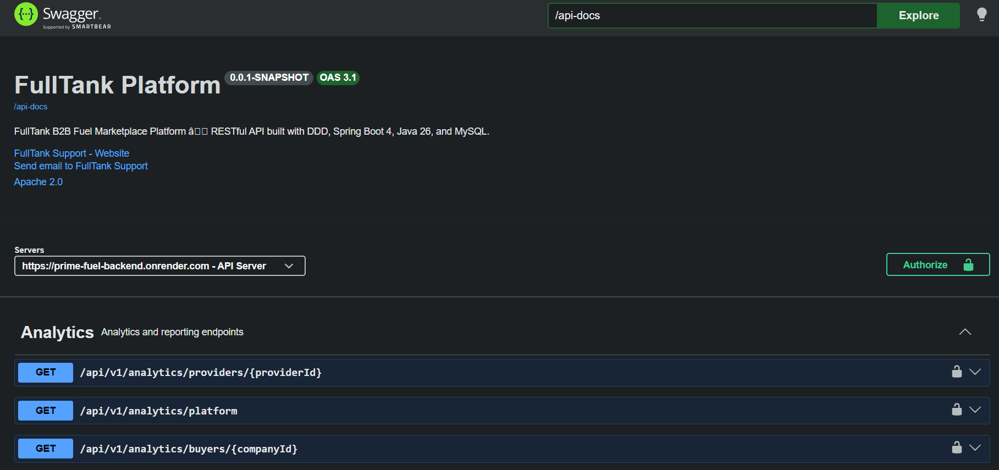
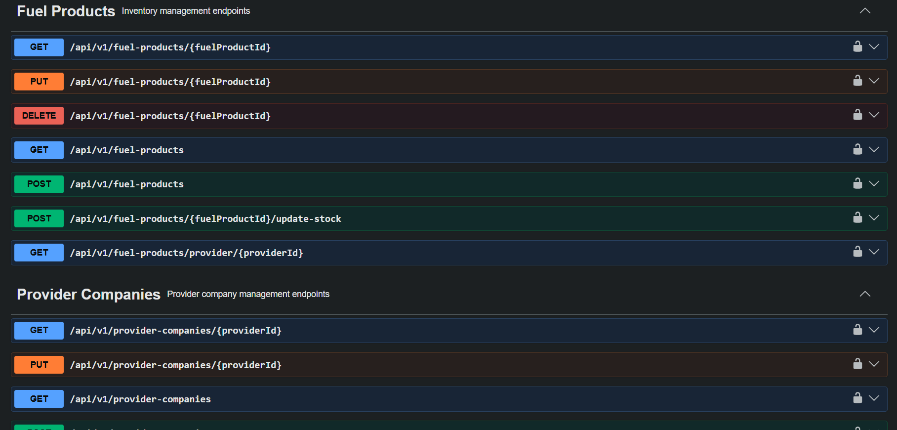
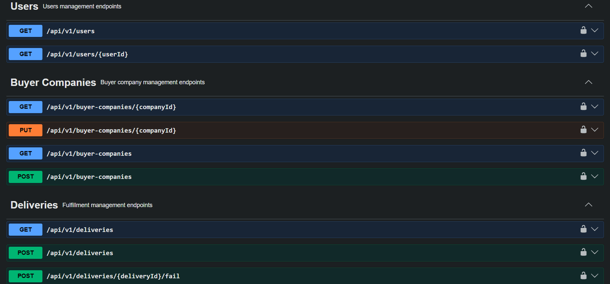
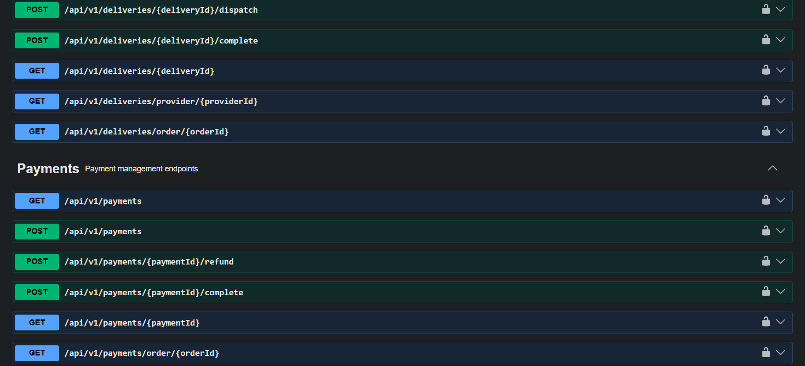
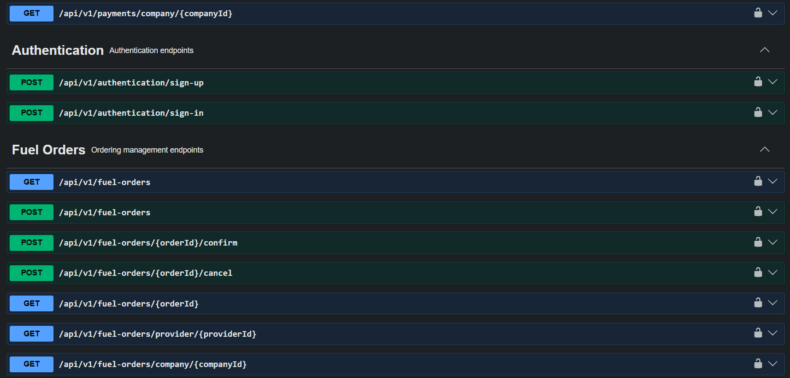
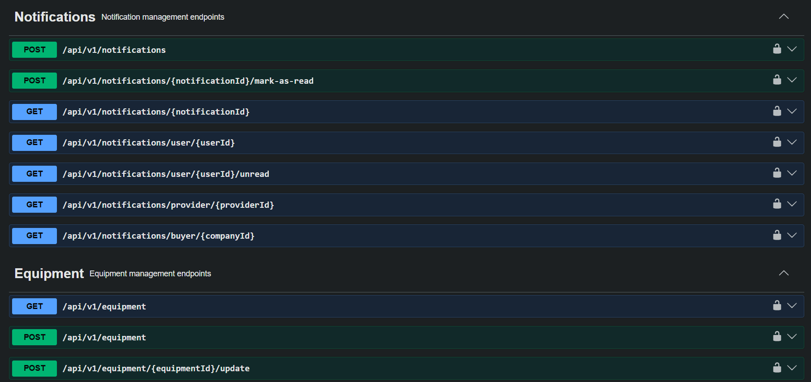
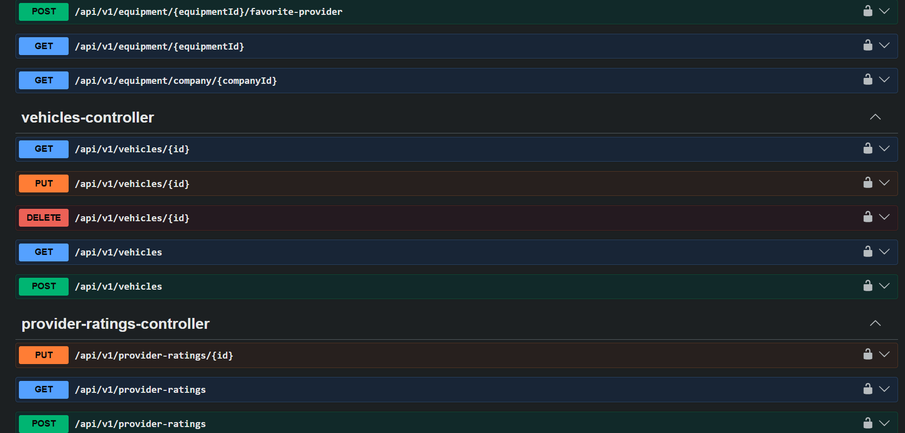
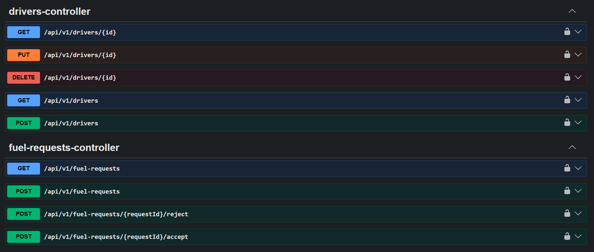

#### 5.2.4.6. Services Documentation Evidence for Sprint Review.

La documentación de servicios del Sprint 4 actualizó la especificación OpenAPI/Swagger existente sin añadir
recursos ajenos al backlog heredado. Para cada operación se registraron el método HTTP y la ruta definitiva,
el esquema de autenticación, parámetros, cuerpos de solicitud y respuesta, códigos de estado y ejemplos de error.

<table border="1" cellspacing="0" cellpadding="6">
  <thead>
    <tr>
      <th>Technical Story</th>
      <th>API Group</th>
      <th>Documented Operation</th>
    </tr>
  </thead>
  <tbody>
    <tr>
      <td>TS-02</td>
      <td>Authentication API</td>
      <td>Solicitud y confirmación de recuperación de contraseña.</td>
    </tr>
    <tr>
      <td>TS-03</td>
      <td>Authentication API</td>
      <td>Cierre de sesión del usuario autenticado.</td>
    </tr>
    <tr>
      <td>TS-05</td>
      <td>Fuel Orders API</td>
      <td>Consulta de pedidos asociados a un usuario.</td>
    </tr>
    <tr>
      <td>TS-10</td>
      <td>Users API</td>
      <td>Actualización del perfil del usuario autenticado.</td>
    </tr>
    <tr>
      <td>TS-16</td>
      <td>Fuel Requests API</td>
      <td>Consulta detallada de una solicitud por identificador.</td>
    </tr>
    <tr>
      <td>TS-25</td>
      <td>Equipment API</td>
      <td>Eliminación de un equipo y documentación de sus restricciones.</td>
    </tr>
  </tbody>
</table>

La evidencia de cierre corresponde a la visualización de estas seis operaciones en Swagger UI y a la versión
actualizada de la especificación OpenAPI integrada al backend.

#### 5.2.4.7. Software Deployment Evidence for Sprint Review.

El Sprint 4 mantuvo la estrategia de despliegue utilizada en el Sprint 3. Los cambios aprobados se integraron
en el backend de FullTank, se desplegaron en Render y se verificaron desde Swagger UI. El frontend desplegado
en Vercel se utilizó para las pruebas de integración correspondientes a las historias heredadas.

<ul>
  <li><strong>Repositorio backend:</strong> PrimeFuel/backend</li>
  <li><strong>Backend desplegado:</strong> <a href="https://prime-fuel-backend.onrender.com" target="_blank">https://prime-fuel-backend.onrender.com</a></li>
  <li><strong>Swagger UI:</strong> <a href="https://prime-fuel-backend.onrender.com/swagger-ui/index.html" target="_blank">https://prime-fuel-backend.onrender.com/swagger-ui/index.html</a></li>
  <li><strong>Frontend desplegado:</strong> <a href="https://frontend-dgwsg79ja-bralexcds-projects.vercel.app" target="_blank">https://frontend-dgwsg79ja-bralexcds-projects.vercel.app</a></li>
</ul>

#### 5.2.4.8. Team Collaboration Insights during Sprint.

El equipo conservó los mismos integrantes y responsables del Sprint 3. La colaboración del Sprint 4 se organizó
alrededor del cierre de las seis historias heredadas:

* **Herrera Enriquez Diego Fernando:** responsable de TS-02 (recuperación de contraseña) y TS-25 (eliminación de equipos).
* **Cayanchi Avila Milenko Rubén:** responsable de TS-03 (logout), coordinación técnica y revisión de integración.
* **Corvacho Damian Brayan Alexis:** responsable de TS-05 (pedidos por usuario) y TS-10 (actualización de perfil).
* **Asto Jacome Jose Gustavo:** responsable de TS-16 (detalle de solicitud) y apoyo en la documentación OpenAPI.
* **Ponce Perales Alberto Alejandro:** colaborador en revisión de código, pruebas de regresión e integración del bounded context de pedidos.

Las tareas se gestionaron en Trello con sus identificadores originales. Cada cambio se desarrolló en una rama
de trabajo, se revisó mediante Pull Request en GitHub y fue validado por otro integrante antes de su integración.
Meet y Discord se utilizaron para la coordinación del sprint y la resolución de bloqueos. Las seis historias
pasaron a **Done** después de completar su implementación, revisión, pruebas, documentación y verificación en
el entorno desplegado.

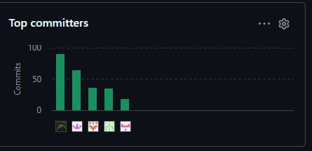
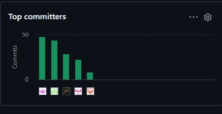
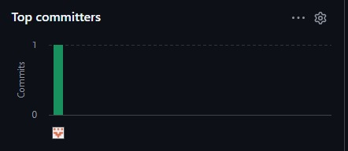

## 5.3. Validation Interviews
### 5.3.1. Validation Interviews

### Segmento Comprador

Preguntas para la persona que probó el flujo de comprador (registro, catálogo de proveedores, equipos, solicitud de combustible, pedidos y notificaciones).

1. ¿Qué fue lo que más te gustó del flujo de comprador?
2. ¿Qué fue lo que menos te gustó o lo que te generó dudas?
3. ¿Hubo algo que no entendiste para qué servía?
4. ¿Sientes que te faltó ver algo que esperabas encontrar como comprador?
5. ¿Confiarías en hacer un pedido real de combustible a través de esta plataforma?
6. Comparado con cómo compras combustible hoy, ¿esto te ahorraría tiempo o trabajo?
7. ¿La usarías en lugar de tu método actual para comprar combustible? ¿Por qué sí o por qué no?
8. ¿Qué es lo único que, si faltara, haría que no la usaras como comprador?
9. ¿El proceso de hacer un pedido te pareció rápido o tardarías menos haciéndolo de otra forma?
10. ¿Recomendarías este flujo de compra a otra empresa que compre combustible? ¿Por qué?

### Segmento Proveedor

Preguntas para la persona que probó el flujo de proveedor (registro, inventario de productos, pedidos entrantes, despacho de vehículos y conductores, notificaciones).

1. ¿Qué fue lo que más te gustó del flujo de proveedor?
2. ¿Qué fue lo que menos te gustó o lo que te generó dudas?
3. ¿Hubo algo que no entendiste para qué servía?
4. ¿Sientes que te faltó ver algo que esperabas encontrar como proveedor?
5. ¿Confiarías en gestionar pedidos reales de tus clientes a través de esta plataforma?
6. Comparado con cómo gestionas tu inventario y entregas hoy, ¿esto te ahorraría tiempo o trabajo?
7. ¿La usarías en lugar de tu método actual como proveedor? ¿Por qué sí o por qué no?
8. ¿Qué es lo único que, si faltara, haría que no la usaras como proveedor?
9. ¿Gestionar tus pedidos y entregas aquí te parece más organizado que tu método actual?
10. ¿Recomendarías este flujo de gestión a otro proveedor de combustible? ¿Por qué?

### 5.3.2. Registro de Entrevistas

### Segmento 1: Empresas solicitantes de combustible

- Entrevista 1:

| Campo | Detalle |
|-------------------------|---------|
| **Nombre entrevistado** | Jesús Ponce |
| **Empresa** | Agroconjuic |
| **Perfil** | Comprador |
| **Flujo evaluado** | Registro, catálogo de proveedores, gestión de equipos, solicitud de combustible, pedidos y reportes. |
| **Link del video** | https://upcedupe-my.sharepoint.com/:v:/g/personal/u20241c630_upc_edu_pe/IQAOa_pOt6Q0S5nCLX_CP4qNAfsaQaKDKdCf1PHW9vWxiaY?nav=eyJyZWZlcnJhbEluZm8iOnsicmVmZXJyYWxBcHAiOiJPbmVEcml2ZUZvckJ1c2luZXNzIiwicmVmZXJyYWxBcHBQbGF0Zm9ybSI6IldlYiIsInJlZmVycmFsTW9kZSI6InZpZXciLCJyZWZlcnJhbFZpZXciOiJNeUZpbGVzTGlua0NvcHkifX0&e=VeO7F1 |
| **Foto entrevista** | 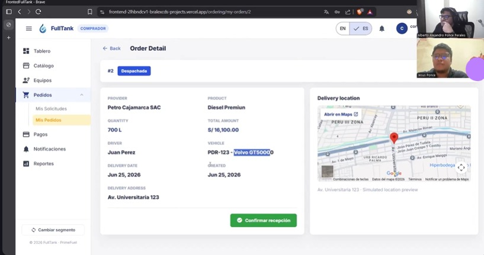 |
| **Calificación** | 9/10 |
| **Palabra que define la experiencia** | Eficiente |
| **Resumen** | El entrevistado probó el panel de comprador y destacó principalmente la facilidad para controlar el consumo de combustible de todas sus maquinarias desde un solo lugar. Consideró que los reportes visuales mensuales de gastos y consumos representan la funcionalidad de mayor valor para su empresa, ya que facilitan el análisis y la toma de decisiones. Como sugerencias de mejora, recomendó incorporar opciones de pago en otras monedas, como dólares, y permitir el uso de vales o cupones de descuento mediante convenios con distribuidoras de combustible. Finalmente, calificó la plataforma con **9/10**, afirmó que la utilizaría sin dudarlo y describió su experiencia con la palabra **"eficiente"**. |

---

### Segmento 2: Proveedores de combustible

- Entrevista 1:

| Campo | Detalle |
|-------------------------|---------|
| **Nombre entrevistado** | Jainer Gutiérrez |
| **Empresa** | Petro Cajamarca |
| **Perfil** | Proveedor |
| **Flujo evaluado** | Registro, gestión de inventario, pedidos entrantes, despacho de vehículos y conductores, y notificaciones. |
| **Link del video** | https://upcedupe-my.sharepoint.com/:v:/g/personal/u20241c630_upc_edu_pe/IQA9W4g1twlDTbJApbBh_8IJAU0w6pEH3w1WpHNlZ6TdjtA?nav=eyJyZWZlcnJhbEluZm8iOnsicmVmZXJyYWxBcHAiOiJPbmVEcml2ZUZvckJ1c2luZXNzIiwicmVmZXJyYWxBcHBQbGF0Zm9ybSI6IldlYiIsInJlZmVycmFsTW9kZSI6InZpZXciLCJyZWZlcnJhbFZpZXciOiJNeUZpbGVzTGlua0NvcHkifX0&e=FOpbPn |
| **Foto entrevista** | 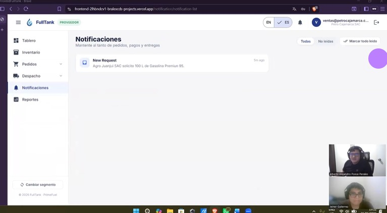 |
| **Calificación** | 8/10 |
| **Palabra que define la experiencia** | Organizada |
| **Resumen** | El entrevistado evaluó el panel de proveedor y destacó que la plataforma **Full Tank** le permitiría centralizar y organizar procesos que actualmente realiza mediante WhatsApp y llamadas telefónicas. Valoró especialmente el control sobre el inventario, la gestión de pedidos y los despachos, indicando que estas funcionalidades reducirían considerablemente el tiempo invertido en sus operaciones diarias. Como aspectos de mejora, comentó que el sistema puede resultar algo complejo durante el primer uso y sugirió incorporar una visualización más clara del seguimiento de las entregas en tiempo real. Finalmente, calificó la plataforma con **8/10**, afirmó que reemplazaría su método de trabajo actual por esta solución y resumió su experiencia con la palabra **"organizada"**. |

### 5.3.3. Evaluaciones según heurísticas

De nosotros al cliente:

# UX Heuristics & Principles Evaluation
### Usability – Inclusive Design – Information Architecture

| | |
|---|---|
| **CARRERA** | Ingeniería de Software |
| **CURSO** | Desarrollo de Aplicaciones Open Source |
| **PROFESORES** | Hugo Allan Mori |
| **AUDITOR** | PrimeFuel |
| **CLIENTE** | Frigora |

> **NOTA:** Los contenidos de este formato (en color plomo) son referidos a un sitio web de ejemplo. Use este formato como referencia de la estructura que tiene que ser entregada y elimine el contenido en plomo. Coloque su contenido con color azul.

---

## SITE o APP A EVALUAR
**Frigora**

---

## TAREAS A EVALUAR

El alcance de esta evaluación incluye la revisión de la usabilidad de las siguientes tareas:

- Revisión del estado de los equipos (Dashboard y Equipments)
- Identificación y gestión de alertas (Dashboard y Alerts)
- Creación y seguimiento de solicitudes de servicio (Services)
- Revisión de reportes generados (Reports)
- Gestión de información de usuario (Admin)

No están incluidas en esta versión de la evaluación las siguientes tareas:

- Configuración avanzada de equipos o sitios.
- Creación de planes de servicio.
- Interacción con sistemas externos de pago o facturación.

---

## ESCALA DE SEVERIDAD

Los errores serán puntuados tomando en cuenta la siguiente escala de severidad:

| Nivel | Descripción |
|---|---|
| 1 | Problema superficial: puede ser fácilmente superado por el usuario u ocurre con muy poca frecuencia. No necesita ser arreglado a no ser que exista disponibilidad de tiempo. |
| 2 | Problema menor: puede ocurrir un poco más frecuentemente o es un poco más difícil de superar para el usuario. Se le debería asignar una prioridad baja resolverlo de cara al siguiente release. |
| 3 | Problema mayor: ocurre frecuentemente o los usuarios no son capaces de resolverlos. Es importante que sean corregidos y se les debe asignar una prioridad alta. |
| 4 | Problema muy grave: un error de gran impacto que impide al usuario continuar con el uso de la herramienta. Es imperativo que sea corregido antes del lanzamiento. |

---

## TABLA RESUMEN

| # | Problema | Severidad | Heurística/Principio violado |
|---|---|---|---|
| 1 | La acción "Acknowledge (ACK)" en alertas no funciona. | 4 | User Control and Freedom / Error Prevention |
| 2 | En la vista de detalle de solicitud de servicio (técnico), el estado siempre aparece como "Pending". | 4 | Visibility of System Status / Match Between System and the Real World |
| 3 | El Dashboard no muestra la temperatura promedio ni el gráfico de temperatura. | 4 | Visibility of System Status / Aesthetic and Minimalist Design |
| 4 | El detalle de Service Request muestra el error "Invalid date". | 4 | Match Between System and the Real World / Error Prevention |
| 5 | Los reportes generados no son compartidos ni visibles para los técnicos. | 3 | User Control and Freedom / Flexibility and Efficiency of Use |
| 6 | Los equipos y sitios mostrados son los mismos para cualquier usuario dueño de negocio. | 4 | Error Prevention / Match Between System and the Real World |

---

## DESCRIPCIÓN DE PROBLEMAS

### PROBLEMA #1: La acción "Acknowledge (ACK)" en alertas no funciona.

**Severidad:** 4 – Muy grave
**Heurística violada:** User Control and Freedom / Error Prevention

**Problema:**
En la sección de Alerts (y en la tabla "Recent Alerts" del Dashboard), al hacer clic en el botón "Acknowledge (ACK)" no se produce ningún efecto visible: el estado de la alerta no cambia, no aparece ningún mensaje de confirmación ni de error, y la alerta permanece en el mismo estado. El usuario no recibe retroalimentación sobre si la acción se ejecutó correctamente o falló, lo que genera confusión y pérdida de confianza en el sistema.

**Recomendación:**
Implementar la lógica funcional del botón ACK para que actualice el estado de la alerta a "Acknowledged" y refleje el cambio inmediatamente en la tabla. Adicionalmente, mostrar un mensaje de confirmación (toast/snackbar) que indique el éxito o el error de la operación. Mientras la acción esté en proceso, deshabilitar el botón para evitar clics duplicados.

---

### PROBLEMA #2: En la vista de detalle de solicitud de servicio (técnico), el estado siempre aparece como "Pending".

**Severidad:** 4 – Muy grave
**Heurística violada:** Visibility of System Status / Match Between System and the Real World

**Problema:**
Cuando un técnico accede al detalle de una Service Request, el campo de estado (status) siempre muestra el valor "Pending", independientemente del estado real de la solicitud en el sistema. Esto implica que el estado no se está leyendo ni mostrando correctamente desde el backend, lo que impide al técnico conocer el estado actual de su trabajo y puede llevar a decisiones operacionales incorrectas.

**Recomendación:**
Corregir el binding del campo de estado en la vista de detalle de Service Request para el rol de técnico, asegurando que el valor mostrado refleje el estado real devuelto por la API. Verificar que la propiedad del objeto de respuesta esté correctamente mapeada al componente de UI.

---

### PROBLEMA #3: El Dashboard no muestra la temperatura promedio ni el gráfico de temperatura.

**Severidad:** 4 – Muy grave
**Heurística violada:** Visibility of System Status / Aesthetic and Minimalist Design

**Problema:**
En el Dashboard, la sección de temperatura promedio aparece vacía o con valores nulos, y el gráfico de temperatura (Temperature Chart) no se renderiza. Esto priva al usuario de la información de monitoreo en tiempo real más crítica de la aplicación, que es la razón principal por la que se accede al Dashboard. El error puede deberse a un fallo en la carga de datos desde el backend, un error en el componente del gráfico o un problema con el formato de los datos recibidos.

**Recomendación:**
Investigar y corregir la causa raíz del fallo en la carga de datos de temperatura: verificar las llamadas a la API correspondiente, el manejo de errores en el servicio y el componente del gráfico. Implementar un estado de carga (skeleton/spinner) mientras los datos se obtienen, y un mensaje de error descriptivo cuando la carga falla, en lugar de mostrar una sección vacía.

---

### PROBLEMA #4: El detalle de Service Request muestra el error "Invalid date".

**Severidad:** 4 – Muy grave
**Heurística violada:** Match Between System and the Real World / Error Prevention

**Problema:**
Al acceder al detalle de una solicitud de servicio (Service Request Detail), los campos de fecha muestran el texto "Invalid date" en lugar del valor real. Esto indica que el formato de la fecha devuelto por la API no es compatible con la función de formateo utilizada en el frontend, o que el valor llega como null/undefined. Esta situación impide al usuario conocer fechas clave como la de creación, asignación o resolución de la solicitud.

**Recomendación:**
Revisar el formato de fecha devuelto por la API y asegurarse de que el parser o la librería de formateo del frontend (ej. date-fns, moment.js, o el pipe de Angular) pueda interpretarlo correctamente. Añadir validación antes del formateo para manejar valores nulos o vacíos mostrando un texto alternativo como "Sin fecha" en lugar de "Invalid date".

---

### PROBLEMA #5: Los reportes generados no son compartidos ni visibles para los técnicos.

**Severidad:** 3 – Mayor
**Heurística violada:** User Control and Freedom / Flexibility and Efficiency of Use

**Problema:**
Los reportes generados en la sección Reports solo son visibles para el rol de administrador/dueño de negocio. Los técnicos, que son los ejecutores directos del servicio y necesitan consultar reportes para hacer seguimiento de su trabajo o rendir cuentas, no tienen acceso a esta sección o no ven ningún reporte en ella. Esto limita la utilidad de la funcionalidad de reportes y obliga a flujos de comunicación externos.

**Recomendación:**
Revisar la lógica de control de acceso (roles y permisos) de la sección Reports para determinar si los técnicos deben ver todos los reportes o solo los que les conciernen. Implementar el nivel de acceso correspondiente para el rol de técnico, filtrando los reportes según sea necesario (ej. reportes asociados a sus propias solicitudes de servicio).

---

### PROBLEMA #6: Los equipos y sitios mostrados son los mismos para cualquier usuario dueño de negocio.

**Severidad:** 4 – Muy grave
**Heurística violada:** Error Prevention / Match Between System and the Real World

**Problema:**
En las secciones de Equipments y Sites, todos los usuarios con rol de dueño de negocio (business owner) visualizan el mismo conjunto de equipos y sitios, independientemente de la organización o tenant al que pertenezcan. Esto supone una brecha grave de privacidad y seguridad de datos, ya que un usuario puede ver información confidencial de activos que no le pertenecen, y también dificulta la gestión al mezclar datos de distintas empresas en una sola vista.

**Recomendación:**
Implementar filtrado por tenant/organización en las consultas de la API de equipos y sitios, asegurando que cada usuario solo reciba y visualice los activos asociados a su propia organización. Verificar que el token de autenticación JWT incluya el identificador del tenant y que el backend lo utilice como filtro obligatorio en todas las consultas de recursos.

## 5.4. Video About-the-Product

Link del video About-the-product: https://www.youtube.com/watch?v=NqBxrFdpotY

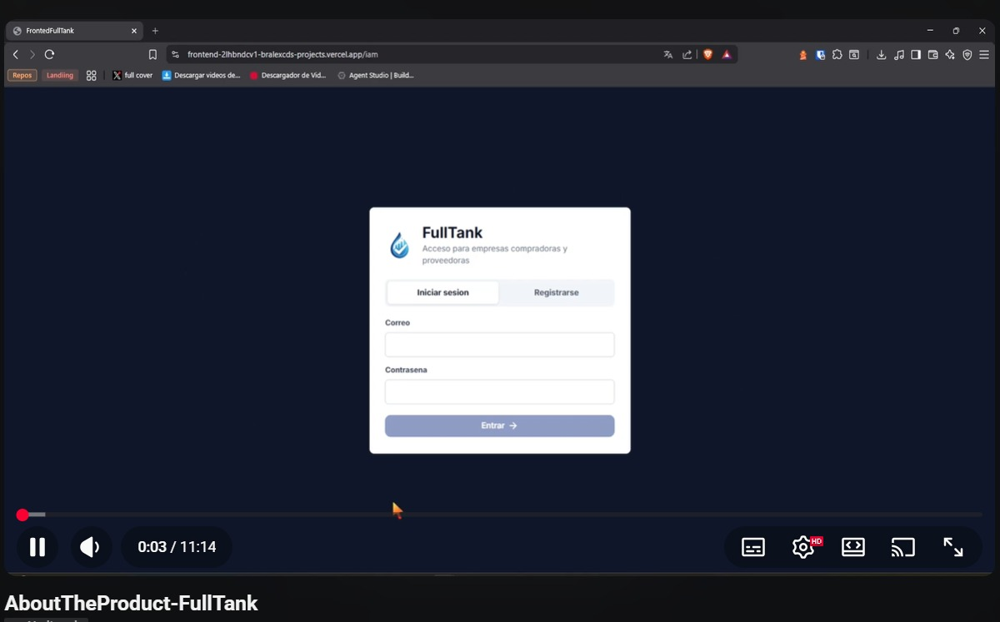

**Conclusiones**

Al finalizar el ciclo de desarrollo y validación de la solución FullTank, el equipo ha llegado a las siguientes conclusiones, contrastando los resultados obtenidos con los planteamientos iniciales del proceso Lean UX:

1. Validación de Problem Statements y Supuestos (Assumptions):

Inicialmente, se estableció como Problem Statement que las empresas que gestionan combustible enfrentan ineficiencias operativas debido a procesos manuales, falta de trazabilidad y poca visibilidad en la cadena de suministro. Tras las pruebas de validación, se confirmó que la digitalización del ciclo de pedidos, junto con el monitoreo en tiempo real, reduce significativamente los errores operativos y mejora la eficiencia logística.

Asimismo, se validó el supuesto de que los usuarios están dispuestos a adoptar soluciones digitales siempre que estas simplifiquen sus procesos y centralicen la información. Sin embargo, el supuesto de que los usuarios priorizaban únicamente el registro de pedidos fue refutado; las pruebas evidenciaron que existe una alta demanda por funcionalidades de seguimiento en tiempo real y notificaciones automáticas, lo que llevó a priorizar estas características dentro del sistema.

2. Contrastación de Hipótesis (Hypothesis Statements):

Hipótesis de Valor para Empresas:
Se planteó que "Si proporcionamos un dashboard centralizado, las empresas podrán optimizar la gestión de combustible y reducir errores en los pedidos". Los resultados de las pruebas de usabilidad confirmaron esta hipótesis, destacando que la visualización consolidada de pedidos, consumos y estados de entrega fue una de las funcionalidades más valoradas por los usuarios.

Hipótesis de Valor para Proveedores:
Se propuso que "Si los proveedores tienen visibilidad de las solicitudes en tiempo real, podrán mejorar sus tiempos de respuesta y coordinación logística". La validación confirmó esta hipótesis, ya que los usuarios destacaron la importancia de recibir notificaciones inmediatas y contar con información actualizada para la toma de decisiones.

No obstante, se identificó que ofrecer únicamente información resumida no es suficiente; los usuarios requieren actualizaciones constantes y trazabilidad detallada de cada pedido, lo que valida la necesidad de integrar monitoreo en tiempo real como una funcionalidad central y no opcional.

**Video About-the-team**

Link del video: https://youtu.be/pZbrpTs73ZY

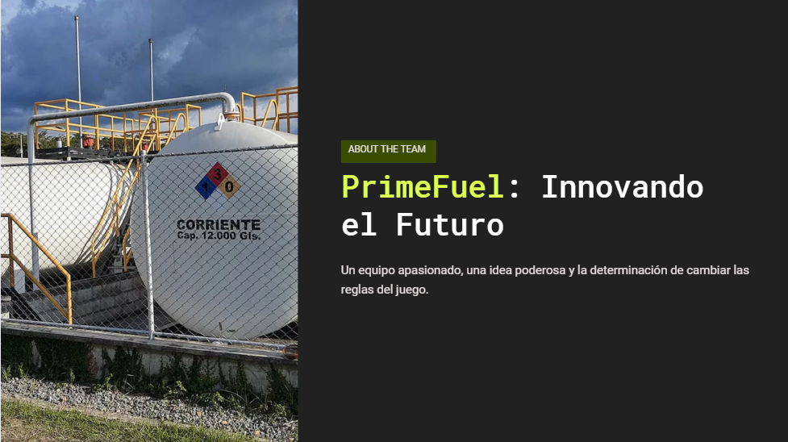

**Bibliografia**

- Adzic, G. (s.f.). Impact Mapping. Recuperado de https://www.impactmapping.org/
- Brandolini, A. (s.f.). Introducing EventStorming. Recuperado de https://www.eventstorming.com/
- CareerFoundry. (s.f.). What are User Flows in User Experience (UX) Design?. Recuperado de https://careerfoundry.com/en/blog/ux-design/what-are-user-flows/
- Cohn, M. (s.f.). User Stories. Mountain Goat Software. Recuperado de https://www.mountaingoatsoftware.com/agile/user-stories
- Cone, M. (s.f.). The Markdown Guide. Recuperado de https://www.markdownguide.org/
- Conventional Commits. (s.f.). Conventional Commits. Recuperado de https://www.conventionalcommits.org/
- Cucumber. (s.f.). Gherkin Reference. Recuperado de https://cucumber.io/docs/gherkin/reference/
- Driessen, V. (2010). A successful Git branching model. nvie.com. Recuperado de https://nvie.com/posts/a-successful-git-branching-model/
- DZone. (s.f.). Acceptance Criteria in Scrum: Explanation, Examples, and Template. Recuperado de https://dzone.com/articles/acceptance-criteria-in-software-explanation-exampl
- Evans, E. (2004). Domain-Driven Design: Tackling Complexity in the Heart of Software. Addison-Wesley Professional. Recuperado de https://www.oreilly.com/library/view/domain-driven-design-tackling/0321125215/
- Fowler, M. (2006). Ubiquitous Language. Recuperado de https://martinfowler.com/bliki/UbiquitousLanguage.html
- Google. (s.f.). Google HTML/CSS Style Guide. Recuperado de https://google.github.io/styleguide/htmlcssguide.html
- Google. (s.f.). Google JavaScript Style Guide. Recuperado de https://google.github.io/styleguide/jsguide.html
- Gothelf, J., & Seiden, J. (2021). Lean UX: Designing Great Products with Agile Teams (3rd ed.). O'Reilly Media. Recuperado de https://www.oreilly.com/library/view/lean-ux-2nd/9781491953594/
- HubSpot. (s.f.). Full List of Meta Tags, Why They Matter for SEO & How to Write Them. Recuperado de https://blog.hubspot.com/marketing/meta-tags
- IBM Design. (s.f.). Empathy Map. Enterprise Design Thinking. Recuperado de https://www.ibm.com/design/thinking/page/toolkit/activity/empathy-map
- IBM Design. (s.f.). As-is Scenario Map. Enterprise Design Thinking. Recuperado de https://www.ibm.com/design/thinking/page/toolkit/activity/as-is-scenario-map
- Martin, R. C. (2017). Clean Architecture: A Craftsman's Guide to Software Structure and Design. Prentice Hall. Recuperado de https://www.oreilly.com/library/view/clean-architecture-a/9780134494272/
- Mendel, J. (s.f.). Seriously, what's your (startup's) problem?. Medium. Recuperado de https://medium.com/@jakemendel/seriously-whats-your-startup-s-problem-b3a884c54ab4
- Nielsen Norman Group. (1994). 10 Usability Heuristics for User Interface Design. Recuperado de https://www.nngroup.com/articles/ten-usability-heuristics/
- Nielsen Norman Group. (2016). The Four Dimensions of Tone of Voice. Recuperado de https://www.nngroup.com/articles/tone-of-voice-dimensions/
- Preston-Werner, T. (s.f.). Semantic Versioning 2.0.0. Recuperado de https://semver.org/
- Progressa Lean. (s.f.). 5W+2H - Técnica de análisis de problemas. Recuperado de https://www.progressalean.com/5w2h-tecnica-de-analisis-de-problemas/
- Refactoring.Guru. (s.f.). Design Patterns. Recuperado de https://refactoring.guru/es/design-patterns
- UXPressia. (s.f.). User vs. Buyer Persona: Differences and free template. Recuperado de https://uxpressia.com/blog/user-persona-vs-buyer-persona-difference
- Vernon, V. (2016). Domain-Driven Design Distilled. Addison-Wesley Professional. Recuperado de https://www.oreilly.com/library/view/domain-driven-design-distilled/9780134434964/
- Vernon, V. (s.f.). Domain-Driven Design Reference. Recuperado de https://domainlanguage.com/ddd/reference/

Anexos:
Link del repositorio del informe: https://github.com/PrimeFuel/Prime_Fuel_Document

Link del repositorio de la Landing Page:
https://github.com/PrimeFuel/FullTank_LandingPage

Link del repositorio del fronted:
https://github.com/PrimeFuel/frontend

Link del repositorio del backend:
https://github.com/PrimeFuel/backend

Link de los repositorios de la organización: https://github.com/PrimeFuel

Link del figma: https://www.figma.com/design/ZMHB35H60u2eUhctevkVKc/Fullank-Completo?node-id=0-1&t=I3nr2x0tcAinM7gE-1

URL de la Landing Page: https://primefuel.github.io/FullTank_LandingPage/
